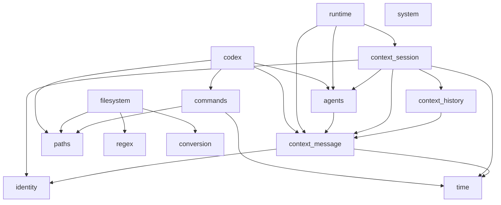

# Architecture

## Purpose

`devtools` is one Python project and distribution organized into cohesive
capability domains under `src/devtools/`. The architecture records how those
domains relate; package-local documentation is authoritative for each
package's exact API and behavior.

## Current foundation and integrations

The completed foundational tooling milestone consists of independent domains:

- leaf foundational primitives: `identity`, `system`, `paths`, `time`,
  `regex`, and `conversion`;
- retained interaction-context domain: `context` (Message, History, and
  Session);
- execution infrastructure: `commands`;
- content and filesystem infrastructure: `filesystem`.
- generic agent contract: `agents`;
- stateless interaction coordination: `runtime`;
- provider/agent integration: `codex`, the first concrete `Agent` adapter.

This grouping describes the current milestone. It does not imply a
`core`, `common`, `shared`, or `foundation` source package.

## Package responsibilities

| Package | Cross-package responsibility |
|---|---|
| `identity` | Canonical opaque UUID identity generation, parsing, and immutable representation; semantic IDs are owned by their respective domains. |
| `context` | Retained interaction context: immutable Message communication values, immutable insertion-ordered Message History, and mutable identified Session lifecycle state retaining History plus current Agent continuation refs; not repository context, filesystem state, command results, agent execution, or runtime orchestration. |
| `system` | Coarse operating-system-family detection, not general environment or machine inventory. |
| `paths` | Path representation, parsing, dot-path conversion, absolute resolution, and known-location construction; not filesystem content I/O or sandbox authorization. |
| `time` | UTC timestamps, non-negative durations, bounded timestamp parsing, and monotonic elapsed timing; not scheduling. |
| `commands` | Immutable direct command specifications and asynchronous immediate-child execution with bounded retained output, best-effort events, and timeout/cancellation cleanup; not session or runtime orchestration. |
| `regex` | Reusable regex compilation, search, iteration, replacement, and immutable match values; not document or file search policy. |
| `conversion` | Explicit callable conversion and stable failure normalization; not automatic target-type construction or serialization. |
| `filesystem` | File models, format-native structure, codecs, format resolution, bounded generic reads, and atomic generic writes. Text, JSON, Markdown, and CSV are codec-backed; binary is model-only. |
| `agents` | Provider-neutral asynchronous message invocation and opaque continuation contract; not provider transport, session history, or runtime routing. |
| `runtime` | Stateless coordination of one caller-selected Agent interaction with one Session; not Agent routing, provider transport, or retained Session state. |
| `codex` | Codex CLI adaptation, JSONL final-turn parsing, thread continuation, and a concrete Agent implementation; not generic command execution, provider discovery, or session state. |

Detailed format and lifecycle mechanics belong in the relevant package-local
documentation, especially [`devtools.filesystem`'s docs](../src/devtools/filesystem/docs/overview.md).

## Dependency graph



In text, the only current cross-domain production dependencies are:

```text
context.message -> identity
context.message -> time
context.history -> context.message
context.session -> context.message
context.session -> context.history
context.session -> identity
context.session -> time
context.session -> agents

commands   -> paths
commands   -> time

filesystem -> paths
filesystem -> regex
filesystem -> conversion

agents     -> context.message
runtime    -> agents
runtime    -> context.message
runtime    -> context.session

codex      -> agents
codex      -> context.message
codex      -> commands
codex      -> paths
```

`identity`, `system`, `paths`, `time`, `regex`, and `conversion` have no
dependencies on another `devtools` domain. `system` currently has no production
consumers. There is no dependency between `commands` and `filesystem` in either
direction.

## Architectural principles

### Explicit package boundaries

Each domain owns one coherent responsibility. Cross-domain relationships are
visible, directional dependencies rather than implicit coupling.

### No speculative shared domain

Reusable-looking code does not justify a `core`, `common`, or `shared`
package. A dedicated reusable domain is extracted after concrete consumers
demonstrate a stable responsibility; `devtools.conversion` is the current
example.

### Composition before speculative abstraction

Common abstractions are introduced only after multiple real consumers require
the same contract. Lower-level packages remain usable without a runtime or
session layer.

### Static before dynamic

Prefer explicit composition and static mappings until real consumers require
dynamic registration or plugin behavior. Current filesystem codec resolution
is intentionally static.

### Immutable values where appropriate

Value-oriented models prefer frozen immutable semantics when their domain
permits it. Lifecycle objects such as `Stopwatch` and `CommandExecution`
remain mutable where lifecycle state is intrinsic.

### Stable package-level APIs

Package-root exports define supported public surfaces. Internal modules may
evolve without becoming additional public contracts.

### Useful error normalization

Standard-library exceptions remain visible when they already provide a useful
contract. Domains normalize failures only where a stable domain boundary adds
meaningful context.

### Higher-layer orchestration

Foundational packages provide primitives. Runtime composes the established
Session and Agent contracts without embedding provider execution in either.

## Cross-package boundaries

`paths` owns path values and resolution policy; `filesystem` owns file content,
codecs, and I/O. `regex` supplies generic regex mechanics that filesystem text
models adapt. `conversion` remains independent while JSON and CSV models use
thin conversion adapters. `commands` consumes path and time primitives but
does not depend on filesystem. `context` owns retained interaction values;
`agents` supplies the generic contract; `codex` is a concrete integration above
them and composes existing context-message, command, and path primitives.
Context Session retains current Agent continuation references without invoking
Agents and owns in-memory complete-turn serialization for its mutable History
and continuation state. Runtime is the stateless one-Agent-interaction
coordinator: it holds Session-owned complete-turn serialization while awaiting
an Agent, so different Sessions may proceed concurrently while a Session's
continuation handoff remains ordered. Session coordination is object-local and
in-process; persistent or distributed coordination remains outside the current
architecture. Runtime does not depend on Codex; Codex is one concrete Agent.

Session indexes current external continuation state by `MessageSource`.
Supporting multiple logical participants sharing one source requires a stronger
participant or Agent-instance identity before Runtime coordinates that topology.

## Documentation authority

```text
Package-local docs
    exact package API, behavior, invariants, and local future work

docs/architecture.md
    cross-package architecture, dependencies, and boundaries

docs/roadmap.md
    completed and future architectural sequencing

docs/implementation_ledger.md
    historical implementation milestones and verification state

docs/documentation_map.md
    documentation navigation and authority map
```

See the [documentation map](documentation_map.md) for links to every package
document.

## Foundation status

The `identity`, `system`, `paths`, `time`, `commands`, `regex`, `conversion`,
`filesystem`, `context.message`, `context.history`, `context.session`,
`agents`, `runtime`, and `codex` milestones are documented and frozen.

Frozen means the current milestone contract is documented and verified; it does
not prevent future, deliberately approved evolution.

## Next architectural boundary

The foundation, generic Agent contract, first Codex integration, Context
Message/History/Session, and Runtime milestones are complete. The next
capability should be separately designed from concrete consumer evidence.
