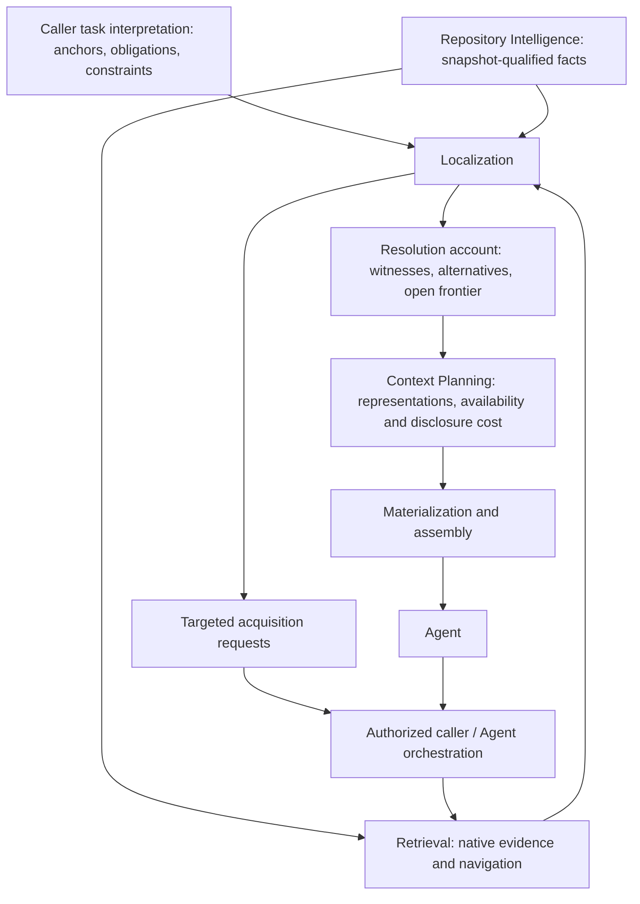

# ADR-0005 — Obligation-driven repository Localization

- Status: Accepted architectural direction; unimplemented
- Date: 2026-10-02
- Scope: task-relative obligation resolution between Retrieval and Context
  Planning, bounded negative evidence, handoff readiness and future evaluation.
- Evidence: [supplied deep research](../../research/obligation-driven-repository-localization.md),
  existing production contracts and the historical mechanisms inventoried below.

## Decision and invariant

Accept a distinct **Localization responsibility** within the repository Context
system. Future supported implementation belongs in `devtools.context.localization`.
This is not another ranker, a mandatory file-selection gate or a general Agent
planner. No implementation, class inventory or durable schema is added here.

Localization relates stated task-relative information obligations to native
repository referents and evidence. Its invariant is:

> Every disposition of an obligation retains the satisfaction criterion, its
> task provenance, the evidence and applicability frame supporting that
> disposition, and any unresolved alternatives or discovery prerequisites.
> A complete handoff requires every applicable mandatory obligation to have a
> supported satisfying set. Stopping acquisition is not itself completeness.

This is stronger than relevance ranking and narrower than proving that a coding
agent can safely complete the task. It is conditional on the stated obligation
frame, supported repository semantics and retained snapshot; omitted obligations
remain a possible failure. Do not call the output universally
"obligation-complete information" without those qualifications.

## Ownership and reconciliation

| Owner | Responsibility | Boundary |
| --- | --- | --- |
| Repository Intelligence (RI) | Deterministic facts, occurrence/subject identity, provenance, bounded coverage and resolution | No task relevance, obligation satisfaction or runtime behavior inferred from syntax |
| Retrieval | Query/capability execution, candidate surfacing, native lexical/structural/graph evidence and rankings | No obligation completeness or disclosure decision |
| Localization | Candidate-to-obligation associations, applicability, competing/complementary alternatives, supported satisfaction and acquisition requests | No new repository truth, rendering, model execution or unrestricted research loop |
| Context Planning | Concrete disclosure choices, faithful forms, overlap, current availability, ordering and capacity | Does not independently reclassify task obligations or claim universal epistemic sufficiency |
| Evaluation | Existing generic identity-coverage kernel | Localizer/protocol owns satisfaction and outcome meaning |
| Agent/orchestration | Task interpretation approval, executing authorized acquisition/validation, retries and escalation | Localization requests are not authority |
| Future Learning | Empirical uncertain interpretations and policies | Cannot replace RI truth, integrity or proof obligations |

Localization may depend on repository/RI and Retrieval primitives, but not on
Context Planning, Agent loops or experiment code. Context Planning can consume
its result without a reverse dependency. Shared identities remain with their
native owners. Initial callers may simply supply native results; no scheduler,
Tool registry, persistence schema or autonomous controller is implied.

[ADR-0003](ADR-0003-information-need-retrieval-evidence-and-ranking.md) still owns
InformationNeed, candidate evidence and ranking. InformationNeed is conceptual,
not a production identified class. Lexical queries are mechanism values;
direct/graph/map requests retain purpose. Production composition correlates
lexical/direct resource evidence, not all channels or obligation coverage.

[ADR-0004](ADR-0004-context-disclosure-planning-and-assembly.md) still owns
representation admission, plans, realization and assembly. Its preceding
Context-owned question/evidence-lane proposal remains historical research.
**The next production increment is now obligation Localization**, rather than
implementing its one-tenth score floors and 2:1 capacity allocation. Do not
promote those constants or require a second parallel question-satisfaction
model. Exact expansion and currently available representation assessment remain
Context responsibilities; requests to resolve an obligation originate in
Localization. Execution of either kind remains with the authorized consumer.

## Minimum task and obligation semantics

Do not introduce a universal TaskModel. The first bounded request should carry
the complete task text/content identity or an exact task reference, purpose,
snapshot/frame, caller-authored obligations and interpretation provenance.
Reusing InformationNeed semantics does not mean inventing an identified
InformationNeed type solely for this work.

Shared anchors are values referencing an exact path, identifier, qualified name
or existing repository identity, with source provenance. An unresolved textual
identifier is not already a resolved repository subject. Several predicates
can reference the same anchor; do not manufacture extra lexical votes or change
BM25 query token semantics. Preserve the full original task as a recall lane.

Constraints restrict acceptable resolution or handoff. Explicit locations are
anchors, unless the caller explicitly makes them mandatory requirements.
Validation requirements distinguish locating the supported validation contract
from actually executing it and obtaining a passing result. The former may be a
localization obligation; the latter is task execution owned elsewhere.
Conditional requirements carry an explicit applicability condition, not an
assumption that configuration/registration applies to every task.

An obligation needs the following minimum contract; these are semantic fields,
not a prescribed constructor or one new class per row:

| Field | Justification |
| --- | --- |
| Stable local identity within the task interpretation | Cross-query association, revision, handoff and evaluation; reuse canonical identity conventions |
| Desired information/predicate and subject anchor references | Distinguish implementation owner, public surface, tests, docs and validation around one entity |
| Task/source provenance | Explicit task span when available, or caller interpretation rationale; never fabricate a span |
| Requirement status and applicability condition | Mandatory/helpful with conditional applicability retained separately |
| Named bounded satisfaction criterion | What constitutes a witness, necessary information characteristics and scope |

Applicability and resolution **state belong to an assessment**, not duplicated
mutable fields on the obligation. Kind can initially be a small descriptive
value; no universal language-neutral ontology is frozen. Dependencies are only
explicit prerequisite references when actually supplied, not a generic task
DAG. Constraints may be request-level or referenced where they affect a rule.
Numeric confidence, learned utility, all six research rule variants and an
independently identified CandidateAssignment/LocalizationEvidence hierarchy are
not justified now.

The first satisfaction algebra is deliberately explicit: one acceptable set
contains **all** its members; alternative acceptable sets are **any-of**.
Native owner lookup can establish a singleton witness under its bounded model.
Do not confuse acceptable alternatives supplied for execution with blinded gold
alternatives reserved for evaluation. Production inputs must not contain sealed
or post-hoc adjudication labels.

## Candidate competition and evidence

An obligation assessment associates native resource/declaration/occurrence/fact
referents with their existing evidence, the rule under consideration and a
reason. A local association/record is sufficient; no second resource or fact
identity is created. One referent may support several obligations, and one
obligation may require several referents.

Alternative owner candidates compete only under a rule requiring a unique
owner. Implementation, export, tests and docs can complement each other across
obligations. A shared document supporting two obligations is not two independent
votes. Preserve native support identity and avoid duplicate evidence counting.

Evidence strengths describe **the inference actually licensed**, not general
confidence: lexical suggestion, role hint, supported relationship, caller
assessment, or bounded deterministic witness. Exact-name uniqueness within a
partial result surface is not global ownership proof. Unsupported/dynamic
bindings or incomplete coverage must remain visible.

Full-task BM25 is a high-recall safety lane, not a universal recall guarantee.
Obligation queries complement it. Their ranks and observations stay independent;
no arbitrary fused score, directory exclusion or score floor removes the global
inventory. Role routing orders attention without closing the candidate world.
An obligation lacking a scoped query still has the global lane and can remain
unresolved. A general-task fallback is open-ended, not a completeness certificate.

## Roles and safe negative evidence

Existing addresses already expose exact canonical paths and components. Basename
and suffix can be derived without new RI fact identities. Module interpretation,
immediate package membership, mirrored paths and bounded project configuration
provide native deterministic support. Do not duplicate them as generic FileRole.

Task-relative implementation/test/docs/API/config roles are multi-label
interpretations. Filename/directory conventions are weak priors; a mirrored path
does not prove test behavior. Python configuration currently covers six literal
selectors, including README and pytest testpaths, with explicit frames. It does
not establish full pytest discovery, exclusions, actual command behavior or
entrypoint binding. This repository declares no project entrypoints. Structured
configuration alone is not evidence that a resource will be executed.

The documentation map and AGENTS supply repository-specific authority locations.
They can support explicit task routing/inspection, not a new universal document
role parser. More pytest discovery, syntactic public exports or documentation
navigation facts require separate bounded RI contracts when needed.

| Negative effect | Meaning and guard |
| --- | --- |
| Demotion | Weak mismatch changes attention/order; retain global eligibility |
| Contradiction | Evidence conflicts with a particular assertion; retain both provenance and unresolved model scope |
| Suppression for one obligation | Omit an assignment under an applicable criterion; do not mark the referent globally irrelevant |
| Hard elimination | Rule, obligation, exact referent, snapshot/frame, positive proof and adequate coverage must be retained and revalidated |

Low rank, low score, graph disconnection, absence of returned support, directory
name and unsupported analysis are never impossibility proof. Stale snapshot
evidence rejects applicability; it does not prove a resource irrelevant in the
new snapshot. An explicit caller frame can exclude a candidate only within that
frame. First implementation should have no general elimination engine: supported
exact-target contradiction is a bounded rule, not a license to prune arbitrary
files. Invalid proof means reject the proposed elimination or leave it unresolved.

## Graph and navigation disposition

Keep current ranking functionality. Personalized PageRank (PPR), repository-map
importance/symbol relevance and Reciprocal Rank Fusion (RRF) remain independent
optional evidence. No parameters change here.

| Operation | Current substrate and limit |
| --- | --- |
| Owner lookup | Declaration subjects, direct containment and module declaration lookup; bounded supported syntax, not arbitrary runtime owner |
| Export navigation | Import/member resolution including the supported one-facade route; no complete public API or dynamic `__all__` model |
| Referencer lookup | Native Reference facts retain targets and source spans; inverse lookup over supplied facts is possible, but coverage is non-exhaustive |
| Dependency neighborhood | Direct structural projection in both Import/Reference directions; typed edges retain native contributions, not transitive impact proof |
| Base navigation | Supported direct-base assessments; no inherited receiver dispatch |
| Closure | No production general closure operator; future traversal must name relation families, frame, depth/work limits, cycles and uncovered frontier |
| Compact explanation | Native symbols, facts and spans; actual rendering remains Context, and recorded declaration spans exclude decorators |

Navigation should use native RI semantics rather than treat ranking transition
weights/directions as repository truth. Existing graph projections can assist
candidate navigation only with their projection limits retained. A resolved
closure within supplied facts is not complete runtime change-impact analysis.

## Stopping, sufficiency and handoff

Accept the concepts of unresolved, supported resolution, supported
non-applicability, named deferred discovery and abstention. Do not freeze enum
spellings or collapse applicability, acquisition status and completeness.

- Open obligations need further evidence or a recorded stop reason.
- Resolution names a satisfying set and evidence under a criterion.
- Non-applicability requires evidence for the explicit condition within adequate
  coverage; "no registry found" in partial results is insufficient.
- Deferred discovery names the observation, prerequisite and reason the fact
  cannot be established yet. Ordinary inexpensive inspection is not inherently
  deferred merely because the budget ran out.
- Abstention records a limit/ambiguity and is a terminal **acquisition outcome**,
  not a satisfied mandatory obligation.

A result records each mandatory disposition, witnesses/alternatives,
applicability assumptions, input coverage, unresolved frontier, proposed next
acquisitions, costs/limits and the stop reason. A scoped readiness assessment can
say complete for the stated frame, conditional handoff with an explicitly
accepted discovery frontier, or blocked/escalation. No universal sufficiency
boolean or guarantee of safe implementation is introduced.

Do not combine ABSTAIN with RESOLVED in a completeness numerator. A consumer may
authorize a bounded exploratory handoff, but the result must still show incomplete
mandatory coverage. Inherent discovery classifications are subject to independent
adjudication; they cannot become a catch-all excuse for localization misses.

Context receives witness referents, obligation links, desired information
characteristics and unresolved limits. It chooses representations and checks
that realized disclosure covers the intended information. Localization resolution
does not establish that a pointer contains enough source or that available
information survived compaction. Capacity failure requests replanning or explicit
partial handoff; it does not retroactively change obligation satisfaction.

## Existing experimental machinery: disposition

Only implementation code and development reports were inspected; no confirmation
runner or retained outcome archive was executed or opened.

| Concrete mechanism | Disposition for future work |
| --- | --- |
| `purpose_relative_import/cases.py`: PurposeRelativeNeed, ResourceJudgment | PROMOTE SEMANTIC IDEA: purpose differs from query; useful/not-useful/unjudged labels remain evaluator-owned. KEEP EXPERIMENTAL manual cases |
| `purpose_relative_admission/reservation.py`: RelationshipSurface, RetainedRelationshipTarget, DirectionalReservationResult | PROMOTE SEMANTIC IDEA: identity-based support retention, direction, explicit abstention. SUPERSEDED as proposed default: top-five replacement/support-count rule |
| `purpose_relative_admission/direct_resolution.py`: run_exact_name_direct_resolution_control | REUSE PRODUCTION PRIMITIVE: exact-name retrieval is already canonical; explicit addressed/owner lookup differs from heterogeneous admission |
| `purpose_relative_ranking.py`: SurfaceCandidate, ranking_design_fingerprint | PROMOTE SEMANTIC IDEA: native features precede evaluator labels; grouped needs prevent split leakage. KEEP EXPERIMENTAL feature policy |
| `increment_28/localization/evidence.py`: classify_localization, _candidate_state | PROMOTE SEMANTIC IDEA: exact inside/outside source evidence and indeterminate state coexist. Not the new obligation domain or a parser to copy |
| `increment_29/mechanics.py`: _source_occurrences, _call_spans | SUPERSEDED active Reference/Call derivation by production declaration References. REUSE PRODUCTION PRIMITIVE with exact occurrence/target support |
| `increment_30/mechanics.py`: derive_immediate_relations; `increment_31/mechanics.py`: derive_mirrors | SUPERSEDED active derivation by production membership/mirrored paths. PROMOTE SEMANTIC IDEA: correspondence is qualified, not behavior |
| `increment_32/mechanics.py`: direct_frontier, incident_edges, project_case; `increment_33/mechanics.py`: reconstruct_path, project_case | PROMOTE SEMANTIC IDEA: bounded paths retain every support, cycle/return diagnostics and frontier limits. KEEP EXPERIMENTAL replay/traversal policy; no production closure yet |
| `increment_27/fusion.py`: build_candidates; `increment_36/mechanics.py`: _ranked_case | KEEP EXPERIMENTAL rank/candidate policy; production fusion is canonical for supported rank operations, not default satisfaction |
| `structural_expansion.py`: StructuralEvidence, expand_addresses | Weak path geometry is IRRELEVANT as proof of owner/test/obligation satisfaction; KEEP EXPERIMENTAL reproduction |
| `increment_25/task_population.py`: TaskCard | KEEP EXPERIMENTAL historical task sourcing, not a production TaskModel |
| `codex_dogfood/capture.py`: CodexDogfoodCase, capture_codex_dogfood_retrieval; `case_0003/prepare.py`: prepare; `case_0003/analyze.py`: expand_judgments, freeze_adjudication, trace_observation | PROMOTE SEMANTIC IDEA: freeze before retrieval, neutral frame, blind judgment then provenance join; observations do not become obligations. KEEP EXPERIMENTAL executor/artifact semantics |

These classifications justify semantic progress without importing experiments
or preserving duplicate active derivation. Frozen archives stay reproducible;
no compatibility shim is authorized by this decision.

## Alternatives, rejected expansions and evidence limitations

Global ranking alone cannot represent mandatory coverage or applicability.
Context-only obligation resolution couples task inference to disclosure capacity
and loses a distinct inspectable account of why acquisition can stop. A generic
probabilistic/sequential Agent framework adds uncalibrated semantics and execution
ownership. Reject those as the next production architecture; retain ranking and
agent exploration as evidence/fallback.

The supplied report is retained byte-for-byte, including its citations and
DECIDE NOW / TEST FIRST / DEFER distinctions. Its opaque research citation IDs
were supplied without a source mapping and are not independently verified or
converted to invented URLs. It was written without repository access and uses
Cases 0001/0002; the earlier investigation also records Case 0003. Architecture
acceptance here rests on inspected repository contracts and the user's adjudicated
direction, not on treating all external research claims as verified results.

Modify the report's recommendations: no mandatory TaskModel, CandidateAssignment
identity, parallel LocalizationEvidence ontology, numeric/categorical confidence
ladder or universal rule engine. Retain explicit scoped evidence and resolution
reasons. A sufficiency record is an auditable bounded assessment, not proof of
epistemic completeness. Reuse path/configuration/Reference substrates already
present; missing facts remain separate RI work.

## Exact next implementation and evaluation

Implement **snapshot-bound obligation Localization and assessment version 1**
under `context.localization`: explicit caller-authored obligation request,
native candidate associations, satisfaction witnesses, applicability/stop account
and a provenance-preserving handoff. Include global and explicit obligation-query
BM25 adapters, and a bounded exact Python declaration-owner resolver using
existing lookup/coverage primitives. Ambiguous, unsupported and partially covered
owner searches remain unresolved. No score threshold removes global candidates.

Use existing path, package, mirrored and configuration facts as separate soft
role evidence where applicable. Do not require a new role ontology or unrelated
RI expansion before testing the obligation kernel. Support explicit acceptable
witness sets and caller assessments for obligations not statically decidable;
label their origin and never pass off manually approved semantic judgments as
deterministic RI proof. Include obligation-linked handoff metadata for existing
explicit Context choices without redesigning materialization or adding all new
representation forms at once.

The first implementation must already assess mandatory coverage and produce
bounded follow-up requests/abstention. Do not postpone the central invariant
until a seventh increment. Actual acquisition remains caller-executed. First
resolution ordering: explicit addressed/native exact evidence, then scoped
candidate investigation, then global escape evidence; supplied ordering and
canonical identity break ties. Ranking never automatically satisfies an
obligation. Retain unresolved competitors and the unpruned global inventory.

Focused tests must cover shared anchors, alternatives/conjunction, cross-obligation
complementarity, conditional applicability, incomplete/ambiguous evidence,
validation-location versus execution, scoped contradiction, global recall,
snapshot mismatch, deterministic ordering, replay and incomplete handoff.
Use the protected development validation profile for executable changes.

Implement experiment-owned blind obligation adjudication alongside that slice:
applicability, acceptable alternative sets, required/helpful/unnecessary/unresolved
information and inferable-at-start versus named inherent discovery. Reuse Evaluation
identity coverage for frame completeness; do not add outcome formulas to its
generic kernel. Freeze a natural task before retrieval; historical cases are
diagnostic, not tuning oracles. No new case is manufactured here.

Report complete applicable mandatory coverage, per-obligation unresolved state,
false hard elimination, avoidable versus inherent exploration, and separate
index/acquisition/disclosure cost. Keep resource recall/depth for continuity;
fixed Recall@K is not the primary success criterion. Optional helpful information
cannot compensate for a missing mandatory witness. Zero applicable mandatory
obligations must be reported explicitly rather than create a division-by-zero
metric or imply an unconstrained task is completely understood.

Subsequent sequence: expand bounded role/RI support as diagnosed; add targeted
native navigation/closure with visible limits; execute bounded sequential
requests under an authorized consumer; then obligation-linked fine-grained
Context policy. Tune neither Personalized PageRank nor Reciprocal Rank Fusion
as the next goal. Learning, automatic task interpretation/cardinality inference,
information-gain policies, full public-surface/pytest behavior and universal exact
pre-localization remain deferred until specific contracts and prospective traces
justify them.
