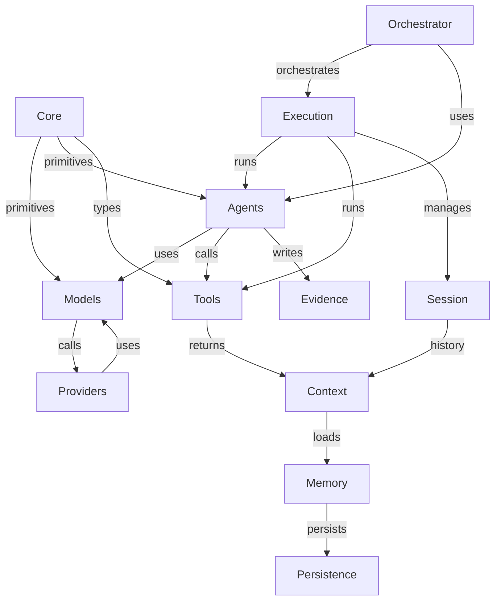

# Framework Domain Boundaries: Agents, Runtime, Tools, Context, and Persistence

## Disposition

Status: Reconciled

Canonical research subject: Framework domain boundaries for Agents, Runtime, Tools, Context, and Persistence.

Related ADRs: ADR-0001; ADR-0004.

Implemented evidence: narrow Runtime and distinct ModelInteraction, Tool, Context, Memory, and Persistence ownership.

Accepted: one-way dependency direction and separation of orchestration from narrow Runtime.

Deferred: reusable Agent orchestration and memory integration.

Rejected for now: generic event buses, dependency-injection frameworks, and workflow infrastructure.

Superseded or refined findings: the architecture taxonomy provides canonical terminology and ownership boundaries.

Open questions: future Agent and orchestration package/API shape.

Revisit triggers: repeated cross-domain consumers that cannot remain bounded composition.

Reconciliation basis: architecture taxonomy; docs/architecture.md; ADR-0001 and ADR-0004.

We examined leading frameworks (LangChain, LangGraph/DeepAgents, LlamaIndex, Pydantic AI, OpenAI Agents SDK, Google ADK, Microsoft AutoGen/MAF, CrewAI, HuggingFace smolagents, Haystack, OpenClaw, etc.) and their source trees to identify **core responsibilities and their natural boundaries**. In summary:

- **Foundation (primitives and schema).** Frameworks universally define base value objects like *Messages*, *Prompts*, *Tokens*, *Paths/Files*, *Identity markers*, *Time*, etc., often under a “core” or “schema” module. For example, LangChain defines `ChatMessage`, `ChatHistory`, and prompt values in its `langchain.schema`; ADK and CrewAI similarly define base LLM request and response types. These primitives should be grouped under a clearly named foundational domain. They are **infrastructure-agnostic** and should not depend on higher layers like tools or sessions.

- **Model/Provider Interfaces (Interactions).** Nearly all frameworks separate *model identity/configuration* from *agent logic*. LLMs are represented by lightweight adapter classes or protocols (e.g. LangChain’s `BaseLLM` class, ADK’s `LlmAgent` with a `model` field, OpenAI’s `Agent` with external model clients, etc.). The model interface typically has methods like `generate()` or `send()` returning an output message/result. The **interaction boundary** (our `Interaction` protocol) – sending a `Message` to a model and receiving a turn – is treated as a minimal primitive across frameworks. Even specialized systems (e.g. OpenAI Agents, ADK) stick to a uniform contract for language-model calls. *External agents* (like Codex or Claude with their own APIs) are generally exposed through the same contract so long as they behave like a “chat completion” provider; only truly autonomous agents (agents calling agents) form separate higher-level orchestration. Thus, **model interaction** should remain a minimal core component: it owns request/response mechanics, provider config, and message formatting, but not higher logic like tool loops. Streaming, structured output, or tool-use metadata are handled by wrappers or result interfaces, **not tacked onto the basic interaction**. LangChain’s `Interaction` (in effect) and ADK’s `LlmAgent` both accept a prompt/inputs and yield raw results, leaving orchestration to other layers. We avoid prematurely expanding this contract (e.g. by embedding tool results or traces inside it) unless multiple frameworks show a need for richer returns.

- **Agents and Orchestration.** Every framework recognizes **agents** as the centerpiece for decision-making. LangChain has *Agents* (planners that call tools in a loop) executed by its `AgentExecutor`, Pydantic AI has a typed `Agent` driving a loop with *capabilities*, OpenAI Agents SDK has an `Agent` class with guardrails and sessions, ADK has `Agent` (graph/workflow nodes), and CrewAI has *Crew* (teams of agents) with *Flows*. The **Runtime (execution layer)** should do only the minimal job of stepping through a single agent/interaction (e.g. calling an LLM or one tool). In contrast, frameworks that require complex multi-step workflows (LangGraph, ADK, CrewAI) do **not** pack that into the base runtime but provide a separate *orchestration engine* or *workflow layer*. For example, LangGraph is explicitly a *graph-based orchestration* on top of LangChain; ADK’s core features include a graph execution engine and workflow nodes. We conclude that our **Runtime** module should remain narrow (single-turn execution, session tracking) and push loops, branching, retries, checkpoints, scheduling, etc., into a higher-level *Orchestration* or *Workflow* domain if/when needed. Doing so avoids overloading the core runtime and aligns with what others have found: engines like LangGraph and ADK offload stateful workflows to graph modules.

- **Tools and Actions.** A critical dichotomy is between *tool definition* (the implementation of an action) versus *tool schema/invocation*. Frameworks universally separate these. LangChain’s `BaseTool` class defines a tool’s name, description, input schema, and execution logic. ADK and OpenAI Agents define *tools* via classes or function-like wrappers (e.g. ADK’s tool constructors; OpenAI’s “tool” classes). Execution of a tool is handled by the runtime/orchestrator invoking the tool with arguments. The **model-visible action** is typically just a JSON or function call (e.g. a special token `{"tool": "name", "args": {...}}`). Then a dispatcher converts that to a tool call. For example, Pydantic AI’s `@agent.tool` decorated functions accept a `RunContext` and validate arguments via Pydantic. Crucially, frameworks keep *permissions/authorization*, *schema*, and *execution* loosely coupled: LangChain’s BaseTool has a Pydantic schema separate from its `run()` method. OpenAI Agents SDK even has separate *guardrails* (checks) apart from tool invocation. We should similarly separate: a **Tool domain** for implementations (and schema), a **Tool Invocation domain** (model-facing request format), an **Authorization domain** (who can call what), and a **Tool Execution domain** (actual runtime execution, error handling, results). These align with LangChain’s split between `args_schema` and execution in `BaseTool`, and Pydantic AI’s `RunContext` carrying state into tools.

- **Context, Memory, and Persistence.** Frameworks distinguish *immediate context* (current conversation/messages) from *session history*, and both from *long-term memory/persistent state*. For example, LangChain separates `ChatMemory` (loads historical messages) from ephemeral chain inputs. ADK and OpenAI Agents use explicit *Sessions* to store history across runs. Haystack’s pipelines clearly modularize retrieval (memory) and generation. Dedicated memory systems (e.g. RDF or vector stores) are typically a separate domain – as seen in many frameworks. We should isolate **Context** (assembling current prompt input from messages, tools results, etc.) from **Memory/State** (durable facts, checkpoints). Evidence/provenance (how an answer was derived) is yet another orthogonal responsibility – e.g. a `History/Evidence` domain that records interactions. Pydantic AI’s capabilities include memory and context management as separate plugins. The user’s current repo already has `context/`, `memory/`, and `persistence/` packages. This suggests splitting *Context building* and *Memory stores* into different modules. Memory could be further divided into session logs vs long-term knowledge. For example, a Memento-like service provides structured memory distinct from on-chain context. In short, **Context** (what goes into an LLM call now) should not implicitly load or store durable memory; instead use clear interfaces or protocols to retrieve and update memory. Provenance (why an output was given) and telemetry/tracing should also be separate concerns, not mixed into LLM call or context modules.

- **Observability and Evaluation.** Few frameworks build these deeply into their core, but they often have pluggable systems: LangChain uses callbacks/trackers, OpenAI Agents logs sessions/tracing, ADK has metrics and telemetry hooks. We should plan for an **Observability** domain (for events, metrics, logs) separate from both the runtime and the evaluation/test code. For now this may not be implemented, but we leave a clear conceptual home (e.g. “events/” or “telemetry/”). Similarly, **Evaluation/Benchmarking** (tests, scoring functions) usually lives outside the core framework (often under `tests/` or `benchmarks/`). We should classify our `model_benchmarks/` as *external tooling*, not core. This matches other projects’ practice of putting examples/experiments separate from library code.

- **Serving vs Interaction.** The question of local model server lifecycle: almost all frameworks assume models are hosted externally (cloud or user-managed servers). Only some (like CrewAI, or ADK with Vertex AI) mention managing serving. We should treat *model serving* as an operational concern, *not* fold it into the interaction layer. For example, LangChain’s `LlamaCppInteraction` just calls a URL; it does not start/stop the server. ADK largely assumes existing endpoints (though Vertex AI integration is separate). Thus, “server lifecycle” belongs outside the core framework (maybe as docs or a separate “tools/serving” area), and the Interaction component only assumes an endpoint exists. This avoids entangling packaging/deployment concerns with pure logic.

**Primary lessons:** We follow other frameworks by keeping core domains **narrow and orthogonal**. For example, LangChain’s BaseTool demonstrates that it is useful to **separate schema (args)** from execution and error-handling. ADK shows that a **graph/workflow runtime** is a distinct layer above individual calls. Many systems explicitly separate *agent planning* vs *tool execution* vs *model calling*. We will adopt those lessons: do not merge planning or loops into the basic runtime, and do not conflate tools with actions or providers with models.

# Physical Repository Organization

We now map these conceptual domains to a package structure. The goal is to make the code tree **reflect the architecture**. After surveying existing projects, the following organization is recommended (example tree):

```text
src/devtools/                       # base for our framework code
    core/                           # foundational primitives
        path_utils/
        time_utils/
        identity/                   # e.g. user IDs, conversation IDs
        schema/                     # Message, ConversationRef, PromptValue, etc.
        system/                     # e.g. environment configuration, logging
    models/                         # model/provider interfaces
        base.py (Interaction protocol)
        providers/                  # provider-specific adapters (LLM clients)
            openai.py
            llama_cpp.py
            codex.py
            ...
        configurations/             # model config objects (name, parameters)
    agents/                         # agent definitions and planning
        base.py (Agent abstract class)
        single_action.py            # one-shot agents
        multi_action.py             # iterative agents (ReAct, etc.)
        planner.py                  # orchestration helper
    execution/                      # execution/runtime support
        runtime.py (runs one interaction)
        session.py                  # session/conversation state
        scheduler.py                # (future) task scheduling
        persistence/                # in-memory and durable stores
            checkpoints.py
            events.py               # tracing/event logging
    tools/                          # tool definitions and schemas
        base.py (Tool abstract class)
        file_tools.py
        shell_tools.py
        mcp_tools.py
        schemas/                    # request/response schemas if needed
    context/                        # context and memory assembly
        builder.py                  # assembles prompt from history
        history.py                  # conversation/message history
        memory_interface.py         # abstract memory store
        memory_backends/
            simple_memory.py
            memento_memory.py       # example for knowledge-graph memory
    orchestrator/                   # (future) high-level workflows/graphs
        graph.py                    # graph definitions
        nodes.py
        engine.py
    evaluation/                     # evaluation, benchmarks, tests (not library code)
        benchmarks/
        metrics.py
```

Key organization principles, justified by other frameworks:

- **Domain grouping over flatness.** Many mature projects (ADK, Haystack, Pydantic AI) group related concepts under directories. For example, ADK’s `src/google/adk` has subpackages for agents, tools, workflows (a hybrid of domain- and layer-oriented). We similarly nest “core”, “models”, “agents”, “tools”, etc., instead of a dozen top-level packages. This improves discoverability (one sees all agent-related code together) and scales as new pieces arrive. We avoid *flat leftovers* like `paths/ time/ identity/ system/` at top-level; instead we can merge them under `core/` or `foundation/` (as shown). Haystack uses `haystack/...` subpackages (retriever, reader, pipeline), demonstrating a deep, logical structure. We must balance: too deep nesting can complicate imports, but grouping truly related modules (e.g. all foundations) conveys meaning. Thus, we group foundation primitives under `core/`.

- **Provider-specific code separated from common interfaces.** All frameworks treat provider adapters as plugins. In LangChain, specific LLM calls (OpenAI, Anthropic, LlamaCpp) reside in provider modules, while the core “Chain” doesn’t care which provider is used. We mimic this: under `models/providers/` we put concrete classes for each LLM or agent type. Core interfaces (`Interaction`, `Agent`) reference only the abstract protocol. This avoids mixing, say, an OpenAI client import in `agents/`. The reverse dependency (framework into providers) is inverted by using Protocol/abstract classes. Many frameworks use this (ADK uses interfaces for LLMs, LangChain’s BaseLLM). We cite LangChain’s design: a single LLM class can represent any provider.

- **Tools grouped by functionality but distinct from actions.** In LangChain, all tools live under one package; in ADK, tools often form separate modules. We place all *tool implementations* (file readers, web search, shell, MCP clients, etc.) in `tools/`. Inside, we can use submodules by category. Tool *schemas* or return types (if needed) go under `tools/schemas/`. This matches LangChain (where each tool class includes its own Pydantic schema) but for our structure we separate “schema” if it grows large. Pydantic AI similarly collects capabilities in a namespace. We ensure that **tool invocation logic and model-side tool-call handling (the “Action” concept)** are separate: the format of `ToolCall` objects can be in core or a small `tools/call.py`, distinct from the executors in `execution/`.

- **Execution/runtime vs orchestration separated.** The `execution/` directory holds the minimal runtime (running one step of an agent or tool call) and session state. We explicitly reserve a separate `orchestrator/` for any graph/workflow engine. This matches ADK, CrewAI, LangGraph, etc., which separate the “engine” from the “actor”. We avoid prematurely mixing orchestration into runtime. For example, LangGraph’s code (not shown here, but documented) sits apart from LangChain’s runtime. If experiments show need for workflows, they will go into `orchestrator/`.

- **Experimental and example code outside the core package.** As in LangChain, ADK, OpenAI SDK, etc., we keep model-specific experiments and scripts out of `src/devtools`. We use `examples/`, `experiments/`, `scripts/` for one-off demos. This echoes the user’s own move of `experiments/qwen/` out of `src`. Core libraries should remain general. For instance, ADK’s samples are separate, and LangChain’s `examples/` folder (unshown above) is not part of the library package. We maintain this discipline so that new provider code (like Qwen-specific orchestration) only enters core when fully generalized.

- **Minimal coupling and dependency direction.** We ensure the above structure respects acyclic dependencies. For example, `core/` has no dependencies on other domains. `models/` depends on `core/`. `agents/` depends on `models/` and `tools/` (agents call tools via models). `execution/` depends on both `agents/` and `tools/`. `context/` may depend on `core` and optionally `execution` for session, but not vice versa. This mirrors guidance from other frameworks to invert dependencies at protocol boundaries (LangChain’s `BaseTool` vs `AgentExecutor`). We plan a dependency diagram accordingly (see below).

Here is a **target package tree** (under `src/devtools/`):

```text
src/devtools/
    core/
        path_utils.py
        time_utils.py
        identity.py
        system.py
        schema/
            message.py (Message, MessageSource, etc.)
            conversation.py (ConversationRef)
    models/
        interaction.py        # defines Interaction protocol
        provider_registry.py  # if needed for dynamic lookup
        providers/
            openai_client.py
            llama_cpp.py
            codex_client.py
    agents/
        agent.py             # abstract base Agent, Action/Finish types
        single_action_agent.py
        multi_action_agent.py
        agent_executor.py    # generic execution loop
    execution/
        runtime.py           # runs one Interaction or tool invocation
        session.py           # Conversation/session state object
        scheduling.py        # (future) support for async tasks, retries
        persistence/
            checkpoint.py
            database.py
            events.py       # logging/tracing events
    tools/
        base_tool.py         # abstract Tool (name, schema, etc.)
        registry.py         # if needed to register tools
        file_tools.py
        shell_tools.py
        http_tools.py
        mcp_tools.py
        schemas/
            tool_input.py
            tool_output.py
    context/
        context_builder.py   # assemble prompt/context from inputs
        history.py           # linear conversation history
        memory_interface.py  # abstract memory store (keyed by session or agent)
        memory_backends/
            memory_simple.py
            memory_graph.py  # e.g. Memento-style
    orchestrator/
        graph.py             # workflow definitions
        nodes.py             # graph node primitives
        engine.py            # graph execution engine
    # (Outside src/devtools:)
    examples/
    scripts/
    tests/
```

In this design:

- **`core/`** holds primitives (paths, time, identity). We group `path_utils`, `time_utils`, etc. under one `core/` or `foundation/` namespace, instead of separate top-level packages, to avoid a “junk drawer” namespace. Other frameworks (e.g. ADK’s `adk/` or Haystack’s `haystack/`) bundle such base types internally. The user’s current `paths/ time/ identity/ system/` should be consolidated: they are all orthogonal primitives. We recommend merging them (for example, keep `system.py` as top-level in `core/`, move `paths.py` and `time.py` into `core/`). This still communicates their foundational role but prevents a dozen one-off folders.

- **`models/interaction.py`** defines the `Interaction` protocol and maybe the `Message` I/O format. Provider-specific clients live in `models/providers/`. This is domain-oriented (the *Model/Provider* domain). It prevents polluting `agents/` or other code with imports from a specific API. E.g. ADK’s LLM clients are in their own module. By contrast, having `tools/` refer to providers (as some code might) is avoided – providers only appear in `models/`.

- **`agents/`** contains abstract agent types and executors. We collect all *agent logic* here (planning, action loops). For example, LangChain’s agent-related classes (ZeroShotAgent, AgentExecutor) would go under `agents/` rather than directly under core. Experiments like `QwenAgent` must not be added here unless they generalize; otherwise they stay in `examples/`. This mirrors LangChain’s structure where agent types are grouped under `agents/`.

- **`execution/`** contains the minimal runtime engine and session state. Only the code that actually *runs* one `Interaction` and processes a tool output lives here. For instance, LangChain’s `Chain.run()` or OpenAI Agents’ `Runner.run` belong conceptually here. This domain should avoid knowing about agent planning details; it just executes one step. *Persistence* (saving state, events) also resides under here, as durability is an execution concern. This is analogous to LangGraph’s approach: the *engine* is separate (in `orchestrator/` below).

- **`tools/`** is the domain of actionable operations. We keep tool definitions (and their input schemas) here. The model-of choice’s view of tools (JSON schemas etc.) will be derived from these definitions. LangChain’s `BaseTool` splitting shows the need to keep schema and runtime separate. We follow that by having `base_tool.py` define the interface (with `args_schema`) and other attributes, but actual execution (the `run()` method) is implemented in each subclass file (`file_tools.py`, etc.). This separation aligns with LangChain and Pydantic AI patterns (tools are combinable but share a contract).

- **`context/`** assembles the message history and memory into prompts. For example, Haystack’s pipelines have explicit “retrieve + generate” steps; we similarly structure code so that retrieval of memory or history happens in context-building code, not hidden inside the LLM call. Memory backends (MongoDB, SQLite, knowledge graph) are under `memory_backends/` and implement a common interface defined in `memory_interface.py`. This echoes Memento’s principle of treating memory as a service.

- **`orchestrator/`** is currently a placeholder for future multi-agent workflows or graph-based agents. Like LangGraph or ADK’s workflow engine, it is initially empty and will be built out only when needed. This ensures the core remains simple.

For each grouping above, evidence from other projects supports it. For instance, Haystack’s clear separation of “retriever”, “reader”, and “pipeline” corresponds to our splitting of memory vs generation. ADK’s prominence on “workflow runtime” implies that if we add orchestration, it should have its own subpackage. LangChain’s tooling for example is all in one folder, which can become unwieldy; grouping by tool category (as we suggest) may improve navigability as the number of tools grows.

In terms of **depth vs flatness** (point 12), we favor a moderate hierarchy: grouping related modules (e.g. all foundation code under `core/`) is more meaningful than one giant flat `devtools/`. Too much nesting can hurt imports (e.g. overly long paths), but domain-based grouping aids discovery: if a developer needs to add a new *tool*, they know to look under `src/devtools/tools/`. Other frameworks (ADK, LangChain) use similar hierarchy. We stop at two levels (e.g. `core/*`, `models/providers/*`) to avoid deep nesting that would make imports cumbersome. This balances clarity with complexity.

# Cross-Framework Responsibilities Comparison

To crystallize these findings, we compare how each framework handles major responsibilities (table below). Cells summarize what that framework *owns or separates*, not listing every feature.

| Framework               | Foundation/Primitives             | Model/Provider Interface                 | Agent Planning/Orchestration        | Tools/Actions                        | Context/Memory                        | Persistence/State/Evidence         | Evaluation/Observability       | Repo Organization               |
|-------------------------|-----------------------------------|------------------------------------------|-------------------------------------|---------------------------------------|---------------------------------------|-------------------------------------|-------------------------------|-------------------------------|
| **LangChain**           | Value objects (Messages, Prompts) under `langchain.schema`; no monolithic foundation. | `BaseLLM` protocol abstracts providers; any `LLM` or `ChatModel` class implements it. No separate model registry. | Agents (ZeroShot, ReAct, etc.) as classes; `AgentExecutor` runs an agent+tools. No workflow engine in core. | `BaseTool` class defines tools (name, schema, error handling); agent loops call them. No separate “Action” type. | Memory handled by ChatMessageHistory, Memories (tools like ConversationBufferMemory). Context = chain prompt. No built-in long-term memory. | Minimal built-in persistence; user can use LangSmith or write to DB. Tracing via callbacks. | Logging via callbacks; no built-in evaluation suite. Examples and tests external. | Monorepo with subpackages (core vs integration); domain-oriented (agents, tools, memory packages). Hybrid organization. |
| **LangGraph/DeepAgents** | Minimal primitives; focus is on graph constructs (Nodes, Edges) and state nodes. Uses LangChain primitives for LLM input/outputs. | Uses LangChain or custom calls under the hood. `Interaction`-like nodes to call providers. | **Orchestration core:** graph-based stateful execution, supporting loops, concurrency, durability. Sessions, streaming, human loop are first-class. | Tools represented as graph nodes/tasks; skill libraries. Invocation via graph execution. | Built-in state/memory nodes in graph; maintains context across sessions. Ingests and retrieves memory in workflow. | Durable state in workflow engine (checkpointing); built-in event tracing for runs. | LangSmith integration for monitoring. | Separate `langgraph` package (monorepo style). Engine-oriented organization (graph nodes, state, memory packages). |
| **Pydantic AI**         | Typed primitives via Pydantic models; no separate “core” module (foundation is Pydantic BaseModel). | Uses provider strings (like `"openai:gpt"` ) to select model; wraps providers in classes (e.g. LiteLLM) behind a uniform API. | Agent is primary interface (`Agent` class) with pluggable capabilities; no separate workflow engine by default (though can attach Temporal). Supports nested sub-agents. | Tools are methods decorated with `@agent.tool`; they receive a `RunContext` for inputs and must return typed output. Schema from function signature. No separate “action” object. | “Capabilities” include memory, context management (e.g. `context` cap, `memory` cap). Context compiled from conversation and these. | Persistent memory optional via capabilities; Temporal or DBOS for durability. Evidence can be added via context/history. | Telemetry via optional integrations (Temporal, Airflow); evaluation suite under pydantic_evals. | Monorepo: core (`pydantic_ai`) plus subprojects (harness, evals, graph) each focused domains. Domain/plugin-oriented. |
| **OpenAI Agents SDK**   | Defines basic message/session schemas under `agents/` module. Foundation is minimal. | Agent class handles configuration of LLM (uses OpenAI API by default) and tools. Provider-agnostic (via openai or other chain). | Agents are user-defined with “instructions” and loop over tools; can use Sandbox for long-lived tasks. Has *Realtime Agents* (voice) and *sessions* (chat history) built-in. | Tools are user-provided function-like objects (MCP functions, embeddings, etc); invocation format is JSON. Has built-in guardrails separate from tools. | Manages sessions with Redis option (stores chat history). No long-term memory module (users store externally). | Supports optional Redis for session persistence. Built-in tracing of agent runs (LangChain traces). | Provides tracing and run logging; examples folder for benchmarks. Org: small single-package (`src/agents`) flat. |
| **Google ADK 2.0**      | Core types (LLM requests, responses, sessions) under `src/google/adk`; also uses Gemini/GCP APIs. Has YAML config support. | Agents explicitly have a `model` field (Gemini or custom LLM); can inject any provider via adapter. | **Graph-based orchestrator:** ADK’s key feature is a workflow runtime with routing, retry, fan-out/in, nested tasks. Multi-agent (A2A) support built-in. | Tools and functions are first-class: “Tool” classes wrapping functions or RPCs; also supports OpenAPI tools. Tool confirmation (HITL) flow is built-in. | Context is passed via runtime; provides in-memory and database-backed task state. Also supports checkpoints and long-running workflows. | Durable checkpoints via Datastore/etc., state captured in workflow execution. Events and metrics built-in (Stackdriver). | Rich observability (Stackdriver, traces, logging). Evaluation via built-in rollout tests. | Monolithic under `src/google/adk`, domain-oriented into `agents/`, `workflows/`, `tools/` subpackages. |
| **Microsoft AutoGen/MAF**| Foundation is basic chat/message schemas; AuthID, Workflows. | Uses “model client” interfaces (e.g. OpenAI, Azure models) that fit a common client API. | Agents are objects (e.g. `AssistantAgent`) with multi-agent support via `AgentTool`. Runs are script-like (async `run()` loops). No separate graph engine exposed (MAF is newer). | Tools are classes wrapping external actions (e.g. `McpWorkbench`). Invocation via agent loop. Supports multi-agent handoff via tools. | Provides optional session logger; no built-in memory store beyond conversation. | Limited built-in persistence (you must manage files or logs). Supports MCP for tools. | Limited built-in; users use Azure Monitor or custom. Org: monorepo with `python/` and `dotnet/`, structure under `python/autogen_agentchat`. Flat domain but somewhat layered (agents, tools, ext). |
| **CrewAI**             | Defines base types (Agent, Crew, Task) in `lib/crewai/`. Has trace logging setup. | Agent configuration (role, goals) separate from model (user must plug in an LLM wrapper). Supports any LLM via gRPC or API. | Distinct **Crew** and **Flow** domains: *Crews* run asynchronous agent teams (meetings), *Flows* are event-driven DAGs mixing API calls and Crew steps. | “Skills” (a bit like tools) are grouped in a plugin marketplace. Invocation is event-driven. Tools as code snippets or API calls. | Crews have persistent state (kanban style boards); Flows have state per execution. Also a database for long-term state. | Robust telemetry & tracing via Crew Control Plane (external platform). Local code logs to console or Elastic. | Full observability via external dashboard (Crew AMP). Evaluation done with examples (docs/). | Domain-oriented: `lib/crewai` with subpackages (agents, crews, flows, models, traces). Some hierarchy (e.g. `crewai/flows`, `crewai/crews`). |
| **HuggingFace smolagents**| Minimal: small set of classes in ~1000 lines. `Agent` and `CodeAgent` classes under `src/smolagents`. | Accepts any HF or OpenAI model via a uniform `InferenceClientModel`. Providers hidden behind a common interface (HF Inference API or Litellm). | No explicit “agent” class beyond CodeAgent. No persistence or memory beyond Python runtime. No orchestration: each `agent.run()` is one-shot (though `stream_outputs` is supported). | Tools are simple functions or GPT agents. For code agents, the code itself is the “actions”. No formal tool schema (calls to `await agent.run(...)`). | No notion of conversation history or memory – each call can optionally include context, but by default stateless. | Stateless by design. No logs or state stored. | Tracing via Python logging if added. Repo is very flat: just `src/smolagents/` with all code. Domain is minimal. |
| **OpenClaw**           | (Not a framework library; a Node app.) Messages and configs live in JSON files. Uses a “Gateway” service vs "Agent harness". | Models are plugin executables (Claude, Codex, Llama) that comply with an internal MCP protocol. The client code just issues `ConversationRef`s to the gateway, which routes to a model. | Single-Agent assistant paradigm (no multi-agent orchestration). Sessions (per chat) are managed by Gateway. | Integrates many channels (Slack, Teams, etc.) via connectors. Tools are external (e.g. web API calls) invoked through chat (no explicit tool API). | Memory is “states and credentials” held on user device (via sqlite). Supports personal vs team mode. Persists conversation logs locally. | State and logs stored locally. Security and plugin isolation enforced. | Local tracing via logs; no integrated monitoring. Org: monolithic (client-server) with a layered architecture (Gateway vs workers). |
| **Memento (memory)**   | Not an agent framework, but provides *Memory* only. It builds a structured knowledge graph of facts with temporal annotations. | Acts as an MCP server: any agent can call `memory_ingest` / `memory_recall` via a simple API. | Not applicable; just memory store. | No tools. | **Dedicated memory domain:** decoupled from agent. Agents must explicitly call Memento’s endpoints to store/retrieve. This cleanly separates memory from interaction. | Data persisted in local SQLite by default. Knowledge graph analytics. | Benchmarked on memory tests. Repo is standalone. |

**Cross-framework observations:**

- **Foundation splits:** Some projects merge many primitives under one package (`smolagents` is flat), others nest them (ADK’s `src/google/adk` has subpackages, LangChain splits `core` vs `langchain` code). Our `core/` grouping (paths/time/identity) mirrors ADK’s approach of a single namespace for base types and avoids a flat namespace issue.
- **Model/provider vs agent:** No framework ties agent code to a specific model; all separate model clients from agent logic. Notably, LangChain corrected a mistake by removing model-specific agents (Qwen/DeepSeek) and using a generic interaction instead. We follow suit. The separation in frameworks shows model identity should be just config on an agent, not its own subclass (except for “agents as tools” or distinct agent-level systems like Codex).
- **Tools vs actions:** Frameworks unanimously separate tool implementation from invocation. LangChain’s BaseTool encapsulates schema/error handling, and Pydantic AI’s `@tool` usage shows a clear boundary between schema and code. We should avoid “one giant Result object” for all tool metadata; instead use callbacks or result wrappers if needed.
- **Context vs memory vs persistence:** Every mature system distinguishes these. LangChain has `Memory` classes separate from `ChatHistory`; ADK’s “sessions” vs data stores; Memento proves the value of a separate memory component. We likewise keep the immediate conversation context builder separate from any durable storage.
- **Runtime vs orchestration:** LangChain’s minimal runtime vs LangGraph’s graph engine suggests we should likewise keep them modular. We do **not** make our runtime a mini-workflow engine prematurely.
- **Repo taxonomy:** Domain-oriented packages (agents, tools, context) are common. LangChain and Pydantic use monorepos with multiple domain subpackages. OpenAI Agents SDK is simpler/flat (one package) but also does not cover so many responsibilities. A flat layout leads to discoverability issues (as our `src/devtools` became). We choose a hybrid depth: one or two layers where helpful, mirroring frameworks like Haystack (hierarchical pipeline modules) and ADK (agents, workflows subdirs).

# Responsibility Assignment and Separation

Based on this survey, we identify conceptual **domains** (and example duties) for our framework, and highlight current areas to split or group. The domains may correspond to packages or modules as above. For each, we outline responsibilities and boundaries:

- **Foundation/Core:** Owns *value objects* (Messages, ConversationRef, Prompt/Response types), basic utilities (paths, time, identity tokens).
  - *Does NOT* own agents, tools, models, or persistence.
  - **Dependencies:** None (lowest layer).
  - **Remarks:** Exists now as `paths/ time/ identity/ system/`. We should merge these into one `core/` module. This grouping reflects practices in LangChain and ADK (all base schema together).

- **Model/Provider (Interaction):** Owns *communication with models/agents*. Defines the `Interaction` protocol, `MessageSource`, request/response wrappers. Implements concrete classes for each provider (OpenAI, LlamaCpp, Codex, etc.).
  - *Does NOT* own agent planning or tool logic.
  - **Dependencies:** `core/` for message types; nothing else above. Providers may depend on SDKs (OpenAI, Anthropic, etc.), but that’s isolated.
  - **Remarks:** Mirrors LangChain’s separation of LLM clients. We keep provider code here, not mixed in `agents/`.

- **Agent:** Owns *planning and decision-making logic*. Defines abstract `Agent` classes and routines for iterative or single-step agent strategies. Also includes translation of model output into `AgentAction` or `AgentFinish`.
  - *Does NOT* execute tools or manage sessions.
  - **Dependencies:** `Model/Provider` to send messages; `Tools` to perform actions; `core` for types.
  - **Remarks:** Analogous to LangChain’s `Agent` and `AgentExecutor`. We do not put runtime loop here; rather, `AgentExecutor` could live in `execution/`.

- **Tools:** Owns *tool implementations and schemas*. Each `Tool` defines `name`, `description`, `args_schema`, and `run()` logic. Also may define result formatting.
  - *Does NOT* handle invocation protocol or permissions.
  - **Dependencies:** `core` for types (Message), possibly `models` if tool calls another model.
  - **Remarks:** In line with LangChain’s `BaseTool`. We should avoid adding, say, authorization logic inside `Tool`. There should be a separate *Permission/Policy* module if needed.

- **Tools Invocation & Actions:** Owns *model-facing action format and dispatch*. Translates an agent’s planned action (e.g. function call) into a JSON or `ToolCall` message, and parses a returned `ToolResult`.
  - *Does NOT* know how a tool is implemented.
  - **Dependencies:** `Tools` for name and schema, `Model/Provider` for sending/receiving.
  - **Remarks:** This is conceptually a separate layer (LangChain’s ReAct loop, or Pydantic’s RunContext could fit here). Our framework may start without a full “Action” abstraction, but if we do, it must sit between `Agents` and `Tools`.

- **Execution/Runtime:** Owns *running one turn of an agent or tool call*. Contains logic to invoke `Interaction.send()`, handle asynchronous flows, and update session memory. Also retry logic for failures.
  - *Does NOT* contain planning (agent logic) or loop management.
  - **Dependencies:** `Agent`, `Tools`, `Model/Provider`, `Context`.
  - **Remarks:** Minimal runtime, like LangChain’s `Chain`/`AgentExecutor`. We should not overload it with workflows.

- **Session/Context:** Owns *conversation history and context assembly*. Provides interfaces to append messages to a session, load history for an `Interaction`, and compile the prompt input. Also manages session IDs, timestamps.
  - *Does NOT* dictate conversation logic or recall memory from outside.
  - **Dependencies:** `core` for ConversationRef, possibly `Model/Provider` if conversation IDs come from provider.
  - **Remarks:** Similar to OpenAI Agents’ session management and Haystack’s conversation module. Context assembly (including any retrieved memory) may interact with `Context` domain rather than `Session` directly.

- **Memory (Long-Term):** Owns *persistent memory stores and retrieval*. Provides abstract interfaces to save and retrieve facts or embeddings. Can support vector DBs, knowledge graphs, etc.
  - *Does NOT* automatically inject memory into prompts (that’s `Context`’s job) and does not execute actions.
  - **Dependencies:** `core` for data types; possibly external DB libraries.
  - **Remarks:** Informed by Memento’s separation and LangChain’s Memory modules. We keep memory out of session code.

- **Persistence/Evidence:** Owns *logging, events, and checkpointing*. For example, it might record that “Agent X called tool Y with args Z at time T” and any resulting artifacts.
  - *Does NOT* influence agent decisions.
  - **Dependencies:** Possibly `execution` for hooking into runs.
  - **Remarks:** Could be folded into `execution` or separate. Other frameworks integrate traces (OpenAI, ADK); we should plan for it.

- **Orchestration/Workflow:** Owns *composing multiple execution steps into a graph or flow*. Allows loops, branching, multi-agent tasks.
  - *Does NOT* control low-level agent logic.
  - **Dependencies:** All above (agents, tools, runtime).
  - **Remarks:** Proposed for the future only, as LangGraph/ADK have distinct layers for this. Do not implement yet unless pressure arises.

- **Evaluation/Benchmarks:** Owns *evaluations, metrics, test suites*. Lives outside core as tooling.
  - **Dependencies:** Uses core APIs but should not be imported by them.
  - **Remarks:** Aligns with frameworks that keep tests separate (e.g. LangChain’s `tests/`, Haystack’s examples). We should, as the user has done, keep `model_benchmarks/` outside `devtools`.

Using these domains, we can spot **splits and merges**:

- *Should split:* If a current module carries multiple roles, break it. For example, if `context/` also writes to persistence, split it into `context/` vs `persistence/`. Or if `runtime/` both executes and stores to DB, separate the logging part. Evidence from others: frameworks often refactored once they needed durability (e.g. LangGraph vs LangChain).

- *Should merge:* Small, single-purpose packages (e.g. separate `paths/`, `time/`) can join `core/`. The user mentioned `paths`, `time`, `identity`, `system`: these are better siblings under one namespace (`core/`). This grouping is conceptual, not semantic merging – each remains a module.

- *Hidden responsibilities:* For example, the current `interaction` may carry session logic or tool parsing; we must explicitly segregate those. Or `tools` code might implicitly assume context assembling. The comparison suggests keeping those separate.

# Dependency Diagram

Below is a Mermaid-style dependency graph (arrow means “depends on”):



This is illustrative. The key is **one-way** flows: `Core` ← nobody, then `Models` and `Tools` depend on `Core`, `Agents` depend on both `Models` and `Tools`, `Execution` depends on `Agents/Tools/Session`, and higher-level `Orchestrator` depends on `Execution` and `Agents`. No circular dependency should appear. For example, `Core` should not import any higher layer, and agents should not depend on context-building directly (they produce actions, not final prompts).

# Target Repository Tree

Concretizing the above, here is an excerpt of the proposed repository layout under `src/devtools/` (packages end in `/`):

```
src/devtools/
    core/
        __init__.py
        path_utils.py
        time_utils.py
        identity.py
        system.py
        schema/
            __init__.py
            message.py        # Message, MessageSource, etc.
            conversation.py   # ConversationRef, SessionRef
            prompts.py        # PromptValue types
    models/
        __init__.py
        interaction.py       # Interaction protocol, Response type
        providers/
            __init__.py
            openai.py        # OpenAIProvider implements Interaction
            llama_cpp.py     # LlamaCppProvider
            codex.py
        model_config.py      # e.g. mapping provider names to classes
    agents/
        __init__.py
        agent.py            # BaseAgent (abstract)
        single_agent.py     # Single-action Agent
        multi_agent.py      # ReAct-style Agent
    execution/
        __init__.py
        runtime.py          # executes a single step (LLM or tool)
        session.py          # Session state (messages, metadata)
        persistence/
            __init__.py
            checkpoint.py   # save/load conversation checkpoints
            events.py       # event/tracing utilities
            database.py     # simple storage (SQLite, JSON)
    tools/
        __init__.py
        base_tool.py        # abstract BaseTool (name, schema)
        registry.py         # (optional) register tools by name
        file.py             # tool: file read/write
        shell.py            # tool: execute shell commands
        http.py             # tool: HTTP API call
        mcp.py              # tool: call MCP-compliant agent
        schemas/
            __init__.py
            tool_input.py  # maybe JSON schema for actions
            tool_output.py
    context/
        __init__.py
        builder.py         # PromptBuilder: combine session+tools context
        history.py         # message history buffer
        memory_interface.py # MemoryStore abstract base
        memory_backends/
            __init__.py
            simple_memory.py # in-memory or JSON memory
            memento_memory.py# using Memento knowledge graph
    orchestrator/
        __init__.py
        graph.py           # Graph and Node classes (future use)
        engine.py          # Graph execution engine stub
```

And outside `src/devtools`:

```
experiments/...
scripts/...
tests/...
examples/...
```

This concrete tree answers questions like “Where to add a new model/provider?” → `models/providers/`. “Where to add a new tool?” → `tools/`. “Where does persistence belong?” → `execution/persistence/`. “Where to add context compilation?” → `context/builder.py`. It should make navigation self-explanatory, unlike the flat `src/devtools/` that accumulated.

# Changes from Current Organization

Several significant moves are proposed:

1. **Group foundational primitives under `core/`.**
   - *Current:* `src/devtools/paths/`, `time/`, `identity/`, `system/`, etc. are separate.
   - *Proposed:* Merge into `src/devtools/core/`.
   - *Reason:* These are all low-level utilities and types that form the foundation of the framework. Grouping them under `core/` communicates this.
   - *Evidence:* LangChain and ADK consolidate schema under one package. A flat scatter of primitives is confusing.
   - *Tradeoff:* Slightly longer import path (e.g. `from devtools.core.identity import ...`), but improved organization.

2. **Separate model adapters from agents.**
   - *Current:* Some provider-specific code might be in `interactions/` or mixed under `tools/`.
   - *Proposed:* Create `models/providers/` for each adapter, and an `interaction.py` in `models/` for the generic interface.
   - *Reason:* Prevents the earlier mistake of creating model-specific agent classes (e.g. no `QwenAgent`). Many frameworks do this: e.g. LangChain has `ChatOpenAI` in its providers, not as separate agents.
   - *Evidence:* The prompt’s example of `LlamaCppInteraction` handling different models under a common protocol is exactly how LangChain and ADK do it.
   - *Tradeoff:* It means reconfiguring any code that constructed model calls, but it clarifies boundaries.

3. **Move tools into a dedicated folder with schemas.**
   - *Current:* Tools may be in a flat `tools/` at top-level or mixed.
   - *Proposed:* `tools/` become a package as above, with `schemas/` subpackage.
   - *Reason:* Reflects responsibility split (LangChain’s BaseTool, Pydantic’s `@tool`). Tools shouldn’t live under `runtime` or `agents`.
   - *Evidence:* LangChain’s separation of tools and its rich BaseTool class, and ADK’s distinction between task agents and tools.
   - *Tradeoff:* Minor path changes, but greatly improves discoverability (“this is where all tool code goes”).

4. **Consolidate `interactions/` into `models/interaction.py`.**
   - *Current:* The repo had `interactions/models.py` and `protocols.py`.
   - *Proposed:* Retire `interactions/` in favor of `models/interaction.py` as the canonical interface. Provider-specific interaction code moves under `models/providers/`.
   - *Reason:* The term “interaction” is essentially the model call interface, so it belongs with models. This clearer naming aligns with LangChain (BaseLLM) and avoids confusing with agent “agent interactions”.
   - *Tradeoff:* Minimal code moves; better conceptual match.

5. **Separate experimental code.**
   - *Current:* E.g. `src/devtools/qwen/` or `model_benchmarks/` might be mixed.
   - *Proposed:* Move any provider/experiment code (Qwen logic, specific workflows) out of `src/devtools` into `experiments/` or `examples/`. Only leave generic frameworks behind.
   - *Reason:* Mirrors practice in LangChain (no upstream code for one model) and respects the rule “don’t add specialized code to core until it generalizes.”
   - *Tradeoff:* Might duplicate some helper code, but keeps the core lean.

6. **Flatten `tools` vs `execution`.**
   - *Current:* Tools might have been partly in `runtime`, causing cross-dependency.
   - *Proposed:* Ensure `runtime/` does not import specific tools (it should call them via the registry/interface). This may mean adding an indirection (e.g. a tool registry).
   - *Reason:* Avoid circularity. LangChain’s runtime doesn’t know tool internals; it just calls a generic `tool.run()`.
   - *Tradeoff:* Introduce a small registry or factory, but cleaner layering.

7. **Introduce `orchestrator/` stub.**
   - *Current:* No such directory yet.
   - *Proposed:* Add empty `orchestrator/` (or omit until needed, with a comment placeholder in design docs).
   - *Reason:* Signifies where future workflow code belongs, drawing on LangGraph/ADK models. Helps devs see “advanced orchestration” is not in `runtime`.
   - *Tradeoff:* None currently (empty).

8. **Group persistence and evidence.**
   - *Current:* Possibly logs sprinkled in `runtime`.
   - *Proposed:* `execution/persistence/` for checkpointing, event logging, etc.
   - *Reason:* Follows the principle of separating concerns. If tracing becomes complex, we’ll know where to put it (orchestration or persistence).
   - *Tradeoff:* Modular code, slightly more modules.

The **evidence** for these moves comes from other frameworks’ layouts and the issues they encountered. For example, LangChain’s flattened `langchain_core` code led to reorganizations (creating `libs/langchain/langchain` vs `langchain_core` for new and old code). Our structural changes anticipate growth.

# Migration Strategy

We should reorganize **without** changing core behavior first. Proposed phases:

- **Phase 1 (Physical reorganization only):** Move files into the new tree structure, adjusting imports. No logic changes. For example, relocate `paths.py`, `time.py`, `identity.py`, `system.py` into `core/`. Move provider client classes into `models/providers/`. Organize `tools/` as above. At this stage, ensure `import` paths are updated but behavior is identical. This is mechanical (no semantic change).

- **Phase 2 (Responsibility split implementations):** After the repo is organized, begin refactoring any modules that have mixed duties. E.g. if `context` was saving to disk, move that to `execution/persistence`. If `runtime` was doing memory lookups, refactor to use `context/memory_interface`. These are more invasive changes but can be justified (and perhaps done incrementally per domain).

- **Phase 3 (Extensions and new features):** Only after structure is solid should new abstractions (like a full action framework or workflow engine) be added, and only when driven by actual needs or usage patterns discovered in experiments. This aligns with the user’s “experience-dictates” approach.

**What not to redesign now:** We should *not* conflate structural moves with redesigning user-facing abstractions. For instance, do not change how an `Interaction` works, only move its code. Don’t create a new dependency injection framework or event bus yet; focus on architecture, not on big new functionality. Once reorganized, the code should run exactly as before.

# Premature Abstractions to Avoid

Based on what we’ve seen, here are **attractive ideas** that the frameworks **do not** try too early, and we also should hold off on:

- A generic *Action* class or command pattern. LangChain, ADK, etc. use simple JSON/function call models. Only if we see many repeated patterns should we formalize an action abstraction beyond the tool-invocation we already have.
- A full *workflow engine*. We purposely keep `orchestrator/` minimal until multiple agents or tasks demand it (LangGraph is fairly new and complex).
- A *service registry* or DI container. These frameworks mostly rely on simple factory functions or class instantiation (Pydantic AI uses `uv` for plugin add, OpenAI SDK is config-based). Pull in complexity only when needed.
- A *model registry*. We can map provider strings to classes, but no need for a heavyweight registry database. The ADK “Agent Config” system is powerful but not needed now.
- A *capabilities/policy system*. Some frameworks (CrewAI) have advanced permission models; we should start with simple flags (e.g. `tool.allowlist`). Only add robust policies if security demands it.
- A full *event bus*. We can use callback hooks or simple logging for now. Large event-stream frameworks (Kafka, etc.) not necessary at first.
- *Extensive plugin frameworks.* Keep things flat until we need user plugins. Our `tools/` and `models/providers/` are already modular enough.

These are exactly the kind of over-architecting we avoided by building incremental slices so far.

# Final Recommendation

**A. Current direction:** **YES, but with important corrections.** The core concepts (Interaction abstraction, separating experiments, common agent interface) are fundamentally sound and in line with other frameworks. However, the *physical organization* needs restructuring as above, and a few concept splits (e.g. around context and memory) should be made explicit now. We do *not* need a ground-up rethink, but we **must** correct the flat namespace and ensure responsibilities are properly separated.

**B. Reorganize now:** **Yes.** A phased reorganization (as outlined) should begin immediately. The risk of migrating later (when more code and features exist) is higher. Doing the cleanup now while semantic complexity is still moderate will pay off.

**C. Boundaries to freeze:** Before adding new features, we should freeze:
- The definition of **Interaction** (the provider interface) – it seems correct to keep it minimal as is, reflecting others’ designs.
- The **Runtime** layer’s remit – do not expand it to orchestration without clear demand.
- The separation of **Agents vs Tools vs Memory** – hold these conceptual domains fixed.

**D. What moves physically now:**
- Create the `core/`, `models/providers/`, `tools/schemas/`, `execution/persistence/`, `context/`, `orchestrator/` directories as above.
- Move existing files into these new locations (updating import paths).
- Move any model- or provider-specific examples out of `src/devtools` into `experiments/`.
- Merge the foundation primitives into `core/`.

**E. Experimental code:** Keep it in `experiments/`, `scripts/`, or under `examples/`. Resist pulling it into the reorganized `src` unless we find a truly generic need (consistent with our earlier Qwen handling). For now, anything in `experiments/qwen/` or model benchmarks belong outside the library code.

**F. Next architectural action:** After reorganization, the next step is to implement and test a *clear separation between context assembly and memory*. For instance, ensure `context_builder` only gathers input (maybe with pluggable Memory calls), and that memory backends implement a clean interface. This will likely surface as a need in agent usage. In parallel, verify that tools and their schemas are correctly invoked via the new structure. Once that is stable, we can explore incremental orchestration capabilities, but only then.

In conclusion, other frameworks teach us that **explicit, orthogonal domains and a logical package hierarchy** pay dividends. By adopting these principles—demonstrated by LangChain’s BaseTool split, ADK’s graph/runtime separation, Pydantic’s capabilities model, etc.—we set up our framework for growth without accumulating hidden coupling. This revised architecture should be put in place *before* adding new agent behaviors, to avoid costly refactors later. The recommended changes are significant but justified by a careful survey of established projects; following them will leave us with a stable, extensible foundation.
