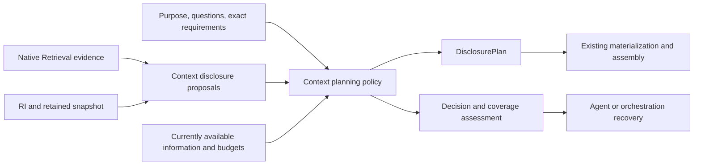
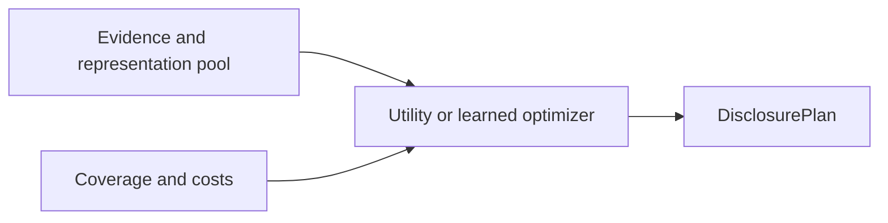
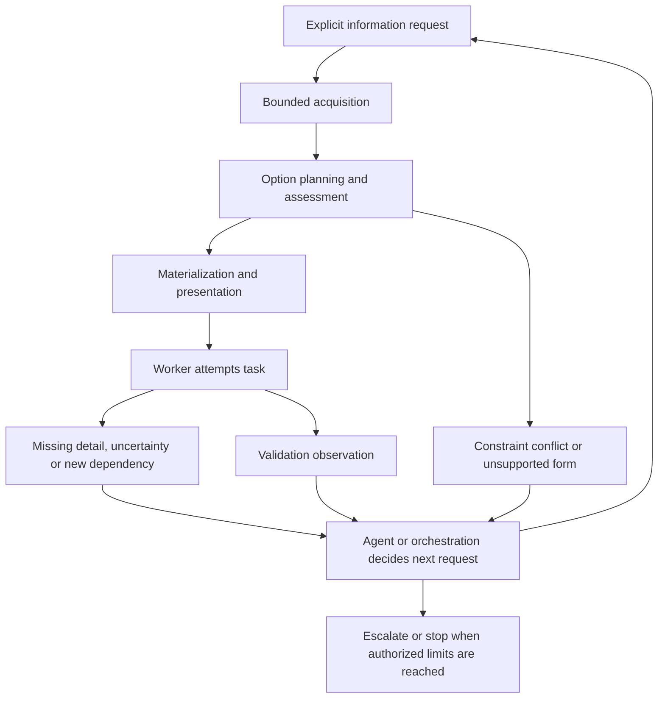

# Heterogeneous evidence admission and Context recovery

## Later disposition: obligation-driven Localization

[ADR-0005](../architecture/decisions/ADR-0005-obligation-driven-repository-localization.md)
and the [supplied Localization research](obligation-driven-repository-localization.md)
now distinguish task-obligation resolution from representation admission.
Context retains concrete option choice, availability and cost. Localization
owns stated obligation satisfaction, applicability and acquisition frontier.
The question-lane policy below, including its one-tenth floors and 2:1 weights,
is preserved historical research; it is no longer the next production baseline
and has never been implemented or evaluated. The native-evidence, fidelity,
identity, scoped-assessment and recovery distinctions remain useful. The roadmap
now starts with a bounded obligation kernel rather than this policy.

Investigation date: 2026-10-02. Starting point: clean `main` at
`0d5d3050664f8ff38b8ac1823bd0dc23b528aa38`. This record contains design reasoning
and an implementation specification, not implemented behavior or a new experiment.

## Recommendation and governing evidence

Choose **evidence-guided disclosure planning inside Context**. Admission is an
observable decision within that planner, coupled to representation and cost.
Do not add a mandatory resource-admission service between Retrieval and Context.
Introduce a bounded planning result beside the existing DisclosurePlan so that
choices, deferrals, constraint failures, open questions, and recovery targets
are inspectable even when no nonempty plan can be produced.

The information admitted is a **concrete disclosure option** about native
repository referents. A resource, declaration, occurrence, or relationship is
what the information concerns; its representation is what consumes disclosure
capacity. Retain those native identities without a universal InformationUnit
class or an exhaustive ontology. A pointer, exact recorded declaration range,
qualified fact projection, and whole resource are different options and serve
different requirements. A pointer cannot satisfy a source-reading requirement.

Inspected authority and implemented contracts:

- [Taxonomy](../architecture/taxonomy.md), [documentation map](../documentation_map.md),
  [architecture](../architecture.md), [roadmap](../roadmap.md), AGENTS.md,
  [ADR-0003](../architecture/decisions/ADR-0003-information-need-retrieval-evidence-and-ranking.md)
  and [ADR-0004](../architecture/decisions/ADR-0004-context-disclosure-planning-and-assembly.md).
- [Prior Context/graph research](repository-context-planning-and-graph-assisted-retrieval.md),
  research dispositions, B-0002 and superseded B-0008.
- Production lexical BM25, direct structural retrieval, resource composition,
  typed graph/PPR, repository-map ranking, explicit plans/materialization,
  qualified Reference disclosure, their package docs and representative tests,
  and the Evaluation identity-coverage kernel.
- Retained dogfood Cases 0001-0003, typed graph replay and repository-map replay
  reports. No sealed confirmation outcomes were accessed, rerun, or joined.

Repository Intelligence (RI) owns deterministic qualified repository facts.
Retrieval owns purpose-relative evidence. Personalized PageRank (PPR) expresses
query-conditioned graph diffusion; repository-map importance and compact
symbol relevance have separate meaning. Reciprocal Rank Fusion (RRF) combines
ranks without establishing sufficiency or independent corroboration.

| Case | Required resources | Full BM25 complete depth | Short BM25 complete depth | Other evidence |
| --- | ---: | ---: | ---: | --- |
| [0001](../../experiments/codex_dogfood/case_0001/README.md) | 7 | 35 | 132 | No required lexical miss rescued by direct structure |
| [0002](../../experiments/codex_dogfood/case_0002/README.md) | 10 | 43 | 87 | Later typed/map comparisons are diagnostic; map incomplete; full BM25/map RRF depth 139 |
| [0003](../../experiments/codex_dogfood/case_0003/README.md) | 19 | 348 | 180 | Full typed PPR 314, short 278; map finds 5/19; full/short BM25/map RRF 372/279 |

Full BM25 reaches every adjudicated required resource in these three frames.
That supports retaining broad lexical discovery, not a guarantee for other
tasks/repositories. Case 0003's frame and obligations differ substantially.
The short need helps Case 0003 after hurting the first two. There is no universal
query-form winner. Case 0003 retains a documented manifest metadata correction;
its algorithm was unchanged, but the prospective protocol was imperfect.

Structural channels promote implementation substrates that lexical ordering
places deep. They have rescued no required lexical miss in these cases.
Map omission combines missing facts for governance/docs/configuration with an
eligible-symbol limitation for import-only facades. New configuration facts
remain unprojected. Equal resource RRF worsens complete depth in both query arms
of Cases 0002 and 0003. These observations justify differentiated use of channels,
not their deletion or a default fused ranking.

Required-resource judgments measure task obligations at resource granularity.
They do not label sufficient spans or representations. Agent opens/edits do not
automatically identify required resources. Recovery from advisory omissions is
observed; recovery reliability and exploration savings have not been measured
against a comparable control. This investigation makes no new performance claim.

## Architecture alternatives

### A. A standalone resource admission gate

Retrieval supplies rankings; an additional service selects a resource set;
Context subsequently chooses representations. This is viable for a consumer
whose only supported form is whole files. It offers a simple file-set interface
and learned file usefulness could replace its policy.

Its cost here is two decisions over the same scarce capacity: admitting a large
file ignores cheap declaration options, while rejecting a file can eliminate
a useful symbol. Current explicit plans would still require a second decision.
Migration requires a new owner or duplicates Context responsibility. Autonomous
workers receive a brittle file boundary and future Learning loses representation
counterfactuals unless a second dataset is maintained. Reject as the general
architecture; a whole-resource-only policy may remain a Context specialization.

### B. Context-owned option admission and assessment (recommended)

Context interprets evidence for supported representation proposals, admits
options under constraints, and returns an assessment alongside the immutable
plan. Retrieval retains native ranking ownership. Evaluation assesses outcomes
later. This reuses PlannedDisclosure, plan lineage and snapshot materialization.
Migration adds policy/results and concrete source/pointer forms; callers can
continue using explicit plans. No compatibility fork or mandatory pipeline
is required. Autonomous workers gain inspectable choices and recovery handles.
Learning can replace proposal preference/stopping while keeping hard guards.

The disadvantage is real implementation work for option costs, source overlap,
native evidence validation, and honest coverage semantics. That work is already
in Context's accepted responsibility. A planner will still need explicit caller
purpose/questions; it cannot infer every obligation deterministically.

### C. Agent-directed acquisition with orientation only

The agent owns successive information requests; Context only materializes chosen
information. Current Codex exploration already supports this pattern, so its
migration cost is low and it remains an escape path/control. It avoids an
unvalidated automatic admission rule. It also leaves information costs, coverage,
and recovery quality model-dependent; cheaper workers or restricted tools may
fail to recover. Learning observations would confound request formulation,
search capability and disclosure policy. Keep this consumer mode, but choose B
to provide reusable infrastructure and a deterministic baseline.

### D. Joint utility optimization or a learned planner immediately

This is a viable policy inside B, with potential marginal contribution,
diversity and cost advantages. It interacts naturally with option identities
and existing plans. Migration requires calibrated utility features or justified
objective assumptions plus representation-level outcomes. Current file labels
and correlated rankers do not supply them. A Pareto frontier alone leaves the
choice among many nondominated options unanswered. No submodular guarantee
follows merely from writing a greedy utility formula. Defer the optimizer,
not its Context-owned seam, until matched prospective outcomes support it.

## Ownership and the meaning of each operation

| Operation | Owner and contract |
| --- | --- |
| Candidate generation | Retrieval: bounded surfaced native referents; scope/truncation explicit |
| Evidence correlation | Retrieval's existing composition where supported; Context's operation-local adapters correlate additional native inputs without replacing them |
| Evidence interpretation | Context planning policy: why an observation supports a particular option for the supplied question; no new RI claims |
| Ranking | Retrieval's native within-channel order; optional identified rankers remain separately available |
| Admission | Context: choose or defer concrete options under the current purpose, availability and constraints |
| Budgeting | Context: cost basis, ceilings, mandatory conflicts, actual realization cost; consumer adapter supplies hard model constraints |
| Representation choice | Context: explicit permitted form and fidelity; no silent whole-file fallback or compression |
| Disclosure ordering | Context plan records stable choice order; model-input assembly may use a separately identified presentation policy |
| Recovery control | Agent/orchestration: whether to attempt, request more, validate, retry, escalate or stop; narrow Runtime does not acquire this loop |
| Assessment | Context owns bounded planning/availability assertions; task owner owns acceptance; Evaluation owns comparison validity and controlled comparisons |

Native referent identity remains the unit for evidence correlation. Concrete
option identity remains the unit for admission. One relationship option can
reference multiple resources and occurrences. Source overlap is keyed by
repository, snapshot, address, content identity and exact interval; semantic
fact identity is a separate coverage dimension. Identical text or repeated
appearance in related channels is not independent evidence.

Do not create a universal normalized score, Selection domain, required-resource
oracle, persistent need graph, or ModelKnowledgeState. An InformationNeed can
be carried by a planning request without acquiring an independent lifecycle.
Task decomposition can be human/model supplied and is provenance-bearing
hypothesis; it is not deterministic repository truth.

## Deterministic baseline: question-directed evidence lanes, version 1

This specifies an executable first policy, not demonstrated superiority over
BM25. It improves the decision structure: explicit requirements, multiple forms,
protected lexical access, bounded structural exploration, overlap accounting
and recovery. Its task utility must be measured prospectively.

### Inputs

1. One retained RepositorySnapshot and explicit root purpose/task text.
2. Ordered, uniquely keyed planning questions. A single root question is valid;
   decomposition is optional. Each question has text, allowed representations,
   typed anchors where known, and zero or more explicit mandatory disclosure
   requirements. Distinguish a question from an exact requirement such as
   "make this entire observed resource available." Do not derive mandatory
   requirements from retrieval ranks or final adjudication labels.
3. Caller-bound native results for each question: full-task BM25 and optionally
   focused/short-query BM25, direct structural results, typed PPR, repository
   map. Preserve which query/result belongs to which purpose. The planner does
   not execute retrieval or silently reformulate the task. A missing channel
   is unavailable evidence, not opposition. A channel that failed is recorded
   differently from a successful empty result.
4. Explicit currently available disclosure manifest, including concrete option
   identities, exact source footprints and fact IDs actually still presented.
   Prior-plan lineage alone is not this manifest. Availability is supplied by
   the consumer, not inferred from conversation history or model comprehension.
5. Remaining hard and initial-policy UTF-8 byte ceilings, mandatory requests,
   permitted forms, work bounds and versioned policy parameters. Both ceilings
   are required caller inputs; no repository-wide magic budget is selected.
6. Exact native declaration/Reference analyses needed to validate supported
   fine-grained options. No parsing in the planner, mutable-tree reopening,
   filename-based governance inference, or invented signature spans.

Use existing snapshot validators for lexical corpora and graph views and native
fact/source checks. Graph/map/direct inputs must match the question's bound
purpose and snapshot. BM25 has no purpose field, so the caller's binding is
explicit and retained. Different query arms remain distinct; their raw scores
are never compared across arms. Reject inconsistent dependencies; do not hide
an invalid provided channel by silently treating it as missing.

### Proposals and supported representations

A narrow DisclosureProposal holds a concrete PlannedDisclosure, native referent
references, question key, supporting native observations, source/fact coverage
footprints, measured cost basis and expansion targets. It is not a new RI fact
or a mandatory abstract superclass for repository entities.

All concrete options in one resulting DisclosurePlan carry the common root
disclosure purpose, preserving the existing plan's compatibility rule. Question
keys and each native result's bound acquisition purpose remain separate in the
proposal/decision account. Do not rewrite a native result's purpose to make it
look compatible. Multiple question supports may therefore explain one selected
option without producing duplicate options or a mixed-purpose plan.

The first coherent implementation should support:

- Existing whole-resource and qualified imported-function Reference options.
- A snapshot-bound resource/declaration pointer, explicitly labelled orientation.
- Exact **recorded declaration ranges** for supported functions, classes and
  direct methods, retaining their native analyses and source identities.
- A bounded knowledge-only projection of the currently supported qualified
  Reference fact, so a fact can remain disclosed when its source is already
  available without repeating the original source payload.

A Python AST declaration range begins at its declaration node and can omit
decorators, preceding imports and other context. It must not be called a complete
behavioral definition or satisfy a whole-resource requirement. Do not invent
signature-only spans. Source forms belong to Python Context disclosure;
resource pointers/whole resources and the planning policy belong to planning.
Reuse and, where necessary, relocate the canonical UTF-8 range extractor rather
than duplicating function-only extraction for classes/methods. Preserve current
qualified Reference route/type limits. Broader Reference renderers, arbitrary
windows, signature extraction, maps and synthesized summaries are separate work.

Representation follows explicit question intent/allowed forms. A module-edit or
resource contract request can require whole source. A declaration-reading request
can allow the recorded range. A relationship question can allow fact projection.
A discovery/orientation question can allow pointers. No automatic preference
for the smallest representation irrespective of the question. A cheaper pointer
is never an implicit replacement for required source. Unsupported requested
forms return a visible assessment and an expansion alternative.

### Eligibility and within-lane order

Maintain lexical and structural groups for each question, preserving all native
evidence on every proposal. These are policy lanes, not new Retrieval channels.

| Lane | Eligibility | Stable native order and role |
| --- | --- | --- |
| Resource BM25, one lane per supplied query arm | Positive native score at or above the arm's relative floor | Native rank; whole resource unless another supported form is explicitly justified; preserves docs/config/facades |
| Direct structure | Exact supplied seed and explicitly permitted family/direction; default Imports and References only | Seed ordinal, family ordinal (Reference then Import), direction ordinal (outgoing then incoming), canonical target path, native fact identity |
| Repository map | Positive compact symbol lexical match at or above its relative lexical floor | Native map symbol rank; its importance remains inspectable and affects this order; recorded source or pointer according to intent |
| Typed PPR | Converged result; positive resource score above its relative floor; positive incoming Import/Reference/direct-base fact flow | Native PPR rank; exact winner declaration when supported/allowed, otherwise whole source; no claim of a traced path from an explicit anchor |

Map global-only symbols do not qualify for automatic implementation-source
admission in version 1. Explicitly requested global orientation can use supplied
pointer choices; building an automatic global map renderer is separate. For PPR,
restart/personalization or containment-only incoming mass is insufficient for
the structural lane. Preserve same-resource versus cross-resource support;
neither is a semantic usefulness label. Nonconverged PPR abstains in this policy
while its native result is retained. Config selectors, membership and mirrored
paths do not enter default relationship closure. A caller can supply separately
reviewed explicit choices without altering the policy's default family list.

Direct closure is **one supplied relation hop** from an explicit anchor under
allowed semantics. It supplies proposals, not mandatory dependencies. Imports,
syntactic Calls, package membership and inheritance do not establish that every
endpoint is needed for every task. Additional hops require a new bounded
acquisition request above planning. No automatic traversal occurs in the planner.

Relative floors compare a score only with the maximum positive score of that
same native result: `score >= alpha * maximum`. For map this is compact lexical
BM25, not its RRF score. Missing support does not become a negative label.
Mandatory exact choices bypass heuristic floors but still obey applicability,
authorization supplied by the caller, permitted fidelity and hard capacity.

### Freeze as development policy

Freeze `question-directed-evidence-lanes-v1` before its first prospective use:

- Relative lexical, symbol-lexical and PPR floors: `alpha = 1/10` separately.
- Equal question weight; within each question lexical group weight 2 and
  structural group weight 1. Split each group's weight equally among its
  currently active lanes. Removing an exhausted group releases capacity to the
  remaining group. Preserve the outer equal-question share among active questions.
- No default resource RRF, support-count bonus, global-only symbol admission,
  implicit source-role boost or fixed admitted resource count.
- Stable canonical ordering; byte ceilings and finite proposal-work bound are
  supplied per invocation. They are resource limits, not required-resource counts.

These numeric values are transparent experimental starting parameters, selected
without replaying or optimizing case outcomes. They are not calibrated
probabilities or architecture truths. Freeze the complete request/configuration
before new-task retrieval and worker behavior. Do not tune Cases 0001-0003.

### Selection algorithm

1. Validate the snapshot, purpose bindings, native inputs, available manifest,
   required forms and budget/cost semantics. Generate bounded proposals lazily
   from the supplied result surfaces; retain work-limit/truncation status.
2. Resolve mandatory exact requirements in caller order. Exact overlap may
   satisfy a matching source requirement, but pointers and a fact ID cannot
   satisfy source requirements. Preserve fact projection independently. If a
   required choice is absent, unsupported, unauthorized under supplied policy,
   stale or exceeds hard remaining capacity, return a blocked planning result
   with no automatically executable plan. Do not silently omit the requirement.
3. If mandatory choices exceed the initial soft ceiling but fit the hard ceiling,
   retain them, select no optional items and report that exception. Otherwise
   start optional allocation with the remaining initial-policy capacity.
4. For each active lane find its highest-priority eligible proposal with a
   permitted representation, novel requested information and a fitting measured
   incremental cost. An oversized head is deferred with its cost/reason; it
   cannot prevent considering a later fitting item. A permitted alternative form
   is a distinct choice, never silent truncation or compression.
5. Among lanes with a fitting proposal choose minimum
   `charged_incremental_bytes / effective_lane_weight`. Effective weight is the
   active question share times the active group share times its lane share.
   Use rational comparisons; ties use question ordinal, group order (lexical
   before structural), lane ordinal, native order key, canonical referent and
   option identity. Select that lane's proposal and charge only that lane.
   The same option in other lanes is removed, with all evidence retained and
   no additional agreement vote. Different source options for the same referent
   remain distinct until source/fact coverage establishes redundancy.
6. Recompute availability, marginal source/fact coverage, actual rendered cost
   and active lanes after every choice. Repeat without a selected-file count.
   Current information can make a proposal redundant while a distinct fact
   projection remains novel. Each selected new item must have positive cost or
   genuinely new semantic coverage; finite input/work bounds prevent loops.
7. Stop on no eligible novel option, no permitted fitting option, initial
   capacity reached, mandatory exception, or proposal-work limit. Record each
   reason, deferred targets and open questions. Do not label a threshold horizon
   as repository-wide saturation or sufficient Context.

Byte service controls influence without pretending native scores share a scale.
Related graph/map outputs share the structural group's capacity; adding a
correlated channel cannot multiply that group's nominal allocation. This is
not a proof of independence, optimality or improved recall. Large options can
still dominate charged cost and floors can exclude a useful weak match; these
are explicit risks for evaluation and recovery.

### Cost and overlap contract

Measure exact UTF-8 bytes of the prospective rendered disclosure, including
item headings, provenance text and plan wrapper. Source length alone is not
this cost. Previewing a supported source-preserving materialization from retained
state for measurement does not mean it has been presented. Reuse canonical
renderers/extraction and measure the final combined text; item counts/order can
change wrapper overhead. Revalidate on actual materialization and fail/replan
if the selected plan violates its measured ceiling. Do not truncate in assembly.

The byte ceiling is a deterministic development accounting basis. It does not
prove a model token-capacity fit. A consumer adapter must account for task,
instructions, tools, conversation and output reserve and perform the hard
token check with its actual tokenizer/serialization before execution. A failed
check returns for replanning; bytes are not called tokens. No universal tokenizer,
pricing adapter or multidimensional optimizer is needed in the first slice.

Deduplicate identical concrete options. Whole source contains its recorded
declaration/source intervals, but it does not automatically expose a semantic
fact annotation. Preserve distinct fact identities and reasons even when their
supporting source is already available. Version 1 conservatively selects
already available/fully contained source only once, with explicit fact-only
options where supported. Partially overlapping optional source forms are
deferred unless an existing explicit option supplies the union without changing
meaning. Conflicting mandatory overlap cannot be silently dropped; either choose
the authorized whole-resource form or report unsupported composition. This avoids
introducing arbitrary source-window union/rendering merely to optimize the first
policy. Source/content equality is required; unrelated equal strings do not merge.

### Output, identity and provenance

A DisclosurePlanningResult contains an optional existing DisclosurePlan,
ordered proposal decisions with reasons, source/fact coverage ledger, costs,
mandatory requirement assessments, unanswered question keys, truncation/channel
status and scoped recovery targets. No eligible choices is an abstaining result
with `plan=None`; current DisclosurePlan requires a nonempty choice tuple.
Assessment belongs beside the plan rather than changing its meaning or making
an empty plan a compatibility case.
If every exact requirement is already available and no novel option is selected,
record `already-available/no-additional-disclosure` rather than a mandatory
failure. That records the request frame only, not general task sufficiency.

The existing plan identity continues to identify what was selected, its purpose,
snapshot, order and preceding-plan lineage. A separate deterministic decision
identity identifies why: versioned policy/configuration, ordered questions and
requirements, exact input dependencies/surfaces, current-availability manifest,
cost basis/ceilings, considered decisions and stop reason. Do not make plan
identity change merely because unused retrieval evidence changed.

Native results lack one common identity API. Use operation-local canonical
fingerprints of retained basis: snapshot and exact corpus/document dependencies,
query and retriever settings, graph projection/nodes/contributions/transitions,
ranked referents/native measurements and cited fact/declaration identities.
Length-frame values, define stable finite-float encoding, and exclude runtime
timings from semantic identity. Do not hash `repr`, mutable object addresses,
pickles or the working tree. Retain native input references and fingerprint
semantics so replay can validate them. This introduces no durable native-result
schema or standalone relevance-evidence identity requirement.

## Sufficiency and recovery

Before execution the system can establish applicability, materialization
integrity, byte fit, exact requested representation presence and evidence-frame
coverage. It cannot generally establish that every unknown task obligation is
represented or that the model will use the information correctly.

| Assertion | Who may establish it and what it means |
| --- | --- |
| Evidence coverage | Supplied channel/frame accounting; no relevance or sufficiency implication |
| Structural completeness | Only within a named RI family's declared coverage, never general repository completeness |
| Representation completeness | Requested exact source/form was faithfully supplied; a pointer or recorded AST range has narrower scope |
| Explicit requirement coverage | Matching options currently available for caller-declared requirements; declaration of requirements can itself be incomplete |
| Question answered | Caller/model/human assessment with rationale/support; retrieval support alone cannot establish it |
| Predicted sufficiency | Future calibrated purpose/consumer-specific estimate with model and validation population; presently unavailable |
| Worker uncertainty | A reported signal, possibly useful and possibly miscalibrated; absence of uncertainty does not establish adequacy |
| Post-task adequacy | Bounded outcome evidence against task acceptance; passing validation does not by itself identify Context's causal contribution |

Do not introduce a general boolean ContextSufficiency artifact. Implement
bounded coverage/constraint assessment in the planning result now. A caller can
decide to attempt the task with open questions visible. Learned sufficiency
prediction may later attach to this record with explicit scope and calibration;
it cannot replace source integrity or become RI truth.

Use two bounded Context request operations: **acquire for a stated question**
and **expand an exact disclosure target to an explicitly requested form**.
Their request carries the purpose, snapshot or acquisition scope, known typed
anchors, currently available manifest, previous plan/request reference, trigger
provenance and resource limits. Their response carries a new planning result
and, when successful, faithfully realized disclosure. The semantic contract is
accepted now; no transport protocol, Tool registry or generic executor is added.

Exact expansion resolves retained addressed information directly; it need not
run relevance search. A new question can invoke bounded retrieval. Planner
assessment supplies open questions/targets, but the planner does not execute an
agent retry loop. Agent/orchestration owns escalation, repeated requests,
attempt/time/cost limits and validation interpretation. Tools can expose the
requests later under existing authorization boundaries. Ordinary search/open
remains available to appropriately authorized workers.

Validation failure triggers investigation, not an assertion that Context is
missing or an automatic retry. Detect repeated equivalent requests with no new
available information and report no progress; orchestration decides escalation.
After edits, acquire a new snapshot and recheck dependencies. Old disclosures
may be historical evidence but must not masquerade as current source. Current
whole-snapshot plan constraints require a new plan for the new snapshot; cross-
snapshot reuse is not silently added. Never infer availability after compaction
from a historical disclosure ID alone. Recovery capability is an input promise
from the consumer; when unavailable, deferred mandatory information blocks the
attempt and optional omissions remain explicit risks. Reliability must be measured.

## Role of graph evidence and next graph work

Direct relations are useful for bounded explanation and new acquisition targets,
not automatic dependency closure. Typed PPR offers a relational exploration lane
only with actual fact-flow support; it need not replace resource BM25. Repository
map lexical matches localize source options; importance helps native ordering
and explicit orientation, not governance authority. Declaration-free resources
remain eligible through lexical/direct resource evidence.

The next use of graph channels is therefore **consume existing native loci and
facts in option planning**, then measure novelty, representation cost and recovery
benefit. Do that before another ranking adjustment. Configuration-fact projection
and facade participation remain concrete separate Retrieval pressure; they are
not postponed indefinitely, but should follow diagnosis of representation/admission
loss rather than be mixed into this first policy comparison. Broad selector facts
must not automatically receive equal dependency transitions. No graph weight,
projection, centrality or aggregation parameter changes in this investigation.

## Evaluation and future Learning

Retain now, locally to the responsible operation, enough correlation for replay:
task/question/request basis and provenance; snapshot/frame; query arms and native
channel settings/status/costs; complete bounded candidate surface; considered
option identities and footprints; estimated/actual rendered costs; eligibility
and deferral reasons; current-availability manifest; policy version/parameters;
selected plan, realized/presented content; recovery triggers/requests; validation
observations; worker/model/tool configuration; task acceptance and limitations.
Report missing telemetry explicitly. Use existing Evidence mechanisms for actual
execution observations where applicable; do not create a Trace/Telemetry framework.

| Responsible owner | Measurements |
| --- | --- |
| Retrieval | Native reach and misses by resource family, rank depths, channel novelty, input/frame completeness, construction/query latency and work bounds |
| Context | Option admission precision, required information represented at cumulative cost, source/fact redundancy, unsupported forms, cost prediction error, mandatory failures, open questions and realized/presented differences |
| Agent/orchestration | Requests, opens/searches, no-progress recovery, successful recovery, validation attempts, task success, latency/compute/tool limits and escalation |
| Evaluation | Valid identity joins, frozen frames/configurations, blind labels, valid controls/interventions, missing observations and appropriately bounded comparisons |
| Future Learning | Label origin, data splits, policy/action exposure, calibration, task/model/tool covariates, held-out performance and counterfactual limits |

Use Evaluation's identity-coverage kernel for frame/observation completeness.
Context owns meanings of option coverage/fidelity; Retrieval owns its rank
semantics; task owners define acceptance. No generic metric registry is needed.

Prospectively compare this policy against full-task BM25 whole-resource planning
under the same actual presentation budget and the existing agent-directed
orientation/search mode. Optional ablations remove structural lanes or vary
representation while retaining comparable purpose/constraints. Freeze before
new-task retrieval, adjudicate resources and sufficient representations blind
to rank/agent behavior, and freeze judgments before joining. Cases 0001-0003
are diagnostic only. Never treat omitted or unopened options as negative labels.
Report all required obligations, recall over depth/cost, last required coverage
cost, helpful/unnecessary information cost, omitted mandatory targets, structural
rescues, recovery success/failure and actual task outcome. No fixed top-five
evaluation and no savings claim without a comparable control.

Learning can later replace option preference, representation preference,
allocation, stopping prediction, retrieval application choice or request
decomposition. Keep deterministic snapshot/authority/capacity/fidelity guards
outside learned preferences. Model outputs can propose targets/questions but
cannot establish unsupported RI facts. Deterministic logs have no exploration
propensities or counterfactual usefulness labels; off-policy causal claims
require controlled variation or a justified prospective exploration design.
Successful task execution is not a blanket positive label for every disclosure.

## Decisions, limits and exact next increment

**DECIDE NOW:** Context-owned option admission; native referent identities;
observable planning assessments; separate scoped coverage dimensions; explicit
current availability; two request semantics; recovery control above Runtime;
specialized evidence roles; no universal score or sufficiency boolean.

**FREEZE AS DEVELOPMENT POLICY:** version 1 eligibility, 1/10 within-result
floors, equal question allocation, lexical/structural group weights 2:1,
byte accounting, supported forms and tie rules. These are replaceable policy
parameters, not empirical claims.

**MEASURE NEXT:** sufficient representation labels, precision/coverage at actual
cost, structural-lane contribution, threshold losses, whole-source versus
recorded-range fidelity, recovery completion and matched worker outcomes.

**DEFER WITH SPECIFIC EVIDENCE:**

- Learned utility or sufficiency probability: needs independently frozen option-
  and task-level outcomes, consumer covariates and calibration/control evidence.
- Automatic task decomposition: needs evaluation of omitted obligations and
  recovery under caller versus model-derived questions, not simply more query hits.
- Signature/decorator-aware or summary representations: needs a justified
  source/semantic contract and sufficient-representation adjudication. Existing
  AST ranges do not supply it.
- A transport/Tool wrapper and autonomous recovery controller: needs a concrete
  authorized worker integration with measurable no-progress and resource-limit
  behavior. Semantic requests and pure planning can be implemented first.
- Configuration graph weights/facade map participation: needs a separate fixed
  projection hypothesis and prospective diagnosis showing remaining candidate
  reach/representation loss after consuming current evidence.

The then-next implementation proposal was **evidence-guided repository disclosure
planning version 1** under `devtools.context.planning`, with Python-specific
recorded-range/qualified-fact options under Python Context ownership. Implement
native evidence adapters, request/proposal/result records, exact byte measurement,
source/fact coverage, the policy above and pure expansion targets. Reuse existing
plans/materializers and validators. Do not implement an orchestration loop,
retrieval executor, new graph projection, learned policy or model transport.

Focused validation must exercise snapshot/corpus/fact mismatches, mixed purpose
bindings, duplicate/correlated evidence, ties, threshold boundaries, unsupported
forms, decorator scope, whole/span containment, partial overlap, independent fact
coverage, cost including headers, mandatory overflow, missing channels,
nonconvergence, no-plan outcomes, current versus historical availability, bounded
work, deterministic replay and recovery lineage. Run the protected development
profile and normal static/staged gates. Plan the next natural-task prospective
comparison before observing new retrieval outputs; do not invent an implementation
task just to manufacture a case.

Recommended implementation worker: **GPT-6 Sol, High effort**. The coherent slice
crosses evidence applicability, representation fidelity, overlap, cost and identity;
the main risk is a silent semantic strengthening rather than arithmetic complexity.

## Disposition

The Context-owned boundary, bounded assessment and request/recovery semantics
refine [ADR-0004](../architecture/decisions/ADR-0004-context-disclosure-planning-and-assembly.md)
without creating a new domain or lifecycle. Central architecture summarizes the
accepted, unimplemented direction. This record owns alternatives and the concrete
development policy; B-0002 preserves its implementation pressure and roadmap
selects the next bounded build. It supersedes the earlier research's proposed
default weighted resource RRF and generic scalar utility as the next baseline,
not its broader hypotheses. Existing native channels and caller-directed APIs
remain implemented; no automatic planner, sufficiency predictor or recovery
controller is claimed by this documentation checkpoint.
