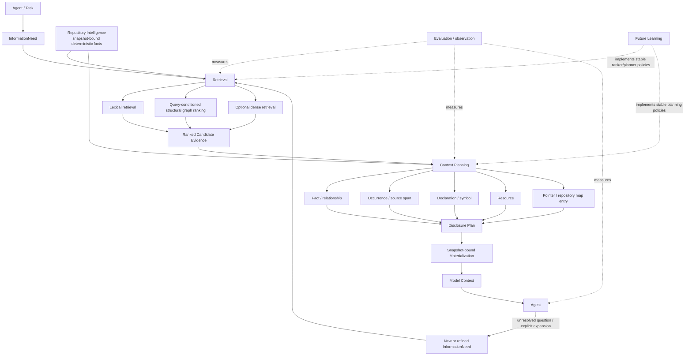
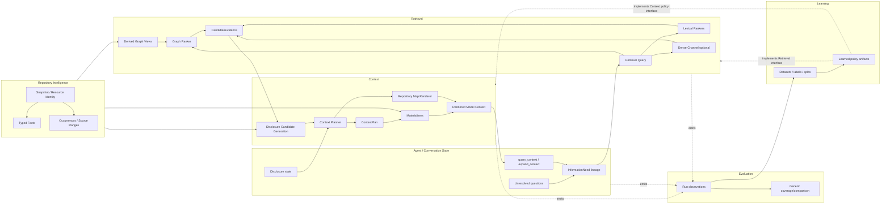
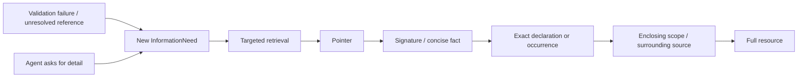

# Architecture for Repository Context Planning, Progressive Disclosure, and Graph-Assisted Retrieval in `devtools`

## Executive conclusion and architectural decisions

The central architectural decision is this:

> **`devtools` should not insert a new top-level `Selection` domain between Retrieval and Context. It should make Context Planning first-class inside the Context domain, while making ranked heterogeneous evidence a first-class Retrieval contract.**

The target pipeline should therefore be:



The existing separation among Repository Intelligence, Retrieval, and Context is fundamentally sound. The weak point is not over-separation among those three domains; it is that **Retrieval currently stops too early at heterogeneous evidence, while Context currently starts too late at caller-selected facts**. The missing architectural object is a snapshot-bound, provenance-preserving contract that lets ranked evidence become *candidate disclosure choices*, followed by a planner that decides granularity, ordering, cost, and recovery.

Your experimental program already establishes several things strongly enough to act on. Lexical retrieval is a serious recall backbone, but fixed small K is untenable: both real dogfood cases required going tens of ranks deep for complete required-resource coverage. Structural information has genuine complementary value because 17 known-useful structural pairs were outside all five positive lexical universes, but raw Graph-1/Graph-2 expansion was extremely noisy. Dense retrieval has not justified becoming a production-default channel, but eight cases are nowhere near enough to reject it as a future channel. Most importantly, the Graph-1/Graph-2 result disproves **unranked typed breadth expansion as a relevance mechanism**, not structural retrieval generally. fileciteturn0file0

The strongest next graph hypothesis is therefore **query-conditioned weighted diffusion over a deliberately constructed structural graph**, not another hop-count experiment. Aider is particularly important here because its actual implementation does not perform unranked dependency BFS: it builds a weighted file graph from symbol definitions/references, changes weights based on identifier and chat relevance, uses personalized PageRank, distributes graph flow back onto definitions, and renders only ranked definitions that fit a token budget. citeturn20search1turn20search8

The strongest immediate production build, however, should be **the Context Planning substrate**, not the graph ranker in isolation. Your two real Codex dogfoods already show a concrete present problem—candidate volume and coarse handoff—even though lexical retrieval found all required resources. The graph ranker should be the next retrieval phase plugged into that substrate. This ordering attacks a demonstrated production bottleneck without deferring the graph decision.

The principal decisions are:

| Decision | Recommendation | Status |
|---|---|---|
| First-class `Selection` domain | **No.** Selection is an operation performed by Context Planning, not an independent semantic domain. | **DECIDE NOW** |
| First-class Context Planning | **Yes**, inside Context. Separate planning from materialization/rendering. | **DECIDE NOW** |
| Fundamental unit | `InformationUnit` semantic identity plus one or more `DisclosureOption` representations. | **DECIDE NOW** |
| Resource-first vs unit-first | **Hierarchical mixed-unit planning**; resources are orientation containers, not universal atomic selections. | **DECIDE NOW** |
| Universal graph | **No.** Keep shared RI facts and purpose-built typed graph projections. | **DECIDE NOW** |
| Repository map | **Yes**, but as a task/budget-conditioned Context rendering over RI and retrieval scores, not repository truth. | **DECIDE NOW** |
| Map ownership | Context renderer consumes RI + Retrieval evidence; persistent inputs remain RI. | **DECIDE NOW** |
| Next graph algorithm | Weighted query-conditioned **personalized PageRank / random walk with restart** over a symbol-labelled resource dependency view. | **DECIDE NOW** |
| Heterogeneous deterministic ranker | Weighted reciprocal-rank fusion of independently meaningful ranked channels. | **DECIDE NOW** |
| Structural ranking | Structural facts generate a PPR-ranked channel; raw relation counts remain evidence/features. | **DECIDE NOW** |
| Fixed K | Reject as a sufficiency model. Use evidence horizon + budget + explicit recovery. | **DECIDE NOW** |
| Initial stopping rule | Deterministic evidence/marginal-utility floor plus budget and safety ceiling; never call this “sufficiency.” | **PROVISIONAL DECISION** |
| Minimum Context abstraction | Information unit, disclosure option, materialized context item, context plan. | **DECIDE NOW** |
| Progressive disclosure | Deterministic initial granularity plus agent-requested expansion; later allow planner-triggered escalation. | **DECIDE NOW** |
| Agent recovery | Stable `query_context` and `expand_context` operations plus ordinary source inspection fallback. | **DECIDE NOW** |
| Evaluation ownership | Generic comparison/coverage mechanics and pipeline run records; not universal relevance semantics. | **DECIDE NOW** |
| Retrieval-specific evaluation | Candidate/rank/retrieval metrics and relevance interpretation. | **DECIDE NOW** |
| Context-specific evaluation | Information coverage, materialization integrity, disclosure size, overlap, recovery behavior. | **DECIDE NOW** |
| Learning ownership | Dataset construction, feature matrices, labels, splits, training, calibration, model artifacts. | **DECIDE NOW** |
| Learned-policy interfaces | Owned by the consuming domain: Retrieval ranker interfaces and Context planning/stopping interfaces. | **DECIDE NOW** |
| Dense retrieval | Keep as pluggable channel; do not make production-default from current evidence. | **DEFER default enablement** |
| Generated summaries | Representation protocol should permit them, but do not make them an initial production representation. | **DEFER enablement** |
| Calibrated relevance/sufficiency | Do not implement until representative labeled tasks exist. | **DEFER** |
| Graph relation weights/cutoffs | Ship explicit deterministic defaults behind configuration and evaluate prospectively. | **PROVISIONAL DECISION** |
| Immediate production implementation | Context Planning and disclosure substrate, including Retrieval→Context evidence contract. | **DECIDE NOW** |

The architectural north star is therefore not “find the right files.” It is:

> **Maintain a recoverable, provenance-preserving policy over heterogeneous repository information, with Retrieval responsible for evidence and Context responsible for disclosure decisions.**

## Diagnosis of the current system and the graph discrepancy

**What the experiments actually established.** The strongest negative result is narrower than it first appears. Graph-1 produced 704 novel case/resource pairs and 10,550 typed paths; only 2 of 128 randomly sampled unresolved candidates were judged useful. Graph-2 produced 987 novel pairs and 294,154 complete paths; none of the 128 sampled unresolved candidates was useful. Both also exhibited reverse-import fan-out and return/reversal paths. Yet the complete structural surface still contained known-useful resources absent from every positive lexical universe. The defensible conclusion is therefore: **reachability has structural recall value, but unranked reachability is a bad approximation to task relevance**. fileciteturn0file0

The dogfood results reinforce a different problem. In both real tasks, full lexical retrieval eventually covered every required resource, but the last required resource appeared at ranks 35 and 43 using the full task prompt, and still deeper—132 and 87—using the shortened InformationNeed. That says two things: fixed K=5 is structurally wrong for multi-resource engineering tasks, and **InformationNeed must not replace the richer root task text as retrieval evidence**. A derived sub-need should augment the root task, not erase it. fileciteturn0file0

### Why Graph-1 and Graph-2 failed

Most of the suspected criticisms in the prompt are applicable, but not equally.

| Suspected problem | Assessment | Architectural consequence |
|---|---|---|
| Unranked expansion | **Definitely applicable.** Reach was effectively treated as the principal inclusion criterion. | Graph reach must become a feature or ranked distribution, not relevance truth. |
| Equal treatment of relation types | **Applicable at the ranking layer.** Types were retained, but there was no learned or defensible relation-conditioned relevance score. | Keep types; assign explicit directional semantics and provisional weights. |
| Free inverse Imports | **Strongly implicated by observed fan-out.** | Do not add inverse-import transitions to the default diffusion graph. Expose reverse dependency as a separate query/view. |
| High-degree hubs | **Definitely applicable.** | Use transition normalization and query restart; never enumerate every downstream path. |
| No degree normalization | **Applicable.** | Use a normalized transition matrix. |
| No query conditioning | **Applicable to expansion after its initial seeds.** | Personalization must remain present throughout ranking. |
| Weak seeds | **Possible, not demonstrated.** | Preserve full task text and multiple seed sources; measure ablations. |
| Resource-level graph only | **Potential limitation, not demonstrated cause.** | Preserve symbol/occurrence evidence on resource edges and rank definitions after resource diffusion. |
| Loss of occurrence specificity | **Applicable to file projection.** | Every aggregate graph edge must retain contributing RI-fact IDs and occurrences. |
| Treating reach as relevance | **Core failure.** | Reachability becomes a candidate-generation primitive only. |
| No path decay | **Applicable.** | PPR restart provides geometric attenuation without explicit hop enumeration. |
| No relation weighting | **Applicable.** | Call/reference/import contributions must differ. |
| No restart probability | **Applicable.** | Personalized restart limits structural drift. |
| No lexical prior | **Applicable.** | Lexical ranking should seed personalization and later fuse with graph rank. |
| No learned ranker | **Not itself a flaw.** | A deterministic PPR + fusion baseline is appropriate before learning. |
| Immediate reversal paths | **Definitely applicable.** | Default graph must not manufacture reverse edges and two-step returns. |
| Duplicate semantic paths | **Definitely applicable.** | Aggregate evidence by source, destination, relation family, and symbol; do not enumerate paths. |
| Fixed graph depth | **Applicable.** | Diffusion/restart should replace “Graph-1/Graph-2” as the primary ranking semantics. |
| Raw-frontier evaluation | **Important evaluation mismatch.** | Judge ranked graph outputs at realistic horizons and evaluate graph-only recall. |

The striking contrast with Aider becomes straightforward once its implementation is examined. Aider extracts definitions and references, constructs a `MultiDiGraph` whose nodes are files, and creates edges from a referencing file to files that define referenced identifiers. It does **not** treat every edge uniformly: identifier mentions, identifier shape, privacy, number of definitions, frequency, and whether the referencing file is currently in chat alter edge weights. Repeated references are damped with a square-root transformation. Aider supplies a personalization vector to PageRank when chat/mentioned files or identifiers provide it, and uses the personalization vector for dangling nodes as well. It then distributes each source node's PageRank across outgoing edges to rank `(definition-file, identifier)` pairs. citeturn20search1

Aider's output is equally important. The system does not dump its entire graph into the model. Its repository map contains file names and selected key definitions/signatures, uses `grep-ast`-style source structure to render those definitions, and searches for the largest ranked map that fits its current map-token allowance. The official documentation describes a default map-token budget and dynamic expansion when the chat lacks explicit files. citeturn20search8turn20search1

**Therefore, no: Graph-1/Graph-2 did not test the same hypothesis as Aider.**

Graph-1/Graph-2 tested approximately:

\[
\text{relevant}(v)\;\approx\;v\text{ is reachable from a structural seed within }h\text{ edges}
\]

Aider tests something closer to:

\[
\text{importance}(v\mid q,C)
=
\text{stationary flow into }v
\]

under a query/chat-conditioned, direction-sensitive, weighted, normalized transition process, followed by symbol-level projection and a strict prompt budget. citeturn20search1

Those are materially different retrieval hypotheses.

### What other coding systems actually support publicly

The broader comparative evidence points toward a **hybrid architecture of indexes plus on-demand retrieval**, not toward one dominant “repository graph solves everything” design.

| System | Publicly established architecture | What is *not* publicly established |
|---|---|---|
| **Aider** | Tree-sitter definitions/references; weighted file dependency graph; PageRank/personalization; ranked definitions; budgeted repo map; model can request more files. citeturn20search1turn20search8 | It is not an arbitrary semantic whole-repository knowledge graph. |
| **Cursor** | Syntactic code chunks, embeddings and semantic search; Cursor reports semantic search improving its own agent evaluations; current guidance says agents discover context with grep and semantic search on demand. citeturn20search0turn20search3turn20search11 | The searched official materials do **not** establish a dependency-graph/PPR retrieval architecture. Claims that Cursor uses such a graph should be treated as speculation. |
| **Sourcegraph/Cody** | Context comes from keyword search, Sourcegraph Search and Code Graph; Code Graph data contains definitions, references, symbols and doc comments from language-specific indexers; newer agentic context fetching iteratively invokes search, files, terminal, MCP and OpenCtx tools. citeturn20search2turn20search5turn20search4 | Public docs do not establish that every Cody request is ranked through PageRank or a generic graph-walk algorithm. |
| **Continue** | Legacy codebase context used embeddings/keyword retrieval and reranking; current Agent mode emphasizes file exploration/search tools and agent-driven navigation. citeturn3search0turn3search2turn3search9 | No well-supported public evidence found for a central repository graph ranker comparable to Aider. |
| **SWE-agent** | Explicit search/file-view tools; its ACI deliberately constrains observations, including roughly bounded file windows and succinct search results, because larger search observations can be confusing. citeturn4search1turn3search14 | Graph retrieval is not required by the published core interface. |
| **OpenHands** | Typed Action→Observation tool interaction, including shell/file/search-oriented operations; this strongly favors recoverable tool-mediated retrieval. citeturn4search0turn4search4 | A central structural graph ranker is not established as the default mechanism by the public materials reviewed. |
| **GitHub Copilot coding agent** | GitHub publicly documents repository indexing and semantic code search as context mechanisms available to Copilot/coding-agent experiences. citeturn5search5turn5search17 | Public material reviewed does not expose a graph-ranking algorithm. |
| **Codex** | OpenAI documents an iterative agent loop with tools, repeated observation/action cycles, sessions, and automatic context compaction for long-running tasks. citeturn18search11turn18search9turn18search7 | OpenAI's public documentation reviewed does not establish a hidden repository PageRank/dependency-graph retriever, so `devtools` should not design around an assumed one. |
| **Claude Code** | Public Anthropic documentation supports tool/MCP-mediated context and long-running context-management mechanisms. citeturn6search0turn6search2turn6search7 | No verified public basis was found for claiming a specific graph-ranking implementation. |
| **RepoPrompt** | Public implementation exposes explicit full-file, sliced and code-map forms with token estimates and reviewable selected context, demonstrating a practical mixed-representation model. citeturn7search0turn7search1 | It should not be treated as proof that one particular automatic selection algorithm is optimal. |

The research literature gives a similar answer. DraCo constructs a repository-specific context graph from code entities and extended dataflow relations and reports improvements over similarity/import-oriented baselines for repository-level completion. citeturn19search0 CodexGraph exposes a code graph database to an LLM agent so that the agent can construct structure-aware graph queries rather than relying exclusively on similarity retrieval. citeturn19search1 RepoGraph exposes a `search_repo <search_term>` operation returning definition/reference relationships for a requested class or function, which is fundamentally **seeded graph interrogation**, not unconditional breadth expansion. citeturn21search0 RepoCoder, from a different direction, showed that iterative retrieval-generation can outperform a one-shot retrieval pipeline, reinforcing the need for recovery rather than an allegedly complete initial context. citeturn19search10

These systems do not collectively prove “graphs beat lexical retrieval.” They support a more specific conclusion:

> **Structural information works best when its semantics constrain the search, when a task or symbol provides personalization, when expansion is ranked or queried rather than indiscriminate, and when the result is projected into compact source-level context.**

That is precisely the hypothesis `devtools` should implement next.

## Target architecture and domain boundaries

The recommended end state preserves your strongest existing boundary: **RI is truth about repository state; Retrieval is evidence about relevance; Context is disclosure policy and materialization**.

What changes is that each interface becomes richer.



The major component contracts should be explicit:

| Component | Owns | Inputs | Outputs | Identity/provenance | Explicitly does **not** own |
|---|---|---|---|---|---|
| **Repository Intelligence** | Deterministic snapshot knowledge: resources, declarations, imports, references/calls, membership, source positions. | Snapshot state. | Typed facts and source identities. | Canonical snapshot/content/fact identities and derivations. | Task relevance, relevance rank, disclosure utility. |
| **Retrieval** | Candidate generation, channel-specific ranking, graph views used *for retrieval*, evidence fusion. | InformationNeed/root task, current anchors, RI. | `CandidateEvidence` keyed by repository identities. | Every signal names originating channel/fact/query/config. | Prompt rendering, claiming Context sufficiency. |
| **Context Planning** | Choosing what information to disclose and at which representation/granularity. | Need, ranked evidence, RI, prior disclosure state, budgets. | `ContextPlan`. | Plan ID + exact candidate/unit identities + policy/config identity. | Repository truth; model training; claiming task success. |
| **Materialization** | Validating and rendering selected representations. | Plan + retained snapshot state. | `ContextItem`s / rendered Context. | Exact source content identities, byte/source ranges and derived-content provenance. | Re-ranking candidates. |
| **Agent/session state** | Need lineage, unresolved questions, previously disclosed information, requests for expansion. | Agent actions/observations. | New/refined needs and expansion requests. | Session/turn/need IDs. | Repository-fact derivation. |
| **Evaluation** | Generic coverage/comparison primitives, run records, aggregation and reproducibility metadata. | Observations plus experiment-specific expectations/labels. | Measurements/reports. | Dataset/run/config/snapshot identities. | Universal definitions of “relevant” or training semantics. |
| **Learning** | Dataset assembly, features, splits, fitting/calibration and reusable model artifacts. | Observations and explicit labels. | Policy implementations/artifacts. | Dataset/model/training-run identities. | Runtime Retrieval/Context semantics. |

### `Selection` should not become a domain

A separate `Selection` package would immediately face an ownership problem. To decide whether to send a whole file, declaration, call site, relationship fact or pointer, it must understand both retrieval evidence **and Context representations/costs**. If it selects only resources, Context must immediately perform another selection. If it selects representations, it is already a Context planner.

That is unnecessary indirection.

Use the term **selection** for a planner operation:

```text
Retrieval ranks evidence.
Context Planning selects disclosure options.
Context materializes the resulting plan.
```

This keeps learned selection possible later: a learned planner merely implements the same Context-owned policy interface.

### The plannable object should separate semantic identity from representation

Do not make `ContextItem`, `SourceSpan`, or `Resource` the universal selectable object.

Use two levels.

A conceptual `InformationUnit` identifies **what repository information the option is about**:

```python
InformationUnit
    id
    snapshot_id
    kind
    resource_id
    semantic_identity        # optional symbol/fact/occurrence identity
    source_dependencies
    provenance
```

Initial kinds should be intentionally few:

```text
RESOURCE
DECLARATION
OCCURRENCE
FACT
```

Do not create distinct ontology kinds for “call-site source”, “import statement source”, “relationship explanation”, and every future RI fact. Those are represented by an occurrence or fact plus typed RI provenance.

A `DisclosureOption` identifies **how that information can be delivered**:

```python
DisclosureOption
    unit
    representation
    evidence
    cost_estimate
    fidelity
    source_dependencies
    expansion_options
```

Initial representations should be:

```text
POINTER
SIGNATURE
FACT
EXACT_SPAN
DECLARATION
ENCLOSING_SCOPE
FULL_RESOURCE
```

`SUMMARY` should be reserved in the protocol but disabled initially. A summary is not a new repository fact; it is a lossy derived representation of one or more units. That distinction is essential for provenance and later evaluation.

This allows:

```text
one declaration unit
    -> signature representation
    -> exact declaration representation
    -> declaration + enclosing class representation
    -> full-resource representation
```

without pretending these are unrelated selections.

### Planning should be hierarchical, but not rigidly resource-first

The initial orientation layer may be at resource level because lexical retrieval naturally produces resource candidates and because the new graph ranker proposed below ranks resources. But structural evidence should retain symbol/occurrence loci. A high-ranked resource can therefore generate candidate declaration and occurrence options before the planner considers the whole file.

The correct model is:

```text
ranked orientation
    resource / symbol / exact fact
          |
          v
candidate disclosure representations
          |
          v
cost + evidence + overlap planning
```

rather than:

```text
select files
   |
   v
dump files
```

or an over-generalized flat pool containing millions of spans.

### A repository map should exist, but it is Context, not truth

Aider demonstrates the useful distinction: its repository map is a compact presentation of ranked repository definitions, not the underlying repository graph itself. citeturn20search8turn20search1

`devtools` should adopt the same semantic distinction:

```text
RI facts
   -> derived retrieval graph
   -> task-conditioned ranks
   -> RepositoryMap rendering
   -> Context
```

There should not be “the repository map” as a canonical persisted truth object. There should be a parameterized rendering such as:

```python
RepositoryMapRequest(
    snapshot_id=...,
    need_id=...,
    max_cost=...,
    ranked_evidence=...,
)
```

A map can show file paths, important declarations/signatures, selected relation hints, and pointers for expansion. Centrality and task-conditioned scores belong in the derivation metadata, not in RI facts.

This also answers the universal-graph question: **retain the shared fact store and purpose-built graph projections**. A single heterogeneous graph that permanently embeds all imports, package containment, occurrences, declarations, references, tests, configuration, inheritance and future relations would invite exactly the semantic collapse the current architecture has wisely avoided. A common `GraphView` interface is useful; one universal semantic graph is not.

## Recommended retrieval and graph architecture

The next graph implementation should be called something closer to **query-conditioned structural ranking** than “Graph-3.” Naming it Graph-3 would perpetuate the idea that it is simply another depth.

### Graph semantics

The first production graph view should deliberately stay close to facts that are already reliable in RI.

**Nodes:** snapshot-bound repository resources.

**Directed edges:** source resource → target resource when a production RI fact demonstrates a dependency or use relationship.

The edge contains **contributions**, rather than losing symbol evidence:

```text
Resource A
   |
   | Reference:
   |   source occurrence = ...
   |   target function = pkg.foo.bar
   |
   +--------------------------------> Resource B
```

Recommended propagation relations are:

| RI evidence | Transition use | Reason |
|---|---|---|
| Qualified direct `Call` | Strong | Most semantically specific existing use edge. |
| Qualified `Reference` | Strong, below direct call | Resolved usage is stronger than mere import. |
| `Import` | Weak | Important orientation signal but prone to hubs/fan-out. |
| Package membership | **No default propagation** | Containment is organizational rather than evidence that code in sibling resources is task-relevant. |
| Reverse Import | **No default edge** | This was a major Graph-1/2 fan-out source. Provide a separate dependents query/view. |

Because Call is already a specialization of Reference in your RI, do not emit both and double-count the same occurrence. Use the strongest specialization for the contribution. fileciteturn0file0

This resource graph is intentionally not a retreat from symbol-level reasoning. The edge keeps target declaration/fact IDs and source occurrences. Diffusion happens over resources because that is a compact stable graph supported by current RI; **projection back to symbols happens after ranking**. This mirrors an important part of Aider's proven architecture while preserving your stronger RI provenance. citeturn20search1

### Edge aggregation and weights

For every source/destination pair, aggregate contributions rather than constructing one graph path per occurrence.

A suitable initial unnormalized weight is:

\[
a_{uv}
=
\sum_{s\in S_{uv}}
b(\text{kind}_s)
\cdot
\operatorname{log1p}(n_s)
\cdot
\sigma(s)
\]

where:

- \(b\) is a configured relation weight;
- \(n_s\) is repeated occurrence count for the same semantic target;
- `log1p` prevents repetition from growing linearly;
- \(\sigma\) is an optional bounded specificity factor for the referenced symbol.

Reasonable **provisional**, not sacred, base values are:

```text
direct Call      1.00
Reference        0.75
Import           0.25
```

The exact numbers are not evidence-backed constants. Their architectural importance is that relation kinds are not treated as equivalent and that the configuration has a stable identity recorded in Retrieval provenance.

Normalize each source's outgoing weights:

\[
P_{uv}
=
\frac{a_{uv}}
{\sum_x a_{ux}}
\]

This immediately fixes one of the Graph-1/2 problems: a resource importing or referencing 100 resources does not contribute full relevance mass to all 100.

Do **not** add an arbitrary target-indegree penalty initially. Highly depended-on utility modules may genuinely matter. Standard outgoing normalization, task personalization, and eliminating unrestricted reverse edges should be tested before introducing more centrality correction.

### Query conditioning and seeds

Use **the full root task text as the default lexical query**, preserving the evidence from dogfood that shortening it into a manually written need materially worsened complete-obligation depth. A child InformationNeed should add query terms/anchors, not erase the root task. fileciteturn0file0

Build a personalization vector from:

1. the saved lexical-RRF resource ranking;
2. explicitly mentioned paths/modules/identifiers;
3. resources already in active Context or modified by the agent, when relevant;
4. exact/direct structural anchors derived from qualified RI facts.

A straightforward lexical seed weight is:

\[
s_r^{lex}
\propto
\frac{1}{k + rank_{lex}(r)}
\]

plus explicit bonuses for directly mentioned identities. Normalize the complete vector to sum to one.

### Personalized PageRank

Then compute:

\[
p=(1-d)s+dP^\top p
\]

with a provisional damping factor such as:

\[
d=0.85
\]

equivalently a 15% restart probability.

This is appropriate here for three precise reasons.

First, **restart prevents indefinite semantic drift**. Long paths are naturally attenuated rather than being included merely because they exist.

Second, **row normalization limits hub fan-out**. A source with enormous structural degree must divide its flow among outgoing targets.

Third, **personalization keeps the graph query-conditioned**. The graph cannot become merely a generic “most central files” ranking.

Aider's current source uses weighted PageRank and personalization to solve almost exactly this class of repo-map ranking problem, although `devtools` should preserve its own stronger typed-provenance model rather than copy Aider's implementation wholesale. citeturn20search1 Topic-sensitive/personalized PageRank has also long been used to convert a global graph-ranking process into a query/topic-conditioned one; the relevance here is the mechanism, not an assertion that web and code graphs are interchangeable. citeturn16search7

### Symbol projection without path explosion

Do not materialize every path responsible for a score.

For explainability, retain flow contributions:

\[
flow(u,v)=p_uP_{uv}
\]

and further split that flow over the source edge's relation/symbol contributions in proportion to their pre-normalization weights.

Then `GraphEvidence` for resource B can report:

```text
graph score
graph rank
seed attribution
top incoming structural contributors:
    A --Call(foo)--> B       contribution ...
    C --Reference(foo)--> B  contribution ...
    D --Import--> B          contribution ...
target symbol contributions:
    foo
    bar
```

This provides the information needed for Context to generate declaration/call-site options without storing 294,154 explicit multi-hop paths.

### Heterogeneous ranking

Do **not** add BM25 score, cosine similarity, PPR probability and structural counts directly. Their native scales have unrelated meanings.

Each retrieval channel should first produce a defensible ordering. Then use weighted reciprocal-rank fusion:

\[
RRF(x)
=
\sum_c
\frac{w_c}{k+rank_c(x)}
\]

with `k=60` as the conventional baseline already familiar to the project. RRF was introduced precisely as a simple rank-level fusion mechanism that avoids requiring native score comparability. citeturn16search6

The initial production channels should be:

```text
saved lexical-RRF rank       weight 1.0
structural-PPR rank          weight 0.5 provisional
dense rank                   disabled by default
```

The graph weight should begin below lexical because lexical has much stronger project-specific evidence today. That is a **provisional safety choice**, not a statement that 0.5 is intrinsically correct. The structural ranker should earn more influence prospectively.

Dense retrieval should continue to implement the same channel interface. Its eight-case study did not produce a useful candidate outside the complete lexical+structural union, and simple lexical+dense RRF did not improve K=5 in the existing development surface; that justifies not paying its production cost by default, not deleting the abstraction. fileciteturn0file0

A future learned ranker should see features such as:

```text
lexical rank / native score
number of lexical rankers supporting resource
graph rank / PPR score
direct structural relation types
graph flow by relation kind
number of supporting occurrences
query/path/identifier overlap
dense score/rank when available
resource size
candidate representation costs
current-context membership
```

The ranker protocol belongs to Retrieval. Learning may later supply an implementation.

### Stopping without pretending to know the required count

The ranked candidate horizon must not mean “these are all required resources.”

For graph retrieval, define a deterministic **evidence horizon**, for example using a combination of:

```text
relative PPR floor
absolute PPR floor
cumulative graph-mass target
hard safety ceiling
mandatory exact anchors
```

The safety ceiling prevents pathological resource use; it is not “K equals the required count.”

The downstream Context planner should stop initial disclosure when either:

1. no remaining disclosure option exceeds its deterministic marginal-utility/evidence floor;
2. the initial disclosure budget is exhausted;
3. all currently explicit need anchors are represented.

The runtime outcome is:

> “No further candidate met the current policy threshold under this budget.”

It is **not**:

> “The Context is sufficient.”

Only end-to-end validation or an appropriately calibrated future model can support stronger sufficiency claims.

### Production graph implementation specification

| Concern | Concrete implementation |
|---|---|
| Package ownership | `devtools.retrieval.graph` or equivalent; RI remains graph-fact source. |
| Persistent or derived | Graph **view is derived** from a snapshot; cache its adjacency/index by `(snapshot_id, graph_config_id)`. |
| Node identity | Existing snapshot-bound resource identity. |
| Edge identity | Deterministic aggregate ID from snapshot, source, destination and view configuration; carries contributing RI fact IDs. |
| Graph construction | Aggregate qualified Calls/References plus weaker Imports. |
| Excluded by default | Membership transitions, reverse Imports, automatically symmetric relations. |
| Query state | Root task + active InformationNeed + explicit anchors/current context. |
| Seeds | Lexical RRF rank, explicit path/identifier matches, direct qualified RI anchors. |
| Algorithm | Weighted PPR / random walk with restart. |
| Default damping | `0.85`, configurable and provenance-recorded. |
| Degree handling | Normalize outgoing transition weights. |
| Path behavior | No path enumeration; longer influence decays through repeated transition × damping. |
| Candidate projection | Resource PPR rank plus per-symbol/per-relation incoming-flow attribution. |
| Tie breaking | PPR descending, then lexical rank if present, then canonical resource identity. |
| Fusion | Weighted RRF with lexical rank; graph weight initially lower. |
| Dense interaction | Optional independent channel only. |
| Complexity | Graph construction \(O(F)\) in included RI facts; each power-iteration pass \(O(E)\); total roughly \(O(TE)\) for \(T\) iterations. |
| Cache | Snapshot graph/transition matrix; query-specific personalization and PPR outputs can use bounded keyed caches. |
| Invalidation | Snapshot identity invalidates structural graph; ranking additionally depends on query/need/config. |
| Provenance | Return graph-config ID, seed contributions, contributing RI facts, relation kinds and top flow explanations. |
| Failure semantics | Missing/invalid RI facts do not silently become lexical facts; graph channel can return partial/empty evidence observably. |

Required tests should include deterministic graph construction, Call-vs-Reference de-duplication, no implicit reverse imports, normalization sums, personalization behavior, disconnected/dangling graphs, deterministic ties, snapshot invalidation, provenance round-trips, graph-cache identity, and explicit regression fixtures reproducing Graph-1/Graph-2 hub structures.

The empirical experiment must freeze configurations prospectively and compare at minimum:

```text
saved lexical RRF
PPR structural rank alone
lexical + PPR weighted RRF
current direct structural retrieval
```

Measure required-resource recall on fully adjudicated tasks; last-required-resource rank; useful-at-budget; structural-only discoveries; number of candidates handed to Context; and downstream agent searches/opens/repeated reads. The existing partially adjudicated 3,922-pair universe must not be treated as if unknown pairs were negative. fileciteturn0file0

## Context planning, progressive disclosure, and the agent interface

Context should cease being merely a set of specialized “fact → rendering” functions and become **a planner plus trustworthy materializers**.

Your existing exact-function and qualified Reference/Call paths are valuable because they already establish the difficult low-level invariant: selected RI evidence can be transformed into snapshot-validated, smaller-than-file source Context without rereading the working tree, while preserving exact source ranges and failing visibly on stale identities. Those mechanisms should be retained and generalized rather than replaced. fileciteturn0file0

### Context planning contract

A plan should consume:

```python
ContextPlanningRequest(
    root_task,
    information_need,
    snapshot_id,
    candidate_evidence,
    current_disclosure_state,
    budget,
    policy,
)
```

and return approximately:

```python
ContextPlan(
    plan_id,
    need_id,
    snapshot_id,
    selected_options,
    ordering,
    cost_ledger,
    excluded_options,
    policy_observations,
    expansion_handles,
)
```

`excluded_options` is useful. It makes deterministic plans inspectable and later supplies training/evaluation observations. It need not contain every low-scoring repository candidate; it should capture candidates actually considered by the planner and why they lost.

Candidate generation should be lazy. For a ranked resource with graph evidence pointing at `pkg.foo.bar`, Context can emit:

```text
pointer to resource
signature of bar
exact declaration of bar
supporting call/reference occurrences
relationship fact
full resource
```

It should not pre-materialize all of them.

### Deterministic planning baseline

Before learning, use a transparent greedy policy over disclosure options.

A conceptual marginal utility can be represented as:

\[
U(o\mid S)
=
R(o)
+
\lambda A(o)
+
\mu X(o)
-
\rho D(o,S)
-
\kappa C(o)
\]

where:

- \(R\) is normalized evidence strength based primarily on ranks/support channels;
- \(A\) is explicit anchor match, such as a requested qualified symbol;
- \(X\) represents direct structural explanation value;
- \(D\) is redundancy/overlap with already selected material;
- \(C\) is normalized disclosure cost.

This need not pretend to be a probability. Its weights should be explicit policy configuration.

Submodular-selection literature is relevant conceptually because diminishing-return objectives provide a principled way to combine representativeness and non-redundancy under a budget, with greedy algorithms enjoying useful approximation properties for appropriate monotone submodular objectives. That is a reason to model *marginal* utility, not evidence that your first planner must implement a sophisticated submodular optimizer. citeturn16search0

Initial deterministic rules should be intentionally conservative:

1. Exact requested anchors and required relationship endpoints receive first consideration.
2. Prefer exact declarations/occurrences when evidence identifies them.
3. Prefer a full small resource when the fine-grained alternatives approach the same cost or when file-global structure is plausibly important.
4. Deduplicate overlapping exact source intervals.
5. Keep semantic facts even when their explanatory source span overlaps another span, because “source bytes” and “relationship meaning” are different information.
6. Stop initial disclosure on evidence/marginal-utility floor or budget; preserve expansion handles for everything omitted.

That gives variable-cardinality output naturally. A two-file task can stop at two; a twelve-file task can disclose twelve if evidence and budget support them.

### Cost model

Core architecture should use a multidimensional `CostEstimate`, not “tokens” as a universal scalar:

```python
CostEstimate(
    bytes,
    characters,
    estimated_tokens=None,
    tokenizer_id=None,
    exact_tokens=None,
    model_id=None,
    generation_cost=None,
)
```

Byte/character counts are stable repository properties. Token counts depend on the tokenizer/model. Economic cost additionally depends on provider pricing and cache behavior. Those provider-specific quantities belong in adapters.

Context Planning should accept a policy budget that can prioritize correctness:

```text
hard model-context bound
soft initial-disclosure target
optional byte/token targets
```

The planner must never discard an exact requested anchor merely because a cheaper but semantically weaker representation exists unless the policy explicitly permits a lossy substitution.

### Materialization and provenance

`ContextItem` should distinguish source content from interpretation:

```python
ContextItem(
    item_id,
    information_unit_id,
    representation,
    exact_source=None,
    rendered_semantics=None,
    source_ranges=(),
    resource_pointers=(),
    provenance=...,
    freshness=...,
    cost=...,
)
```

This preserves the successful design already demonstrated by the Reference/Call Context path: relationship meaning should not masquerade as repository source text. fileciteturn0file0

Materializers should implement a narrow protocol such as:

```python
class Materializer(Protocol):
    def supports(self, option: DisclosureOption) -> bool: ...
    def estimate_cost(self, option, target) -> CostEstimate: ...
    def materialize(self, option, snapshot) -> ContextItem: ...
```

The existing exact-function path and Reference/Call path should become implementations/adapters behind this protocol.

### Overlap and deduplication

Deduplication should operate on **source identity plus exact interval**, not rendered strings.

For the same content identity:

```text
[100, 200] declaration
[140, 160] call-related source snippet
```

can be source-deduplicated if the larger interval is selected, while the call relationship's semantic annotation remains attached independently.

A whole-file option supersedes every exact-source span from that same immutable content for byte payload purposes but must inherit their provenance/reason annotations.

### Progressive disclosure

The initial expansion lattice should be explicit:



Progression should initially be **hybrid**:

- deterministic Context Planning chooses the initial representation;
- the agent explicitly requests expansion when it encounters uncertainty;
- deterministic system triggers may create a new need when a selected fact cannot resolve, validation fails, or a required dependency is stale;
- learned escalation can come later.

SWE-agent's published interface offers useful supporting evidence for keeping observations bounded and allowing targeted searches/views rather than flooding the agent; its design deliberately presents restricted file windows and concise search observations. citeturn4search1 Cursor's current guidance similarly emphasizes letting the agent discover context through grep and semantic search on demand instead of tagging every potentially relevant file upfront. citeturn20search11 Sourcegraph's newer “agentic context fetching” explicitly performs iterative context gathering using search/file/tool sources. citeturn20search4

### InformationNeed should be immutable and linked

Do not mutate:

```text
"Implement qualified reference Context"
```

into:

```text
"Which UTF-8 extraction helper should I reuse?"
```

and lose the original semantics.

Use:

```python
InformationNeed(
    need_id,
    root_task_id,
    parent_need_id,
    relation,       # ROOT / REFINE / DECOMPOSE / FOLLOW_UP
    text,
    explicit_anchors,
    constraints,
)
```

The repository evidence already acquired, Context already disclosed, agent actions, and unresolved questions belong to **session/planning state**, not inside the InformationNeed itself.

Thus:

```text
root need
    Implement qualified reference Context
        |
        +-- refinement
        |     What identity checks are required?
        |
        +-- follow-up
              Which existing UTF-8 helper should be reused?
```

Retrieval may use root-task text + current-need text together. This directly avoids the demonstrated failure mode where the short manually written InformationNeed discarded useful lexical cues from the original task. fileciteturn0file0

### Agent-facing interface

The stable interface should be a **hybrid initial-context plus tools** model:

```python
prepare_context(task, initial_need, budget) -> PreparedContext

query_context(
    information_need,
    *,
    scope=None,
    budget=None,
) -> ContextPlan

expand_context(
    item_id,
    *,
    representation=None,
    level=None,
) -> ContextPlan
```

Ordinary source opening/search remains an escape hatch.

This is preferable to relying only on prompt injection because modern coding agents repeatedly retrieve information during execution. It is also preferable to exposing raw RI because the agent should not need to understand internal fact-store schemas. OpenAI's documented Codex architecture centers on iterative model/tool interactions, sessions and repeated observations, rather than assuming all task information must be preloaded. citeturn18search11turn18search7 Sourcegraph similarly exposes progressively available retrieval sources, and OpenHands' Action→Observation architecture demonstrates the value of typed, inspectable tool results. citeturn20search4turn4search0

Conversation-history compaction must remain separate. OpenAI documents automatic context compaction for long-running Codex sessions; that is a mechanism for preserving useful conversation state as the model context grows, not a substitute for repository retrieval or Context Planning. citeturn18search9

### Sufficiency terminology

Use terminology that states only what the system knows.

| Concept | Runtime meaning |
|---|---|
| **candidate evidence** | Retrieval produced support for this identity. |
| **candidate horizon** | Candidate survived current retrieval policy/threshold/budget. |
| **evidence saturation** | Additional evidence fell below the configured retrieval threshold. |
| **plan completion** | Planner produced a valid plan under current policy/budget. |
| **materialization integrity** | Every Context item was successfully validated/materialized from its dependencies. |
| **known-obligation coverage** | In an evaluation where required obligations are labeled, disclosed items cover them. |
| **Context sufficiency** | Do **not** assert generally at runtime. |
| **task success** | Determined by acceptance/validation criteria, not retrieval score. |

That vocabulary prevents an uncalibrated relevance score from becoming a false epistemic claim.

## Evaluation, Learning, and the comparative production strategy

Evaluation should expand now, but it should not become a dumping ground for every domain's semantics.

The correct pattern is:

```text
domain defines what an observation means
        |
        v
Evaluation supplies generic comparison/coverage machinery
        |
        v
experiment defines expectations and protocol
        |
        v
Learning may consume curated observations + labels
```

### Pipeline evaluation

Measure each layer separately.

| Layer | Primary questions | Measures |
|---|---|---|
| **Retrieval** | Was required information reachable and well ranked? | required-resource recall, Recall@K where meaningful, last-required rank, candidate count, graph-only discoveries, NDCG/MRR where label structure supports them |
| **Context Planning** | Did the planner preserve useful information while controlling volume? | known-obligation coverage, selected-resource count, representation mix, redundant selected bytes/tokens, budget utilization, marginal additions |
| **Materialized Context** | Did actual disclosed bytes/facts contain the required evidence? | required span/fact coverage, exact-source volume, overlap, provenance/freshness failures |
| **Agent** | Could the agent complete the engineering task efficiently? | task success, validation result, extra retrieval rounds, searches, opens, repeated reads, edits, latency, token usage |

Do not infer negative labels from unjudged examples. The existing heterogeneous union has thousands of unadjudicated pairs, so metrics relying on complete binary relevance must either operate on completely judged subsets or handle incompleteness explicitly. fileciteturn0file0

The generic identity-coverage primitive already in Evaluation should remain there. It is genuinely cross-domain.

Generic ranking utility functions can also live there *if* they accept explicit expected/observed judgments and do not smuggle in a universal concept of repository relevance. The semantic statement “this resource is required for this software-engineering obligation” remains experiment/domain data, not an Evaluation-owned truth.

### The next labeling program must move below the file level

The existing resource-level labels are valuable for retrieval. They are insufficient to train or evaluate fine-grained Context Planning.

For a controlled subset of future dogfood tasks, annotate:

```text
required resource
required obligation
supporting declaration/fact/span
acceptable alternative evidence, if any
whether full-file structure is genuinely required
```

This is an important challenge to the current experimental design: a file judged “USEFUL” does not imply its entire contents should be disclosed, while a file judged “NOT_USEFUL” at task level does not tell you whether one exact cross-file relationship from it would have been useful as a fact.

### Learning boundary

Learning should depend on recorded domain observations, but runtime Retrieval and Context must **not depend on Learning internals**.

Use domain-owned protocols:

```python
class CandidateRanker(Protocol):
    def rank(
        self,
        need: InformationNeed,
        evidence: Sequence[CandidateEvidence],
    ) -> RankedCandidates: ...
```

and:

```python
class ContextPlanningPolicy(Protocol):
    def plan(
        self,
        request: ContextPlanningRequest,
        candidates: Sequence[DisclosureOption],
    ) -> ContextPlan: ...
```

Potentially later:

```python
class DisclosureStoppingPolicy(Protocol):
    ...
```

A deterministic implementation ships first. A logistic model, gradient-boosted ranker, pairwise model, neural reranker or learned planner can later implement exactly the same interface.

The future Learning domain should own:

```text
Population / dataset definitions
training examples
feature matrices
labels
splits
fitting
calibration
model artifacts
model-version lineage
training-run evaluation
```

Sampling is not exclusively a Learning concept: prospective random sampling for retrieval adjudication is an **experimental methodology** even when no model will be trained.

Likewise, Recall@K does not become a Learning object merely because training may later optimize retrieval.

### What should be deferred

These are genuine deferrals, with the burden satisfied explicitly.

| Decision | Missing evidence | Why it could change architecture/policy | How to obtain it | Safe implementation now |
|---|---|---|---|---|
| **Enable dense retrieval by default** | Representative cases showing incremental recall or downstream value after lexical+PPR. | Dense indexing has non-trivial storage/compute complexity and may change fusion weights. | Prospectively evaluate on broader dogfood and structural-miss cases. | Preserve independent dense-channel interface; default off. |
| **Calibrated relevance probabilities** | Large, representative and consistently judged candidate dataset. | Probability thresholds only have stopping semantics if calibrated to the deployment distribution. | Full judgments on many tasks; holdout calibration/reliability analysis. | Use ranks and descriptive evidence thresholds, not probability language. |
| **Learned stopping / sufficiency** | Agent-level traces tying Context state to successful completion and later-needed information. | A learned stop policy could replace heuristic thresholds but could also create catastrophic false stops. | Log expansion/recovery/task-success traces across many realistic tasks. | Always retain recovery tools; deterministic initial budget policy. |
| **Model-generated summaries as routine Context** | Fidelity/hallucination measurements, refresh/cache policy, demonstrated token benefit. | Summaries introduce new derived truth and stronger invalidation requirements. | Compare exact-source plans vs summaries on obligation coverage/task success. | Representation interface reserves `DERIVED/SUMMARY`; disabled initially. |
| **Provider-specific economic optimization** | Actual deployment models, tokenizers, caching/pricing patterns. | Optimal context can differ by provider and caching economics. | Instrument real provider usage. | Core multidimensional cost object + tokenizer/provider adapter interface. |
| **Learned relation/PPR weights** | Sufficient graph-ranked labels and downstream outcomes. | Learned relation importance may supersede hand-set Call/Reference/Import weights. | Record graph features and prospective labels now. | Configured deterministic weights with full provenance. |
| **Switch primary diffusion graph to symbol nodes** | Direct file-PPR vs symbol-PPR comparison on the same tasks. | Symbol graphs may improve precision but cost more and can introduce containment-cycle/type-normalization problems. | Implement file-level reference-flow PPR first, then a frozen ablation using richer RI. | Preserve symbol identities/occurrences on edge contributions so migration does not change contracts. |

The last row is especially important: **do not defer graph ranking**, but do defer the more expensive decision of making the diffusion state itself symbol-level. A resource graph whose edges are constructed from qualified symbol evidence tests the ranking hypothesis cleanly and can project results back to symbols.

## Production roadmap and migration plan

The production roadmap should consist of six substantial phases rather than a sequence of tiny experiments.


| Phase | Objective and architecture | Reuse / migration | Tests and empirical gate | Decision unlocked |
|---|---|---|---|---|
| **Context Planning substrate** | Introduce `InformationUnit`, `DisclosureOption`, `ContextPlan`, cost/provenance contract, materializer protocol, deterministic initial planner. | Wrap existing exact-function and Reference/Call Context paths as materializers. Consume current lexical/direct-structural retrieval through a new `CandidateEvidence` contract. | Identity/freshness, exact-source integrity, mixed representations, overlap/dedup, deterministic ordering, budget behavior. Replay two dogfood tasks and existing cases. | Whether mixed-granularity planning actually reduces disclosure volume without removing recovery. |
| **Query-conditioned structural ranker** | Build snapshot-cached reference-flow graph and weighted PPR ranking with provenance/flow explanations. | Reuse production Imports, References/Calls and snapshot identities; do **not** migrate Graph-1/2 path enumeration. | Synthetic hub/reversal tests plus frozen evaluation against lexical and old structural surfaces. | Whether ranked graph structure yields useful graph-only candidates at realistic budgets. |
| **Heterogeneous deterministic planning** | Weighted RRF between lexical and graph channels; adaptive evidence horizon; task-conditioned repository-map renderer. | Promote saved lexical RRF as a production ranking channel if not already formalized. | Ranking reproducibility, ablations, map token/cost bounds, required-resource recall and last-required rank. | Production graph weight and stopping defaults. |
| **Progressive disclosure and agent tools** | Need lineage, disclosure state, `query_context`, `expand_context`, explicit escalation lattice. | Reuse existing ModelRequest/task preservation and Context resource pointers. | Multi-round state tests, snapshot invalidation, no repeated materialization, recovery from deliberately incomplete initial Context. | Whether proactive initial Context or more agent-directed retrieval should dominate. |
| **Controlled Codex dogfood campaign** | Evaluate complete pipeline on diverse implementation/debug/refactor/docs tasks. | Promote only generic dogfood capture/run identity machinery; preserve experimental labels separately. | Blind required-resource + obligation/span adjudication, task success, repeated opens/searches, context volume, latency. | Calibrated policy tuning and whether symbol-level graph ranking is worth building. |
| **Learning convergence** | Build datasets/features and train ranker/planner/stopping models only after trace volume warrants it. | Consume stable evidence/plan observations rather than experiment-specific structures. | Held-out ranking/calibration/downstream agent comparisons against deterministic baseline. | Production learned ranking/planning only when it demonstrably dominates. |

### Production refactoring

The following existing production code should move conceptually, not necessarily physically all at once.

**Context extraction paths:** refactor the exact-function and qualified Reference/Call implementations so that validation/extraction logic becomes reusable materializers. Their strong invariants—retained-snapshot reads, content-identity validation, UTF-8 ranges, no whole-file fallback—must survive unchanged. fileciteturn0file0

**Retrieval composition:** change the output from “composed resource candidates” toward:

```python
CandidateEvidence(
    candidate_id,
    resource_id,
    channels=(...),
    structural_loci=(...),
    native_evidence=(...),
)
```

Do not flatten BM25 score, graph score and fact provenance into a single opaque score.

**Graph experiments:** migrate semantic lessons and test fixtures, not Graph-1/Graph-2's path representation. Complete path enumeration belongs in historical research because the new ranker deliberately eliminates its explosion.

**Lexical experiment machinery:** promote the saved lexical ensemble definition/configuration if it is still represented only as an experiment artifact; it is already your strongest evidenced deterministic lexical baseline. fileciteturn0file0

**Dense experiment code:** retain the adapter/interface and reproducibility artifacts but leave the index/ranker out of the default production pipeline until its marginal value is demonstrated.

**Oracle machinery:** never migrate an oracle into production ranking. Keep it as a research upper-bound instrument.

**Sampling/adjudication tooling:** promote generic run identities, frozen candidate snapshots, blind labels, random-sample manifests, and reproducibility metadata where they are generally useful. Keep individual Graph-1/Graph-2 frozen surfaces as historical artifacts rather than runtime abstractions.

### Documentation and ADR work

At minimum, the architecture should be captured by ADRs covering:

```text
Context Planning versus Selection
InformationUnit and DisclosureOption semantics
Retrieval CandidateEvidence contract
Purpose-built graph views and PPR structural ranking
Repository map as derived Context
InformationNeed lineage and root-task preservation
Progressive disclosure / recovery interface
Evaluation versus Learning ownership
```

ADR-0003 should be amended rather than replaced if it already owns InformationNeed semantics: explicitly state that child needs do not supersede root task semantics and that evidence/disclosure history belongs to session state.

## Immediate next production build, falsification criteria, and final architecture

The **single next substantial production implementation** should be:

> **A snapshot-bound Context Planning and Disclosure substrate that consumes heterogeneous Retrieval evidence and generalizes the existing precise Context materializers.**

This should come before PPR implementation for one practical reason: your strongest real evidence says **current retrieval can already find all required resources in the two studied Codex tasks, but cannot hand them off economically or at appropriate granularity**. The graph program has identified a compelling next algorithm, but the present production bottleneck is the unresolved evidence→Context boundary. fileciteturn0file0

This is not a tiny abstraction-only slice. It should produce usable planned Context for real Codex dogfood.

### Concrete build scope

A reasonable package structure is:

```text
devtools/
    retrieval/
        evidence.py

    context/
        units.py
        representations.py
        planning.py
        plan.py
        materialization.py
        cost.py
        render.py

        materializers/
            function_declaration.py
            reference.py
            resource.py
```

Public concepts should be approximately:

```python
CandidateEvidence
InformationUnit
DisclosureOption
DisclosureRepresentation
CostEstimate
ContextPlanningRequest
ContextPlanningPolicy
ContextPlan
ContextItem
Materializer
```

Do not add `Selection`, `ContextCandidate`, `DisclosureCandidate`, `RepresentationCandidate`, and `InformationItem` simultaneously. The semantic model needs fewer names, not more.

**Core invariants:**

```text
Every unit is snapshot-bound.

Every exact-source representation resolves against retained
snapshot/content identities.

Planning never rereads the mutable working tree.

Planning never converts evidence rank into repository truth.

Materialization preserves exact source provenance.

Derived semantic rendering is distinguishable from source bytes.

Whole-file materialization is an explicit representation choice,
never a silent fallback.

Every selected option has a reason/evidence link.

Budgets control initial disclosure, not agent recovery rights.

Planner output is deterministic for the same snapshot,
need, evidence, configuration and budget.

Unmaterializable/stale dependencies fail observably.
```

The deterministic first planner should handle at least:

```text
exact target declaration
exact reference/call occurrence
relationship fact
full resource
pointer
```

and should be able to return them together in one plan.

For example:

```text
InformationNeed:
    Understand implementation and tests for qualified references.

ContextPlan:
    declaration:
        devtools/context/reference.py::...
    occurrences:
        two ranked call/reference sites
    fact:
        qualified Reference(source -> target)
    resource:
        full small test module
    pointer:
        package configuration module not yet expanded
```

The planner should deduplicate source overlap, order items deterministically, estimate byte/character cost, optionally estimate model tokens through an adapter, and retain expansion handles.

### Tests for the immediate build

The test suite should include:

| Test family | Required invariant |
|---|---|
| Snapshot identity | Planning/materialization cannot drift to current working-tree contents. |
| Existing Context regression | Exact function and Reference/Call outputs retain current ranges/provenance semantics. |
| Mixed plan | One plan can contain fact + span/declaration + resource + pointer. |
| Overlap | Contained source ranges are not needlessly duplicated. |
| Semantic/source separation | Relationship explanation never pretends to be literal source. |
| Determinism | Same request/config returns identical ordered plan. |
| Budget | Increasing soft budget never removes a mandatory exact anchor; hard model bound remains enforceable. |
| Freshness | Redirected/stale dependency produces an explicit failure. |
| Recovery | A pointer/declaration can expand to enclosing scope/full resource while keeping lineage. |
| Provenance | Every materialized item traces back through option → unit → RI/resource identity. |
| Ranking independence | Context accepts evidence ranks without knowing BM25/PPR internals. |
| No universal sufficiency | Planner status never claims “all required information retrieved.” |

### Empirical gate after implementation

Replay the existing 24 development cases and both controlled Codex tasks, but evaluate the build only on claims supported by current labels.

For the existing resource judgments:

```text
Does the planner retain access/pointers to known-useful resources?
How many resources are fully materialized?
How many are represented more finely?
How many bytes/tokens are disclosed initially?
```

For the two dogfood tasks, add a small blinded obligation/span annotation sufficient to answer:

```text
Did initial Context contain the implementation evidence actually needed?
How often did Codex request expansion?
Which pointers became full reads?
How many repeated searches/opens occurred?
Did task success remain unchanged?
```

This empirical gate is intentionally not “prove Context sufficiency.” It tests whether planning reduces handoff volume **without destroying recoverability or success**.

### Graph implementation immediately after that build

The next phase should implement the PPR design described above rather than conduct another BFS experiment. Its acceptance criterion should be falsifiable:

> At matched candidate/context budgets, query-conditioned structural PPR should either improve required-resource/known-useful coverage, produce useful structural-only candidates that lexical misses, improve last-required rank, or reduce downstream search effort. If it does none of those across a prospectively frozen broader task set, it should remain an optional structural evidence channel rather than become a dominant retrieval mechanism.

A particularly important ablation is:

```text
lexical only
vs
lexical + direct structure
vs
lexical-seeded PPR
vs
lexical + PPR RRF
```

and separately:

```text
forward Imports/References only
vs
adding controlled reverse-dependency evidence
```

This directly tests the reverse-import hypothesis exposed by Graph-1/Graph-2 instead of guessing.

### Major risks and falsification criteria

**Graph centrality may favor architectural utilities rather than task requirements.** PPR does not magically become relevance merely because it is normalized. If high-centrality utility files systematically displace required low-centrality resources, personalization or relation semantics are inadequate. Aider's implementation is evidence that weighted PPR can be useful, not proof that the same graph view will work for `devtools`. citeturn20search1

**Resource-level diffusion may still be too coarse.** If PPR identifies the right neighborhood but cannot discriminate correct symbols within large resources, the next experiment should move diffusion or reranking to symbol nodes. Because edge contributions already preserve symbol identities, this change need not rewrite Retrieval/Context contracts.

**Fine-grained Context can omit global semantics.** The planner must therefore make full-resource disclosure first-class, not an embarrassing fallback. The correct objective is “smallest adequate representation given evidence,” not “always minimize tokens.”

**The current adjudication surface is biased toward resources.** Fine-grained planning needs obligation/span labels before its precision can be evaluated seriously.

**Current graph facts are Python-bounded.** A general graph-policy architecture must not make Python Reference semantics universal. Graph views consume typed RI capabilities available for a snapshot/language.

**The two Codex cases are too few to calibrate stopping.** They strongly reject fixed tiny K and demonstrate excessive handoff, but they do not establish a universal disclosure budget. fileciteturn0file0

**Generated summaries can contaminate repository truth.** Keep them derived, lossy and separately provenance-tracked when eventually enabled.

**Learning can prematurely hide poor semantics.** A learned ranker trained before graph/evidence identities stabilize will likely encode experimental accidents. Build feature-stable evidence now; train only after representative traces exist.

### Source-backed conclusions

The high-confidence external evidence is unusually consistent on several points.

Aider proves that a “repository graph” can mean **weighted query/chat-conditioned ranking of symbol-reference relationships followed by compact map rendering**, rather than graph traversal as candidate enumeration. citeturn20search1turn20search8

Sourcegraph demonstrates the value of keeping semantic code intelligence—definitions, references, symbols—available alongside search, while its current agentic context design also emphasizes iterative retrieval from several context providers rather than a single monolithic index. citeturn20search5turn20search2turn20search4

Cursor publicly demonstrates the continuing usefulness of semantic retrieval but simultaneously recommends dynamic context discovery through semantic search and grep rather than indiscriminate prompt stuffing. citeturn20search3turn20search11

RepoGraph and CodexGraph show two complementary structural strategies: a narrow graph-search tool centered on an explicit symbol, and agent-generated structured graph queries. Neither supports the proposition that unguided breadth-first graph expansion should be expected to have good precision. citeturn21search0turn19search1

DraCo provides peer-reviewed evidence that code-entity/dataflow structure can improve repository-level retrieval relative to simpler import/text-similarity approaches, again emphasizing semantically constrained relations rather than generic reachability. citeturn19search0

RepoCoder and current agent products provide independent support for iterative retrieval: the initial context need not contain everything if the system retains reliable recovery paths. citeturn19search10turn20search4turn18search11

RRF remains an appropriate deterministic fusion primitive precisely because it combines ranked evidence without pretending heterogeneous native scores are calibrated onto one scale. citeturn16search6

### Final recommended architecture

The architecture to commit to now is:

```text
Repository Snapshot
      |
      v
Repository Intelligence
  deterministic facts
  identities
  occurrences
  provenance
      |
      +-------------------------+
      |                         |
      v                         v
Lexical Retrieval       Derived Structural Graph View
      |                         |
      |                  Query-conditioned PPR
      |                         |
      +------------+------------+
                   |
                   v
          CandidateEvidence
      channel-native evidence
       ranks + provenance
                   |
                   v
       deterministic rank fusion
                   |
                   v
            Context Planning
       mixed semantic units
       representation choices
       budget + redundancy
       recovery metadata
                   |
                   v
             ContextPlan
          /       |       \
      exact      fact     resource
       span    rendering    / map
          \       |       /
                   v
      snapshot-bound materialization
                   |
                   v
             Model Context
                   |
                   v
                 Agent
                   |
       +-----------+------------+
       |                        |
 task complete             unresolved need
                                |
                                v
                    child InformationNeed
                                |
                                +----> Retrieval again
```

The architectural commitments are therefore:

**Keep** deterministic Repository Intelligence.

**Keep** Retrieval separate from Context.

**Stop** treating structural reach as relevance.

**Do not** create a standalone Selection domain.

**Create** a first-class Context Planning layer.

**Represent** semantic information separately from its disclosure representation.

**Use** a hierarchical mixed-unit planner, not file-only selection.

**Retain** purpose-built graph views over a shared RI fact store rather than creating one universal heterogeneous graph.

**Build** a repository map, but make it a task- and budget-conditioned Context rendering.

**Implement next** a query-conditioned, weighted, forward-direction structural PPR ranker seeded by lexical/task evidence, with symbol-level provenance and no path enumeration.

**Fuse** lexical and graph rankings by weighted RRF rather than mixing incomparable raw scores.

**Treat** dense retrieval as an optional future channel until it demonstrates marginal value.

**Reject** fixed K as a model of task completeness.

**Use** deterministic evidence/budget stopping while explicitly retaining uncertainty and recovery.

**Make** InformationNeeds immutable and linked; preserve root-task text throughout refinements.

**Expose** initial Context plus structured `query_context`/`expand_context` recovery tools to agents.

**Keep** Evaluation generic at the mechanism level but domain-specific at the meaning level.

**Let** Learning implement interfaces owned by Retrieval and Context, rather than making runtime domains depend on Learning internals.

And, most importantly, **build the Context Planning substrate now**. That is the point at which the project stops being a collection of successful retrieval and disclosure mechanisms and becomes a coherent repository-information system capable of supporting autonomous agents. The subsequent PPR implementation then has a stable destination: not “more candidate files,” but ranked structural evidence that a planner can turn into exact, economical, recoverable Context.

## Disposition

This document is canonical research evidence, not an ADR or a production API
specification. ADR-0003 and ADR-0004 remain authoritative for retrieval and
Context semantics. The present production checkpoint adopts an explicit,
snapshot-bound disclosure-planning boundary and schedules a separate
query-conditioned Aider-style/PPR graph-ranking baseline for prospective
evaluation. Specific graph weights, RRF policy, automatic planning/stopping,
repository-map rendering, recovery tools, learned policies, and universal
representation types remain research recommendations until separately justified.
