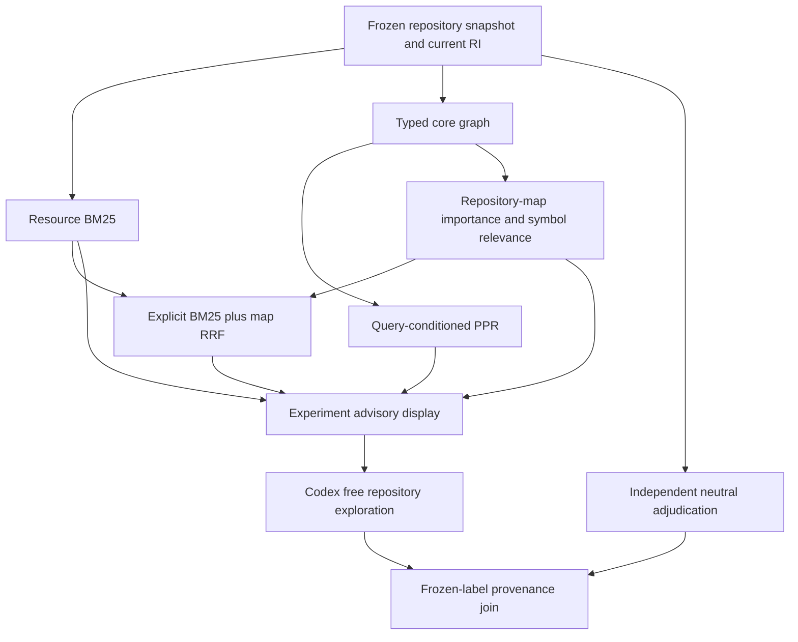

# Codex advisory retrieval dogfood, Case 0003

## Independently justified production task

Starting HEAD: `0bcb2caaf7ae4b6a776bd9505efa1dc87e8325a5`, clean `main`.
This case implements bounded Python-project configuration Repository Intelligence
(RI): deterministic declarations and repository targets supported by retained
configuration. Configuration was a structural blind spot in the repository-map
increment. Actual inspection found project README, Hatch package selection,
pytest test paths, Coverage source modules, and mypy paths. It found no project
scripts or entry points. Those findings justify production work independently of
the evaluation; the task does not invent entry-point facts or change Retrieval.

The frozen complete task is:

> Investigate and implement production Repository Intelligence for deterministic
> Python-project configuration relationships actually declared in this repository.
> Derive bounded configuration declarations and repository-resolvable resource or
> module targets from retained snapshot content, including project README, package
> selection and tool resource/module selectors where static evidence supports them.
> Preserve identity, provenance, bounded coverage, ambiguity and unresolved
> assessments. Do not invent entry-point relationships when no entry points are
> declared; distinguish syntax and declared selection from actual tooling or runtime
> behavior. Reuse existing repository resource and Python module identities and
> resolution semantics. Integrate focused tests and package, architecture,
> documentation-map, roadmap and backlog documentation. Do not modify Retrieval
> ranking, graph projection, fusion or Context policy. Validate using a protected
> development profile excluding sealed confirmation material, then retain a coherent
> checkpoint without pushing.

Separately written short InformationNeed:

> Python project configuration declarations, pyproject TOML, retained repository
> snapshots, resource and module resolution, identity provenance coverage, RI tests
> and architecture.

## Prospective boundary and transparent protocol imperfection

The task, need, repository state, current production RI, unchanged production
retrieval defaults, result surface, metrics and advisory presentation rule were
fixed before inspecting rankings or implementation-agent behavior. The native
input archive retains the complete snapshot, lexical index, current typed core
graph and repository-map view. New configuration RI is absent from these inputs.

There was a **handwritten metadata error and host coordination race**. The initial
manifest incorrectly wrote filename BM25 weight `1.0`; the unchanged production
implementation, whose hashes were frozen, actually uses its canonical `0.25`
constant. The script never passed this handwritten field to scoring. A host
correction recorded `0.25` and an explanatory note while capture bound the earlier
manifest bytes. Both byte-identical manifests and `freeze_correction.json` are
retained. The discrepancy was identified before displaying the implementation
handoff. No algorithm, parameter passed to retrieval, rank, or judgment was
selected or changed in response to outputs. This case has a documented metadata
imperfection and must not be described as a perfectly synchronized freeze.

- Initial capture-bound manifest SHA-256:
  `5b58b4c1c83f84bb6865b66436f0fc9192046ebe305335ee55685d940d752945`.
- Corrected manifest SHA-256:
  `0a5781bd81f7ce18bb89bdfe8b5edc48ad8712511897142c4778b3efc3040620`.
- Snapshot: `7cbfc03c47323c8486b9cf30be945a23ed82f462af26288de0a6fa996c798d3b`.
- Input archive SHA-256:
  `d4b5ced14eb8a9c0957596c5e28c53ecc814ddfefc602e8098bcab7b5eae250d`.
- Native capture archive SHA-256:
  `11664369ac9e65970d538d939c3a698738448a62af49f4420a99d58f998a5750`.

The input and capture hashes matched, and every frozen production Retrieval
source hash remained unchanged at the pre-implementation audit.

## Eligible frame and unchanged channels

The **472-resource frame** includes textual resources under `src/`, `docs/` and
all production test directories, plus the capture protocol pair, its test and
root README/AGENTS/pyproject when present. Suffixes are `.py`, `.md`, `.toml`,
`.yaml`, `.yml`. Historical `docs/implementation_ledger.md`, other experiment
artifacts and `tests/experiments/` except the capture test are excluded. A selected
temporary export allows canonical bounded discovery without traversing `.venv`
or acquiring outcome archives. Per-resource observation is bounded at 1 MiB;
discovery bounds are 10,000 resources and 20,000 traversal entries.

Case 0002 had 302 eligible resources and a narrower test frame. This intentional
prospective expansion gives the production configuration task access to relevant
production test obligations. Cross-case comparisons retain their different tasks,
frames and obligation counts; absolute depths do not imply a controlled ranking
comparison across snapshots. New files created during implementation are outside
the pre-task frame and cannot be treated as missing pre-task retrieval resources.

| Channel | Frozen configuration |
| --- | --- |
| BM25 | Production content plus filename-stem evidence; `k1=1.2`, `b=0.75`, filename weight `0.25`; full eligible-frame work bound |
| Typed Personalized PageRank (PPR) | Canonical typed **core**, damping `0.85`, L1 tolerance `1e-10`, at most 200 iterations; positive BM25 resource reciprocal-rank personalization with `k=60`; maximum node mass per resource |
| Repository map | Production dependency projection; global PageRank with uniform resource restart, same damping/tolerance/iteration bound; compact symbol BM25; equal symbol rank fusion `k=60`; maximum winning-symbol resource projection and lexical abstention |
| BM25 + map Reciprocal Rank Fusion (RRF) | Existing equal rank-based production fusion, `k=60`; no additional fusion policy |

Each runs independently for full prompt and short InformationNeed: eight arms.
The core derives imports, direct functions/classes/methods, containment,
generalized references and direct bases from retained snapshot content. Source
modules use root `src`; other Python resources use root `.`. Core excludes
package/mirrored-path navigation. Configuration facts are not inserted into
Retrieval in this increment.



## Pre-implementation surfaces and measured cost

These counts describe candidate surfaces and construction, without asserting
relevance. All native positive/channel-defined rankings are retained; there is
no fixed top-five admission.

| Query arm | BM25 resources | Typed PPR resources | Map resources / symbols | BM25 + map RRF resources |
| --- | ---: | ---: | ---: | ---: |
| Full task | 469 | 471 | 220 / 1,891 | 469 |
| Short need | 426 | 470 | 215 / 1,752 | 443 |

Snapshot discovery, observation, lexical indexing, RI derivation and retained
four-view construction together took **72.94 seconds**. This combined measurement
includes the existing replay helper's additional views; it is not a claim that
minimal production map construction takes that long. Core: **2,775 nodes /
7,493 edges**. Map: **2,775 nodes / 3,832 edges / 2,303 symbols**. Global
importance took **0.101 seconds**, converging in 127 iterations.

| Query arm | BM25 seconds | Typed PPR seconds | Map ranking seconds | RRF seconds |
| --- | ---: | ---: | ---: | ---: |
| Full task | 0.016 | 1.894 | 0.051 | 0.007 |
| Short need | 0.053 | 1.869 | 0.028 | 0.007 |

PPR converged in 127/128 iterations. Costs are single observed wall-clock
measurements, with shared construction measured separately; no performance
benchmark distribution or exploration-savings control is claimed.

## Advisory intervention and exploration observation

The prospectively fixed experiment presentation displays **top ten from each of
eight labeled native rankings**, with deduplicated address/rank notes. This is
compact advisory evidence, not guaranteed completeness, a production Selection
policy, or the complete retained ranking surface. Codex may search and open any
resource and must recover from missing evidence.

`implementation_instructions.txt` retains the host's architecture guidance,
configuration findings, tool-semantics references and explicit validation
restrictions. This guidance is part of the intervention alongside retrieval;
the case cannot attribute task outcome solely to the handoff. Root inspected
architecture and actual configuration before freezing the task. An authorized
external Codex worker then received the task and advisory evidence. An initial
network-only failed launch is retained separately from the implementation trace.

JSONL observations distinguish explicit searches, direct `Get-Content` opens,
trace-reported file changes, validation commands and task completion. Search
results, indirect script reads and transitive test reads do not become inferred
opens. Opened or modified resources never become requirements automatically.
Raw PowerShell-redirection UTF-16 traces and native UTF-8 traces are decoded
without rewriting bytes or changing recorded hashes. No comparable unaided
control exists, so exploration savings cannot be claimed.

## Blind adjudication and measurements

The independent adjudicator receives only the frozen complete task, snapshot
export and eligible resource/content identities. It receives no retrieval ranks,
provenance, traces, opens, modified flags or post-task source. Required obligations
are distinguished from helpful-only, unnecessary, unresolved and acceptable
alternatives. An explicit affirmation may classify all unlisted eligible
resources unnecessary; otherwise incomplete assessments fail.

`analyze.py freeze-adjudication` verifies snapshot identity, distinct in-frame
judgments, compatible states, rationale and completed read-only adjudicator trace.
It uses production Evaluation's `compare_identity_coverage` solely for generic
identity completeness. Outcome meaning stays in the dogfood protocol. The
immutable freeze refuses overwriting and never opens retrieval/agent artifacts.
Only the subsequent `join` command joins native rankings and exploration.

Measurements include required count; recall at 5/10/20/50/100; last-required
rank; helpful/unnecessary prefixes through complete coverage; missing required
resources; structural rescues; rank movements with native supports; candidates,
runtime and construction; agent searches/opens/recovery and outcome. Incomplete
channels have no complete-coverage prefix: their entire inventory is reported
explicitly instead. Quality conclusions now follow the separately frozen
independent adjudication below.

## Protected validation and reproducibility

`validation_boundary.json` retains the originally planned **22 confirmation/audit
test exclusions** and **seven bounded benchmark test cases**. The host chose a
stronger actual validation boundary: exclude **all retained experiment test
directories before collection**, explicitly admitting only the capture test and
new synthetic Case 0003 protocol tests. Production coverage remains configured
at 100%. The planned plugin/copy mechanism is retained as prospective protocol
context; its presence does not mean those retained tests were executed.

The planned plugin deselects the exact retained outcome readers before execution.
A temporary bounded
benchmark copy contains Python/Markdown/TOML/YAML files only, with no JSON,
JSONL, pickle or gzip outcome content copied. Production tests run in the original
checkout; only those seven benchmarks would change current directory. Default
repository-wide pytest is prohibited for this increment.

```text
uv run pytest tests --ignore=tests/experiments tests/experiments/test_codex_dogfood_capture.py tests/experiments/codex_dogfood/test_case_0003.py
uv run pytest tests/experiments/codex_dogfood/test_case_0003.py --no-cov
uv run python experiments/codex_dogfood/case_0003/analyze.py freeze-adjudication
uv run python experiments/codex_dogfood/case_0003/analyze.py join
```

`freeze-adjudication` is a one-time protocol mutation; run it only after completed
implementation/validation and independent raw judgment capture. On a completed
checkout, use `join` to reproduce analysis from its already frozen labels.
The native archives are trusted repository-owned Python pickles; load only in
a matching trusted checkout. `run.py` separates freeze/capture/handoff phases and
refuses overwriting frozen inputs or capture. `prepare.py` refuses replacing an
existing neutral frame; its copy-only mode refreshes the originally planned
bounded benchmark environment safely. The actual broader precollection exclusion
needs no temporary copy or validation plugin.

Fourteen synthetic protocol tests cover neutral-only freezing, overwrite
protection, snapshot/identity/category guards, incomplete coverage, premature
join rejection, explicit telemetry and raw trace encodings. Their focused run,
helper Ruff, formatting and mypy checks pass.

## Frozen production outcome and host validation

The external implementation worker completed. Its focused production tests
passed **50**, and neighboring Repository Intelligence, Retrieval, Context and
Evaluation regressions passed **248**. The host then reviewed ownership, API
contracts and source; it formatted one fixture and clarified full acronym names
in package documentation. No ranking algorithm or production behavior was tuned
after the worker completed.

The actual protected host invocation above passed **1,299 tests**, with **two
live skips**, **100% production statement and branch coverage**: 8,226 statements
and 1,902 branches. Repository-wide Ruff and mypy passed (582 source files);
the 16 touched production/documentation-adjacent Python files passed formatting
and Git diff checks passed. These outcomes were frozen in `post_run.json` before
independent adjudication began; its byte SHA-256 is
`00e5dfc1198b7f0b515208635e8107d407c4ad1fa19ce638c1427fe7d480d556`.
This is the stronger precollection exclusion invocation, not execution of the
original planned retained-experiment plugin profile.

### Configuration truth produced on the frozen snapshot

The new production package is `devtools.context.python.project_configuration`.
`configuration_ri_summary.json` and its native result archive apply the capability
to the **same pre-task snapshot**. It derives **eight declarations, eight resolved
assessments and 1,026 relation facts**, grouped as follows:

| Configuration selector | Relation facts |
| --- | ---: |
| `project.readme` | 1 |
| `tool.hatch.build.targets.wheel.packages` | 234 |
| `tool.pytest.ini_options.testpaths` | 160 |
| `tool.coverage.run.source` | 1 |
| `tool.mypy.files` | 396 |
| `tool.mypy.mypy_path` | 234 |

Counts include multiple declarations selecting the same resource for different
tool responsibilities; they are not 1,026 distinct files or runtime dependencies.
Directory-prefix relations mean declared bounded selection of retained observed
resources, with explicit configuration-relative, pytest-root-relative or
command-current-directory-relative routes. They do not establish actual packaging,
test discovery, type-checking execution, runtime importability or effects.
Coverage's exact module relation identifies the repository module within the
explicit module interpretation universe. Existing import resolution and the new
configuration resolver share canonical module-name lookup.

The capability preserves key/index provenance against exact retained content,
bound coverage and unresolved assessment states; it does not fabricate TOML
positions unsupported by the parser. No entry-point declarations are invented.
The native configuration result archive SHA-256 is
`dff9d9bc668280be2aae7381cb04dfeb2d17fc74926c1796c3a9d8b9fa0def39`.
**Retrieval does not consume these new facts in this increment.** The prospective
rankings therefore measure the old structural coverage on a real configuration
development task; a future graph projection requires its own explicit retrieval
decision.

## Cross-case synthesis boundary

Cases 0001 and 0002 are published development evidence, not sealed confirmation.
They establish full-prompt BM25 complete depths **35** and **43** for seven and
ten required resources; short-need depths were **132** and **87**. Neither case
reported a required lexical miss rescued by its structural comparison. Case 0002's
later typed-PPR and map replay is diagnostic evidence after repeated examination,
not a prospective architecture-selection result: typed core PPR complete depth
146, repository map incomplete, and full BM25 + map RRF complete depth 139.

Case 0003 was joined only after the independent judgment was frozen. Its
472-resource frame, production feature and prospective channels differ from the
earlier cases. Final synthesis must retain those differences and separately
answer reach, complete depth, short-need effects, structural rescues, categories,
fusion and the remaining Repository Intelligence/Selection bottleneck. No pooled
general recall or exploration-savings claim follows from these few tasks.

## Frozen blind Case 0003 results

The isolated read-only adjudicator completed after implementation and validation
were frozen. The pre-task export was independently checked against all **472**
retained resource/content identities before adjudication. Neutral judgment freeze
SHA-256:
`ead76c5f473ff3511e7e5f0b9c8db3011859ebab4d1ae1129d22cdba95a3929f`.
Identity coverage is exact: no duplicates, missing or unexpected resources.
There are **19 required**, **10 helpful only**, **443 unnecessary**, **zero
unresolved**, and no acceptable-alternative groups. The judgment was never
revised after the provenance join.

All recall entries below are exact required counts with denominator **19**.
Candidates are the full retained channel surface, independent of advisory display.

| Query / channel | At 5 | At 10 | At 20 | At 50 | At 100 | Complete depth | Candidates |
| --- | ---: | ---: | ---: | ---: | ---: | ---: | ---: |
| Full BM25 | 4 | 5 | 7 | 12 | 13 | 348 | 469 |
| Full typed PPR | 2 | 2 | 2 | 2 | 8 | 314 | 471 |
| Full repository map | 1 | 2 | 3 | 4 | 4 | Incomplete: 5/19 | 220 |
| Full BM25 + map RRF | 1 | 2 | 3 | 8 | 11 | 372 | 469 |
| Short BM25 | 2 | 5 | 5 | 8 | 13 | 180 | 426 |
| Short typed PPR | 2 | 2 | 2 | 3 | 10 | 278 | 470 |
| Short repository map | 1 | 2 | 2 | 4 | 5 | Incomplete: 5/19 | 215 |
| Short BM25 + map RRF | 0 | 2 | 2 | 6 | 10 | 279 | 443 |

| Complete-coverage prefix | Required | Helpful only | Unnecessary |
| --- | ---: | ---: | ---: |
| Full BM25 through 348 | 19 | 10 | 319 |
| Full typed PPR through 314 | 19 | 10 | 285 |
| Full BM25 + map RRF through 372 | 19 | 10 | 343 |
| Short BM25 through 180 | 19 | 8 | 153 |
| Short typed PPR through 278 | 19 | 10 | 249 |
| Short BM25 + map RRF through 279 | 19 | 8 | 252 |

Neither map arm has a complete-coverage prefix. Its **entire incomplete
inventory** contains five required, five helpful-only and 210/205 unnecessary
resources. These counts are not unnecessary resources before successful coverage.

### Every required obligation and its ranks

Paths are exact pre-task frame identities. `—` means absent. RRF ranks and full
native supports are additionally retained in `joined_analysis.json`.

| Required resource | Full BM25 | Short BM25 | Full PPR | Short PPR | Full map | Short map |
| --- | ---: | ---: | ---: | ---: | ---: | ---: |
| `AGENTS.md` | 14 | 38 | 108 | 150 | — | — |
| `README.md` | 37 | 71 | 162 | 201 | — | — |
| `docs/architecture.md` | 3 | 3 | 81 | 79 | — | — |
| `docs/architecture/decisions/ADR-0002-repository-intelligence-identity-and-derivation.md` | 7 | 8 | 89 | 86 | — | — |
| `docs/architecture/taxonomy.md` | 13 | 23 | 104 | 125 | — | — |
| `docs/backlog/epics/B-0002-coding-context-substrate.md` | 4 | 6 | 83 | 83 | — | — |
| `docs/backlog/metadata.md` | 47 | 147 | 181 | 278 | — | — |
| `docs/backlog/overview.md` | 32 | 103 | 152 | 229 | — | — |
| `docs/documentation_map.md` | 5 | 10 | 84 | 90 | — | — |
| `docs/roadmap.md` | 1 | 1 | 76 | 74 | — | — |
| `pyproject.toml` | 154 | 84 | 314 | 211 | — | — |
| `src/devtools/context/python/docs/overview.md` | 43 | 63 | 174 | 189 | — | — |
| `src/devtools/context/python/modules/__init__.py` | 337 | 159 | 173 | 100 | — | — |
| `src/devtools/context/python/modules/docs/overview.md` | 36 | 49 | 159 | 172 | — | — |
| `src/devtools/context/python/modules/interpretation.py` | 61 | 78 | 3 | 5 | 14 | 9 |
| `src/devtools/context/repository/identity.py` | 348 | 180 | 72 | 47 | 40 | 24 |
| `src/devtools/context/repository/resource.py` | 191 | 133 | 4 | 2 | 1 | 1 |
| `src/devtools/context/repository/snapshot.py` | 193 | 155 | 141 | 93 | 6 | 27 |
| `tests/context/python/modules/test_interpretation.py` | 138 | 98 | 237 | 184 | 114 | 91 |

Both BM25 and both typed-PPR arms contain every required resource. **No required
lexical miss was rescued** by PPR, map or fusion. The map lacks the same 14
required resources in both arms. Thirteen are configuration, documentation or
governance resources without supported declarations or relationships in the
frozen graph. The fourteenth, `modules/__init__.py`, **has import structure** but
no supported declarations to enter the map's symbol-to-resource surface. Map
absence therefore combines an RI coverage gap with a representation boundary;
it does not uniformly mean RI has no structure.

### Native reasons for important promotions and displacements

Map promotions, written full/short BM25→map, include `resource.py`
**191→1 / 133→1**, `identity.py` **348→40 / 180→24**, `snapshot.py`
**193→6 / 155→27**, and module `interpretation.py` **61→14 / 78→9**.
The required test reaches 114/91 from 138/98, a modest task-specific promotion.
Native symbol provenance distinguishes their causes:

- `resource.py` wins with **`_validate_sha256`**, importance rank **4**, full
  symbol lexical rank **29**. References come from corpus, document, snapshot
  and its own resource. The largest incoming flow, about **0.01341** of
  **0.01458** importance, is same-resource flow. File promotion does not prove
  that this private helper is the task's best compact disclosure.
- `interpretation.py` wins with **`_digest`**, importance rank **9** but full
  symbol lexical rank **826**. Both incoming references originate in that same
  module. Global importance contributes useful file-ranking signal here;
  internal helper importance differs from task-specific API relevance.
- `snapshot.py` wins with **`RepositorySnapshot.resource`**, full symbol lexical
  rank **1**, zero global importance and no incoming supports. Its promotion
  comes from compact symbol relevance, not centrality.
- `identity.py` wins with **`Repository`**, full symbol lexical rank **30**, zero
  global importance and a zero-flow containment-return support. This is also
  symbol lexical promotion rather than incoming-reference centrality.
- The required test wins with **`_snapshot`**, importance rank **210**, full symbol
  lexical rank **535** and local fixture references. This does not establish a
  general semantic source/test obligation relation.

Typed PPR promotes interpretation **61→3 / 78→5**, resource **191→4 / 133→2**,
identity **348→72 / 180→47**, and symbol-free module exports
**337→173 / 159→100**. The latter has import support from interpretation and
membership tests, a real difference from the symbol-only map surface.

The 13 configuration/documentation/governance resources persist in PPR through
lexical personalization with **no incoming structural supports** for their winning
resource nodes. They are displaced: pyproject **154→314 / 84→211**, roadmap
**1→76 / 1→74**. Full PPR nevertheless improves complete depth **348→314** by
promoting the deeper identity/API tail; it contains only two required at depth
50 versus BM25's twelve. Short PPR worsens complete depth **180→278**.

Equal RRF promotes implementation but displaces lexical-only obligations. Full
interpretation reaches **4**, resource **9**, while roadmap becomes **35**,
pyproject **291** and module exports **372**. Short interpretation becomes **9**,
resource **10**, module exports **279**. Complete depth worsens in both arms:
**348→372** and **180→279**. These are observations under the prospectively fixed
rule, not permission to retune it on this case.

### Agent exploration and recovery

The compact display contained **38 distinct suggested addresses**. The completed
trace records **22 commands**, **one search**, **39 direct-open events across
24 distinct resources**. Nine suggested resources were subsequently opened.
Fifteen opened resources were outside the display, including **nine required**:
AGENTS, taxonomy, backlog metadata and overview, pyproject, Python package docs,
modules exports and docs, and module interpretation tests. This demonstrates
recovery from bounded handoff omissions, not complete BM25 candidate misses.

Seventeen of nineteen required resources were directly opened. Required README
and repository identity were not observed as direct opens; that fact does not
revise independent obligations. Incidental/imported reads and host guidance remain
separate from this narrow measurement. The worker opened historical ledger and
newly created configuration resolution outside the pre-task frame, which is
allowed. Trace file changes cover 19 paths; modification is recorded as behavior,
not converted into the complete required set. No complete lexical miss needed
recovery. No exploration savings or top-ten sufficiency can be estimated without
a comparable control.

## Cases 0001–0003: specialized channels and the next bottleneck

| Case / evidential status | Required | Full BM25 complete | Short BM25 complete | Full typed PPR | Full map | Full BM25 + map RRF |
| --- | ---: | ---: | ---: | ---: | --- | ---: |
| 0001 prospective documentation task | 7 | 35 | 132 | Not run | Not run | Not run |
| 0002 prospective capture task; later graph/map **diagnostic** replay | 10 | 43 | 87 | 146 | Incomplete | 139 |
| 0003 prospective production configuration task | 19 | 348 | 180 | 314 | Incomplete | 372 |

1. **Full-prompt BM25 reach:** complete in all three eligible frames. This is
   task-specific reach, not a population-level recall guarantee.
2. **Complete depth:** 35, 43 and 348. Obligations grow from seven to ten to
   nineteen, with enlarged frame and different task. Top five is insufficient;
   even depth 100 misses six Case 0003 required resources.
3. **Short InformationNeed:** not consistently beneficial. It worsened BM25
   complete depth in Cases 0001/0002 (132/87) but improved Case 0003 (180 versus
   348), while full prompt retained stronger early recall. No universal query
   formulation is selected by this case.
4. **Typed PPR rescues:** no required resource absent from BM25 rescued.
   Case 0001 did not run typed PPR. Case 0003 is its first recorded full-prompt
   complete-depth improvement among these typed comparisons, with a substantial
   early-recall trade-off.
5. **Repository-map rescues:** no required resource-level lexical miss rescued
   in Case 0002 diagnostic or Case 0003 prospective comparisons. Symbol lexical
   misses and resource lexical misses are different measurements.
6. **Repeated map promotions:** connected implementation substrates and compact
   symbol matches, including Retrieval in Case 0002 and RI resource/module APIs
   in Case 0003. Private helper importance contributes; required test promotion
   is not consistently strong.
7. **Invisible categories:** configuration, governance and documentation lack
   task-relevant structural evidence in the frozen graphs. Declaration-free
   exports have import structure yet can remain outside the map surface. Some
   test obligations need stronger evidence than fixture references or paths.
8. **Simple RRF:** worsens complete depth in both arms of Case 0002
   (43→139; 87→152) and Case 0003 (348→372; 180→279). It preserves lexical
   reach but is not a general complete-coverage improvement.
9. **Specialized channels:** supported as an architectural interpretation.
   Resource lexical relevance, compact symbol relevance/global importance and
   graph diffusion promote different obligations and must remain inspectable.
   No universal winning ranker emerges.
10. **Selection readiness:** sufficient evidence to investigate admission and
    obligation-aware sufficiency, insufficient to validate a production Selector
    or fixed budget. RI coverage and map representation remain immediate
    bottlenecks for safely narrowing candidates. Broad lexical reach alone does
    not prove a small selected Context is complete.

### Exact next architectural recommendation

Make a separate bounded Retrieval decision about **project-configuration
declaration/selector projection and resource participation**, consuming the new
snapshot-bound RI while keeping declared selection distinct from dependency or
runtime claims. Inspect high-fanout selectors before choosing transitions:
1,026 facts include broad/repeated selections, so equal dependency transitions
may amplify generic project reach rather than task relevance. Include a clear
policy for declaration-free resource evidence without silently changing map
symbol semantics. Freeze any algorithm before the next naturally justified
prospective task; Case 0003 now becomes diagnostic evidence.

The new RI makes pyproject→README/module/selected-resource truth available; this
case does **not** measure post-feature ranking improvement because those facts
were deliberately not added to Retrieval. Documentation links/governance,
API exports, non-Python registration and more faithful test obligations remain
potential bounded RI work. Separately promote the supported protected development
validation profile in B-0047 so future workers can validate without bespoke
sealed-material exclusions.
