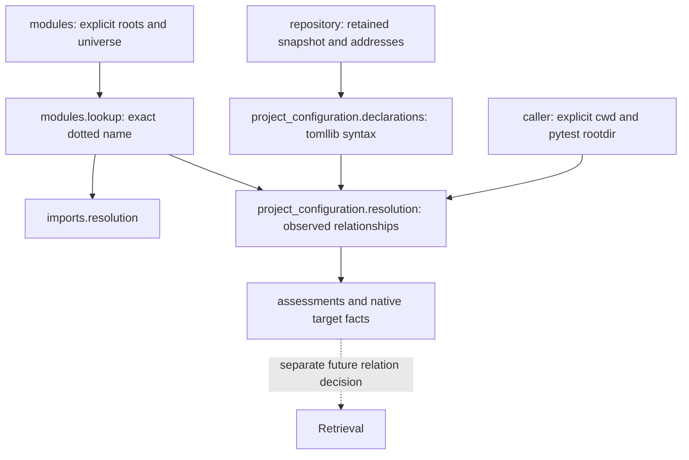

# Python project configuration Repository Intelligence

`context.python.project_configuration` owns bounded static Python-project
Repository Intelligence (RI).
`analyze_python_project_configuration(snapshot, address=...)` parses one exact
retained TOML resource with stdlib `tomllib`. The separate
`resolve_python_project_configuration(snapshot, declarations, universe=...,
frame=...)` derives qualified observed target relationships. Neither operation
reopens the working tree, discovers configuration, executes tools, installs a
project or establishes runtime behavior.

## Ownership and dependencies



This is supported framework Repository Intelligence, not experiment composition
or framework runtime configuration. Models, declarations and resolution have
separate modules. Dependencies are existing repository state/address values and
Python module interpretation/lookup. Potential dependents are RI consumers and
future Retrieval relations; Retrieval and Context policy do not participate in
derivation. Python-specific keys and routes justify this ownership rather than
a universal configuration package. ADR-0002 already admits configuration anchors
and qualified DerivedKnowledge; no new ADR or durable schema is required.

## Syntax and routes

| Selector | Supported syntax | Frame |
| --- | --- | --- |
| `project.readme` | Literal string | Exact resource relative to configuration parent |
| `tool.hatch.build.targets.wheel.packages` | Literal-string array | Configuration parent |
| `tool.pytest.ini_options.testpaths` | Literal-string array | Explicit `frame.pytest_root` |
| `tool.coverage.run.source` | Literal-string array | Explicit `frame.working_directory` path and eligible exact module-name alternatives |
| `tool.mypy.files` | Literal-string array | Explicit command cwd |
| `tool.mypy.mypy_path` | Literal-string array | Explicit command cwd |

Except README, path selectors correlate exact observed resources or strict
component-prefix members under their frame. `PythonConfigurationFrame` uses
existing `PythonModuleRoot` values: `.` means repository root and a canonical
relative directory names another explicit frame. Frame values also pass
`RepositoryResourceAddress` validation, including Windows drive rejection.
No tool cwd or pytest rootdir is inferred from the configuration parent.
Literal `.` selects the framed prefix. Other paths use canonical address
validation. Absolute, traversing, backslash/noncanonical, glob, environment,
home-expansion, interpolation and control-character forms are unsupported;
they are not expanded or normalized into different declarations.

These are observed selector relationships, not complete emulations of packaging,
discovery, measurement or typing. An exact-resource fact only correlates the
literal with a retained address; it does not validate that a tool accepts that
resource kind. Prefix facts assert observed membership, never directory
existence, execution, final wheel inclusion, exclusions, command precedence,
test execution, typing, measurement or importability. README never selects
prefix members.

Coverage retains path and exact dotted-module readings separately. Lookup
belongs to `modules.lookup_python_modules`; imports use the same lookup without
changed behavior. Distinct roots/names remain distinct module interpretations,
without precedence. One positive observed reading with a missing alternative
resolves **within the supplied frame**; the missing reading remains recorded
and is not ruled out in a larger filesystem/runtime environment. Two positive
readings, multiple module matches or exact-address/prefix collisions remain
ambiguous and publish no facts. A missing tool frame remains unsupported even
if a module matches. Package/ordinary module targets are existing exact native
interpretations; package descendants, namespace packages, runtime discovery and
module/member bindings are not invented here.

## Provenance, identity and coverage

Declarations retain semantic TOML key tuples and optional zero-based array
ordinals. `tomllib` handles quoted/dotted keys and multiline arrays; no second
TOML parser or exact source span is fabricated. The containing analysis retains
the exact configuration occurrence/content, repository, snapshot and versioned
derivation identity. Duplicate array items have distinct occurrence/fact
identities. Anchors are semantic provenance within that exact retained resource.
Unsupported tables (including README file/text tables), non-string items and
scalar array-selector values are assessed without target derivation.

Dynamic README produces unsupported selector assessments. Project scripts, GUI
scripts and entry points now have named static setting declarations in
`analysis.settings`, replacing the former presence-only unsupported selector
assessment. Object references are not resolved into runtime bindings.
Static README syntax remains retained when marked dynamic,
and repeated dynamic README entries retain their own array ordinals.
The real project declares no entrypoints. Absent selectors
are listed; present empty arrays have zero declarations and are not absent.
Selector coverage is exhaustive only for the six named keys and assessed dynamic
README syntax in valid input; unknown keys have no relationship claim. Malformed
TOML, including duplicate keys, yields a parse error, no declarations, no facts
and no selector-absence claims.

Resolution validates repository/snapshot IDs, the exact retained configuration
occurrence including content, reproducible declaration analysis, and each
module's repository, snapshot and exact retained occurrence/content. It retains
the full canonical observed resource frame, universe and explicit assumptions
as dependencies. Derivation, occurrence and fact definitions are versioned;
source/target edits, frames, universes and snapshots affect appropriate identity.
Order is selector order, array ordinal, then target address or module identity.
Supplied ordering never chooses a competing interpretation.

Every declaration has a resolved, missing-in-frame, ambiguous or unsupported
assessment. Alternatives retain all matches and route-specific outcomes.
Many members under one directory reading produce many facts without ambiguity.
Facts retain declaration, exact config resource, route, requested framed
selector, target occurrence and optional module interpretation. Missing means
only no match in the supplied frame, never filesystem absence or an external
target. Parse failure and unsupported syntax are not negative target knowledge.

## Alternatives and future Retrieval

A universal configuration loader/registry or runtime-binding framework would
combine unrelated tooling and ambient state without a consumer; it is rejected
for this increment. Speculative entrypoint resolution and manufactured import
declarations remain rejected. Static entry-point syntax is retained under the
bounded setting contract below. Other
README forms/selectors require separately versioned semantics and a concrete
consumer. Native module lookup is reused rather than copying module/member
policy. B-0019 remains deferred framework runtime-configuration pressure.

Future Retrieval could consume `PythonConfigurationTargetFact` under a separate
explicit relation decision: config resource to observed target, chosen selector
families and admissible routes, forward/reverse direction, duplicate handling,
module-to-resource projection and snapshot applicability checks. Fact support
must remain native and prefix membership distinct from semantic execution or
dependency. Ambiguous/missing/unsupported assessments can inform coverage
diagnosis rather than edges. BM25, Personalized PageRank (PPR), repository-map,
Reciprocal Rank Fusion (RRF), graph projections
and Context policy do not consume this capability now. No retrieval quality
conclusion follows from these facts or advisory suggestions.

## Static project and pytest settings

The same `analyze_python_project_configuration` invocation now returns
`analysis.settings: PythonConfigurationSettings | None`. `settings.py` owns
recognition of the following declarations; `models.py` owns their immutable
representation. `declarations.py` parses retained TOML once and composes selector
and setting coverage. `resolution.py` continues to resolve only the six selectors;
setting strings do not become path targets or import declarations.

| Semantic keys | Retained syntax |
| --- | --- |
| `build-system.build-backend` | String |
| `build-system.requires`, `build-system.backend-path` | String arrays |
| `project.name`, `version`, `description`, `requires-python` | Strings |
| `project.dependencies`, `project.dynamic` | String arrays |
| `project.scripts.<name>`, `project.gui-scripts.<name>` | Declared object-reference strings |
| `project.entry-points.<group>.<name>` | Declared object-reference strings |
| `tool.pytest.ini_options.python_files`, `python_classes`, `python_functions` | String or string array |
| `tool.pytest.ini_options.norecursedirs` | String or string array of declared recursion patterns |
| `tool.pytest.ini_options.addopts` | Opaque string or string array; no option interpretation |

README and pytest `testpaths` remain owned by existing selector declarations;
they are not duplicated as settings. `testpaths` supports string arrays, with
semantic item ordinals. Scalar-string `testpaths` remains explicitly unsupported
in that bounded selector model. No tool defaults or effective configurations are
materialized. Strings are not split, normalized, pattern-expanded, validated as
version/requirement specifiers, or resolved as runtime object references.
Declared syntax is not a full packaging-specification validator.

Arrays become immutable tuples preserving order, duplicates and empty values.
Invalid shapes have an unsupported reason and the exact containing source as
provenance; a string in an array-required field is retained as an unsupported
string. Other unsupported shapes have no interpreted value. A declared empty
script or entry-point table has an empty-tuple presence declaration, not an
entry-point binding. Reserved `console_scripts`/`gui_scripts` groups under
`project.entry-points` are unsupported rather than competing inferred bindings.
Declared static metadata also named in `project.dynamic` retains its syntax and
is marked `dynamic-project-field`. Absent means no static declaration in this
named scope, never absence of dynamically supplied metadata or registration.

`absent_keys` accounts for these named settings and three entry-point tables.
An unsupported non-table ancestor produces an assessment, not a setting-absence
claim. Missing keys below valid tables support bounded absence. Malformed TOML
produces `settings=None`, with no positive settings or absence claims.
`recognized_tool_tables` reports only actual table presence for Coverage
run/report, Hatch wheel, mypy, pytest ini options, Ruff and Ruff lint. It assigns
no meaning to arbitrary keys in those tables. Other tools and keys remain outside
coverage. No universal TOML registry or configuration framework is introduced.

Each setting retains its exact tuple key, declared supported value, reason and
versioned derivation identity. The containing analysis retains repository,
snapshot, exact resource/content and parser scope. Quoted keys containing dots
remain single tuple components. The v2 declaration derivation changes with
repository, snapshot, resource address or retained content. Setting identity
includes framed key/value shape and reason. Output is sorted by semantic key;
array order is retained. No source byte offset or line range is fabricated.
Resolution rederives and checks the complete analysis, including settings, so
forged, duplicated, foreign or stale input is rejected. No durable-schema or
compatibility layer is added, and frozen experimental artifacts are unchanged.

Declared pytest configuration is **not complete pytest collection behavior**.
`testpaths` targets are observed prefix membership, not proof of test role.
Naming/recursion declarations do not establish that a particular resource will
be collected, excluded or executed. CLI precedence, configuration selection,
plugins, hooks, `conftest.py`, `unittest`, runtime imports and collection remain
outside this RI. In particular, `addopts` can contain ignore flags but this
analysis does not turn arbitrary argument strings into exclusion facts.

## Substrate inventory and role boundary

| Proposed role input | Disposition and canonical source |
| --- | --- |
| Repository/resource/snapshot identity and exact address equality | ALREADY CANONICAL: repository identity, snapshot and occurrence models |
| Relative path and components | ALREADY CANONICAL: `RepositoryResourceAddress.value` and `.parts` |
| Basename, suffixes, parent, component-prefix containment and depth | DERIVABLE FROM EXISTING CANONICAL FACTS: `PurePosixPath(address.value)` and address components |
| Explicit-root Python module/package interpretation and immediate membership | ALREADY CANONICAL: `python.modules` |
| Mirrored source/test paths and six selector target relationships | ALREADY CANONICAL: `python.mirrored_paths` and existing configuration RI |
| Static project metadata, entry-point syntax and pytest naming/recursion declarations | MISSING DETERMINISTIC FACT: implemented by this setting increment |
| Direct imports and one-facade imported-function member resolution | ALREADY CANONICAL: `python.imports` |
| Static `__all__` and richer bounded export sets | MISSING DETERMINISTIC FACT: separate public-surface slice deferred; dynamic exports remain outside static scope |
| Test/configuration/documentation/public API/validation relevance | TASK-RELATIVE EVIDENCE — DO NOT PUT IN RI |
| Universal `src/`, `tests/`, `docs/` roles or a validation filename rule | WEAK HEURISTIC — DO NOT PROMOTE |

Canonical addresses already answer path questions. For example,
`PurePosixPath(address.value).name`, `.suffix`, `.suffixes`, `.parent` and
`.is_relative_to(...)` are intrinsic operations over validated POSIX-relative
addresses. Component slicing answers prefix membership; exact address equality
is typed value equality. Parent depth is `len(address.parts) - 1`, while the
resource's component depth is `len(address.parts)`. The root parent is `.` in
the standard-library view. No ResourcePathFact, ExtensionFact or BasenameFact is
needed. A resource under `tests/` is not thereby proven to be a test.

Existing one-facade member resolution establishes a bounded direct imported
function target. It explicitly does not establish public exports; neither
non-underscore names nor `__all__` are public-API truth in this model. Extending
that claim needs its own binding/coverage contract and dynamic-form abstention.

`docs/development/validation.md` connects this repository's protected development
command to pytest and separate Ruff/mypy gates; `scripts/validate_development.py`
explicitly ignores the retained experiment test tree. No standardized declaration
connects its filename to a universal validation role. Recognized table presence,
pytest `addopts` syntax and existing selectors remain native facts. The command
relationship remains documented repository convention, not invented RI.

Next: derive obligation-relative soft repository-role evidence from these
deterministic facts and intrinsic paths, retain the global lexical safety lane,
and avoid hard path filters. No role enum, routing, relevance label, score,
candidate elimination or obligation-satisfaction rule is implemented here.
Case 0004 supplies the architectural diagnosis of broad lexical candidate sets;
its judgments, gold resources and ranks do not define these semantics. A future
replay would be retrospective; performance claims require a new prospective case.

## References and validation

Semantic references: [PyPA README](https://packaging.python.org/en/latest/specifications/pyproject-toml/#readme),
[PyPA build/project metadata and entry points](https://packaging.python.org/en/latest/specifications/pyproject-toml/),
[pytest naming and recursion configuration](https://docs.pytest.org/en/stable/reference/reference.html#configuration-options),
[Hatch packages](https://hatch.pypa.io/dev/config/build/#packages),
[pytest testpaths](https://docs.pytest.org/en/stable/reference/reference.html#confval-testpaths),
[Coverage source](https://coverage.readthedocs.io/en/latest/config.html#run-source)
and [mypy paths](https://mypy.readthedocs.io/en/stable/config_file.html).
Tool documentation defines actual execution semantics; this contract defines
only supported static observed relationships.

Focused tests include the actual project declarations over a small explicit
resource selection, frames, duplicates, malformed TOML, unsupported forms,
competing readings/roots, stale dependencies and retained-content behavior.
New-package and shared-lookup branch coverage is 100%. Protected development
checks use explicit test directories and a focused coverage override, avoiding
retained experiment/confirmation collection. B-0047 records pressure for a
supported validation-isolation profile; no general harness is designed here.

The setting increment adds synthetic declarations, quoted entry-point names,
empty/missing/invalid tables and arrays, dynamic metadata, malformed TOML,
deterministic identities/order, exact snapshot provenance and rejection of forged
or duplicate settings. Intrinsic-path tests prove existing canonical semantics
without adding path facts. Focused validation: 72 passed; neighboring Python
RI/repository validation: 329 passed; configuration statement/branch coverage:
100%. The canonical protected profile passed with 1,364 tests and two live skips,
100% of 8,727 production statements and 2,036 branches. No confirmation outcomes
were accessed. Scoped Ruff, touched-file format and `mypy src tests` pass.
Repository-wide Ruff/mypy remain failing only on unchanged frozen Case 0004
experiment helpers (459 lint findings; 41 typing errors in six files).

The earlier selector-slice focused/neighbor invocation (248 passing tests) was:

```powershell
.venv/Scripts/python.exe -m pytest tests/context/python tests/evaluation `
  -o addopts='' -p no:cacheprovider --basetemp=.devtools/case0003-final `
  --cov=devtools.context.python.project_configuration `
  --cov=devtools.context.python.modules.lookup --cov-branch `
  --cov-report=term-missing --cov-fail-under=100
```

`.devtools` is an ignored writable operational directory. This command overrides
the repository-wide coverage scope for the new capability and never invokes
default repository-wide test collection. Host comprehensive validation remains
separate. Ruff and mypy additionally passed over `src`, `tests/context` and
`tests/evaluation`.
