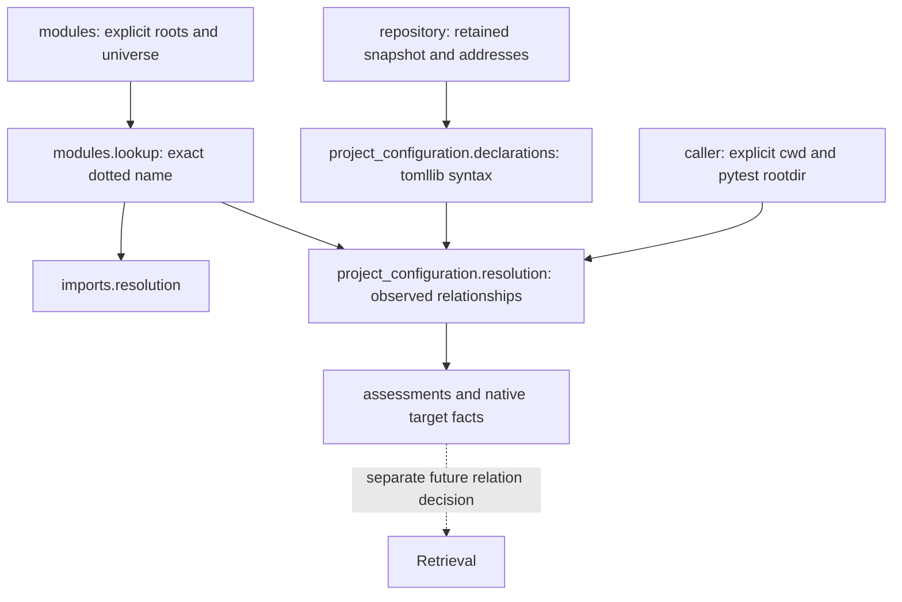

# Python project configuration Repository Intelligence

`context.python.project_configuration` owns bounded static Python-project
Repository Intelligence (RI).
`analyze_python_project_configuration(snapshot, address=...)` parses one exact
retained TOML resource with stdlib `tomllib`. The separate
`resolve_python_project_configuration(snapshot, declarations, universe=...,
frame=...)` derives qualified observed target relationships. Neither operation
reopens the working tree, discovers configuration, executes tools, installs a
project or establishes runtime behavior.

## Ownership and dependencies



This is supported framework Repository Intelligence, not experiment composition
or framework runtime configuration. Models, declarations and resolution have
separate modules. Dependencies are existing repository state/address values and
Python module interpretation/lookup. Potential dependents are RI consumers and
future Retrieval relations; Retrieval and Context policy do not participate in
derivation. Python-specific keys and routes justify this ownership rather than
a universal configuration package. ADR-0002 already admits configuration anchors
and qualified DerivedKnowledge; no new ADR or durable schema is required.

## Syntax and routes

| Selector | Supported syntax | Frame |
| --- | --- | --- |
| `project.readme` | Literal string | Exact resource relative to configuration parent |
| `tool.hatch.build.targets.wheel.packages` | Literal-string array | Configuration parent |
| `tool.pytest.ini_options.testpaths` | Literal-string array | Explicit `frame.pytest_root` |
| `tool.coverage.run.source` | Literal-string array | Explicit `frame.working_directory` path and eligible exact module-name alternatives |
| `tool.mypy.files` | Literal-string array | Explicit command cwd |
| `tool.mypy.mypy_path` | Literal-string array | Explicit command cwd |

Except README, path selectors correlate exact observed resources or strict
component-prefix members under their frame. `PythonConfigurationFrame` uses
existing `PythonModuleRoot` values: `.` means repository root and a canonical
relative directory names another explicit frame. Frame values also pass
`RepositoryResourceAddress` validation, including Windows drive rejection.
No tool cwd or pytest rootdir is inferred from the configuration parent.
Literal `.` selects the framed prefix. Other paths use canonical address
validation. Absolute, traversing, backslash/noncanonical, glob, environment,
home-expansion, interpolation and control-character forms are unsupported;
they are not expanded or normalized into different declarations.

These are observed selector relationships, not complete emulations of packaging,
discovery, measurement or typing. An exact-resource fact only correlates the
literal with a retained address; it does not validate that a tool accepts that
resource kind. Prefix facts assert observed membership, never directory
existence, execution, final wheel inclusion, exclusions, command precedence,
test execution, typing, measurement or importability. README never selects
prefix members.

Coverage retains path and exact dotted-module readings separately. Lookup
belongs to `modules.lookup_python_modules`; imports use the same lookup without
changed behavior. Distinct roots/names remain distinct module interpretations,
without precedence. One positive observed reading with a missing alternative
resolves **within the supplied frame**; the missing reading remains recorded
and is not ruled out in a larger filesystem/runtime environment. Two positive
readings, multiple module matches or exact-address/prefix collisions remain
ambiguous and publish no facts. A missing tool frame remains unsupported even
if a module matches. Package/ordinary module targets are existing exact native
interpretations; package descendants, namespace packages, runtime discovery and
module/member bindings are not invented here.

## Provenance, identity and coverage

Declarations retain semantic TOML key tuples and optional zero-based array
ordinals. `tomllib` handles quoted/dotted keys and multiline arrays; no second
TOML parser or exact source span is fabricated. The containing analysis retains
the exact configuration occurrence/content, repository, snapshot and versioned
derivation identity. Duplicate array items have distinct occurrence/fact
identities. Anchors are semantic provenance within that exact retained resource.
Unsupported tables (including README file/text tables), non-string items and
scalar array-selector values are assessed without target derivation.

Dynamic README and presence of project scripts, GUI scripts or entrypoint tables
produce unsupported assessments. Object references are not resolved into
runtime bindings. Static README syntax remains retained when marked dynamic,
and repeated dynamic README entries retain their own array ordinals.
The real project declares no entrypoints. Absent selectors
are listed; present empty arrays have zero declarations and are not absent.
Coverage is exhaustive only for the six named keys and assessed dynamic/entrypoint
presence in valid input; unknown keys have no relationship claim. Malformed
TOML, including duplicate keys, yields a parse error, no declarations, no facts
and no selector-absence claims.

Resolution validates repository/snapshot IDs, the exact retained configuration
occurrence including content, reproducible declaration analysis, and each
module's repository, snapshot and exact retained occurrence/content. It retains
the full canonical observed resource frame, universe and explicit assumptions
as dependencies. Derivation, occurrence and fact definitions are versioned;
source/target edits, frames, universes and snapshots affect appropriate identity.
Order is selector order, array ordinal, then target address or module identity.
Supplied ordering never chooses a competing interpretation.

Every declaration has a resolved, missing-in-frame, ambiguous or unsupported
assessment. Alternatives retain all matches and route-specific outcomes.
Many members under one directory reading produce many facts without ambiguity.
Facts retain declaration, exact config resource, route, requested framed
selector, target occurrence and optional module interpretation. Missing means
only no match in the supplied frame, never filesystem absence or an external
target. Parse failure and unsupported syntax are not negative target knowledge.

## Alternatives and future Retrieval

A universal configuration loader/registry or runtime-binding framework would
combine unrelated tooling and ambient state without a consumer; it is rejected
for this increment. Speculative entrypoint resolution and manufactured import
declarations are also rejected: this project has no such declarations. Other
README forms/selectors require separately versioned semantics and a concrete
consumer. Native module lookup is reused rather than copying module/member
policy. B-0019 remains deferred framework runtime-configuration pressure.

Future Retrieval could consume `PythonConfigurationTargetFact` under a separate
explicit relation decision: config resource to observed target, chosen selector
families and admissible routes, forward/reverse direction, duplicate handling,
module-to-resource projection and snapshot applicability checks. Fact support
must remain native and prefix membership distinct from semantic execution or
dependency. Ambiguous/missing/unsupported assessments can inform coverage
diagnosis rather than edges. BM25, Personalized PageRank (PPR), repository-map,
Reciprocal Rank Fusion (RRF), graph projections
and Context policy do not consume this capability now. No retrieval quality
conclusion follows from these facts or advisory suggestions.

## References and validation

Semantic references: [PyPA README](https://packaging.python.org/en/latest/specifications/pyproject-toml/#readme),
[Hatch packages](https://hatch.pypa.io/dev/config/build/#packages),
[pytest testpaths](https://docs.pytest.org/en/stable/reference/reference.html#confval-testpaths),
[Coverage source](https://coverage.readthedocs.io/en/latest/config.html#run-source)
and [mypy paths](https://mypy.readthedocs.io/en/stable/config_file.html).
Tool documentation defines actual execution semantics; this contract defines
only supported static observed relationships.

Focused tests include the actual project declarations over a small explicit
resource selection, frames, duplicates, malformed TOML, unsupported forms,
competing readings/roots, stale dependencies and retained-content behavior.
New-package and shared-lookup branch coverage is 100%. Protected development
checks use explicit test directories and a focused coverage override, avoiding
retained experiment/confirmation collection. B-0047 records pressure for a
supported validation-isolation profile; no general harness is designed here.

The final focused/neighbor invocation (248 passing tests) was:

```powershell
.venv/Scripts/python.exe -m pytest tests/context/python tests/evaluation `
  -o addopts='' -p no:cacheprovider --basetemp=.devtools/case0003-final `
  --cov=devtools.context.python.project_configuration `
  --cov=devtools.context.python.modules.lookup --cov-branch `
  --cov-report=term-missing --cov-fail-under=100
```

`.devtools` is an ignored writable operational directory. This command overrides
the repository-wide coverage scope for the new capability and never invokes
default repository-wide test collection. Host comprehensive validation remains
separate. Ruff and mypy additionally passed over `src`, `tests/context` and
`tests/evaluation`.
