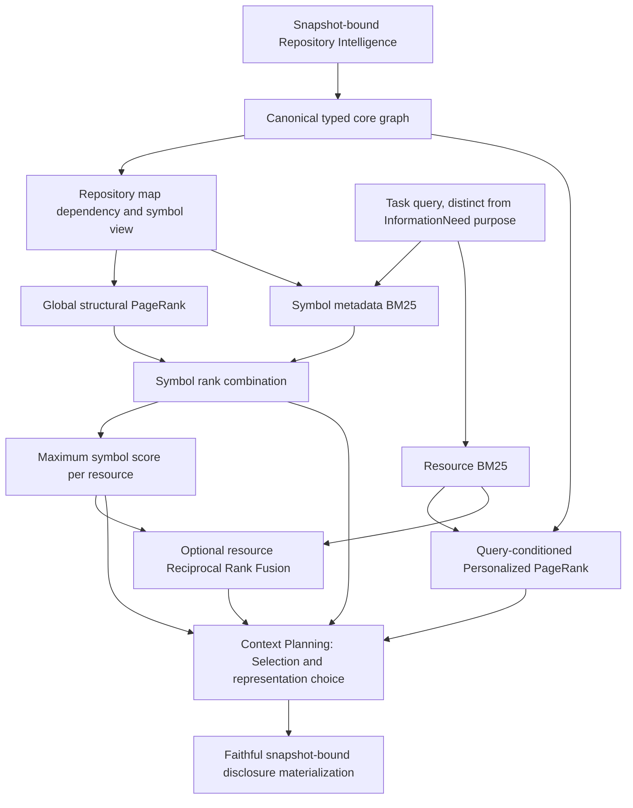

# Repository-map structural ranking

Repository Intelligence (RI) establishes deterministic facts about retained
repository state. This Retrieval package projects those facts into global
structural importance and task-relative symbol ranking. Its results are
retrieval evidence, not new RI facts, selected Context, or a rendered map.
ADR-0003 and ADR-0004 already govern these boundaries; no new ADR is needed.

## Architecture and APIs

`build_repository_map_view(snapshot, core=...)` requires the canonical typed
core projection, retaining it alongside a filtered, reprojected dependency view.
The dependency view's `projection` identifies its typed-core input basis; the
enclosing `RepositoryMapView` owns the distinct map transition semantics.
Each `RepositoryMapSymbol` retains the existing typed node, exact declaration
knowledge, subject identity, source occurrence and direct lexical parent.
Functions/classes use their declared name; a method uses `Class.method`.
This is lexical qualification, not inferred Python import/module identity.

`calculate_repository_map_importance(snapshot, view=...)` computes a reusable,
query-independent `RepositoryMapImportance`. `rank_repository_map` accepts
that result, a separately supplied nonempty purpose, and a canonical lexical
query. It retains every ranked symbol and an explicit ranked-resource projection.
All operations use retained RI and metadata, without rereading source or the
working tree. Snapshot/frame mismatch rejects application. Callers construct
views through the canonical builders; these immutable result records are not
an untrusted wire format or persistence schema.

## Global importance

The map keeps the typed core's supported functions, classes and methods. Forward
Imports remain resource to resource. References and resolved direct bases
contribute from their **source resource** to their exact target declaration.
This measures the referring file's dependency interest without requiring its
containing function to have incoming mass first. The original typed source
and native fact remain in `view.core`, and every projected contribution retains
the exact supporting fact. Same-resource dependencies remain meaningful.

Outward containment is excluded. Owner returns remain method to class, and
function/class to resource. Containment routes existing flow; it creates no
restart importance and does not assert semantic dependency. Membership and
mirrored-path correspondence remain available to other channels but are
excluded here: navigation/path conventions alone do not establish importance.
Unresolved/ambiguous relationships create no transition. No inverse dependencies,
documentation links, governance authority or configuration ownership are inferred.

Every source distributes equal capacity to its active families: import,
reference, direct-base and containment-return. Distinct native fact supports
divide their family's capacity equally. Thus references do not automatically
dominate imports by count; repeated occurrences can influence distribution
within the Reference family. This is a declared neutral policy, not calibrated
relation quality. Direct Call is a Reference tag, not a second contribution.

Global PageRank uses damping 0.85, L1 tolerance 1e-10 and at most 200 iterations.
Teleport and dangling return are uniform over **observed resources**, with no
direct restart mass on symbols. Each file gets one restart share regardless of
declaration count. The stationary equation is
`p = (1-d)*u + d*(P^T*p + dangling_mass*u)`.
The shared `graph.walk` kernel also serves Personalized PageRank (PPR), whose
restart vector remains positive resource BM25 reciprocal ranks. Global
importance asks about repository dependency interest; PPR asks where
query-seeded graph flow concentrates. Neither is relevance truth.

Unreferenced declarations can have zero importance while remaining lexical
candidates. Declaration-free/isolated resources receive resource restart mass
but produce no ranked map symbol or map resource. Global node masses, iterations,
convergence and incoming per-fact flow remain inspectable. The PPR-specific
`personalization_rank_constant` in reused iteration settings is unused by global
importance. A nonconverged bounded result is explicitly reported, not concealed.

## Task relevance and resource projection

Compact symbol metadata is `declared-or-Class.method-name resource/path`.
The existing Unicode-word/casefold analyzer and Okapi BM25 arithmetic are reused,
with k1=1.2 and b=0.75. Statistics are computed over this exact symbol corpus;
query terms are distinct. Bodies, decorators, signatures, docstrings, identifier
splitting and a new tokenizer are absent. This deliberately tests compact
structural orientation rather than reindexing complete source per declaration.
Matches retain metadata, native score and individual term contributions.

Positive global symbol masses and positive metadata BM25 scores are ranked
independently, then combined by equal Reciprocal Rank Fusion (RRF):
`1/(60 + importance_rank) + 1/(60 + symbol_lexical_rank)`, with an absent channel
contributing zero. If no symbol has a positive lexical match, the task channel
abstains rather than returning an unrelated global map. Otherwise global-only
symbols remain structural candidates with explicit missing lexical evidence.
Symbol ties use lexical rank, then canonical typed identity.

The resource score is the maximum score of its ranked symbols. The winning
symbol and all other ranked symbols remain available; scores are not summed by
file. Resource ties use the winning symbol's lexical rank, then canonical path.
This avoids additive declaration-count bias, not every possible size effect:
larger files still offer more potential lexical matches and symbol-corpus
statistics can change when declarations change. Tests prove that adding unused
declarations does not create global resource mass, and resource projection does
not sum symbol scores. There is no claim of universal size invariance.

## Other channels and Context

Resource BM25 remains the lexical baseline and supports documents/configuration
that this Python symbol view cannot expose. Symbol BM25 has different corpus
statistics and does not reuse raw resource scores. Optional
`retrieval.fusion.fuse_lexical_repository_map_rankings` applies equal resource RRF
with constant 60, preserving both original results and native evidence. Inputs
must share purpose, snapshot and exact lexical query. Existing BM25/PPR fusion
uses the same canonical resource rank-combination arithmetic. Shared lexical
material means neither fusion is proof of independent corroboration. No default
fusion or three-channel policy is promoted.

The map result naturally supplies compact disclosure ingredients: path, kind,
declared/directly qualified name, subject, parent and exact declaration span.
It does not supply a signature-only span or an automatic DisclosurePlan.
Rendering a class tree, selecting signatures/bodies, ordering, deduplicating,
budgeting and source materialization remain Context responsibilities. Existing
function Context paths do not automatically generalize to class/method maps.
No new renderer is necessary to compare these retrieval rankings, so this
increment adds no Context rendering subsystem. A future small caller-directed
knowledge projection can consume these identities without strengthening RI
scope or treating ranks as sufficiency.

## Evidence and limitations

The [frozen baseline](../../../../../../experiments/repository_map_baseline/README.md)
records design choices, external implementation inspection, reproducible
Case 0002 diagnostics and the pending prospective protocol. The diagnostic map
improves several implementation ranks relative to typed PPR, but misses required
governance/configuration and fusion worsens complete depth relative to resource
BM25. These findings do not tune this policy or establish general usefulness.
The next naturally occurring task must be independently frozen and blindly
adjudicated before any relevance claim is promoted. Confirmation stays outside
the retrieval/evaluation consumer.
